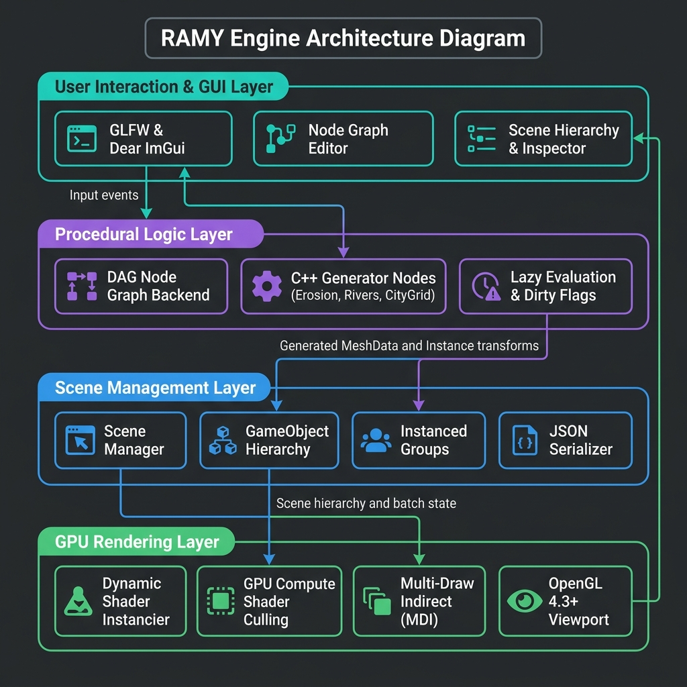

**ACADEMIA DE STUDII ECONOMICE DIN BUCUREȘTI  
FACULTATEA DE CIBERNETICĂ, STATISTICĂ ȘI INFORMATICĂ ECONOMICĂ**

![](data:image/png;base64,iVBORw0KGgoAAAANSUhEUgAAAH0AAABkCAYAAACrWT92AAAgAElEQVR4nNS9eXxc13Xn+T3n3ffqoVAogCAIgiAIUhQlURK1y5YtWZadOHbajpPYSWyn0x6nPT3JZ9yfjh339CSe5dP96aTTSTrb5NNJOpN0OpNMOonjtO3uJO14t2Vb1mbRWilS3EkQBEGwUCjU8uq9e+aP+6oASrItyUsy98PLegBque+ee7bfWUrMjL/z4QGF8n8HJJglYCkiKVgNk6ohqReqAqliCUhaPt+Vr9XyHbV818G750COkXshM+gqdAVrg7ShCI9GF8hAM4SsgFzK9xm88f/PhwJO/i6JnodVqEKC4cBXEakZMlFg9QiZEJgE6uDrIGMgVSAFknJuJvizif5cwkMWprWBNrAG0gLfMKQpSBNoGjRk+BzrGpoDvgDvvhOb8+0bfzdE9+ZVRR3eUkTqJkwaNgkyrdgMsB1sCpgErQM1g/RCv0hXO71kNcvd+bbo8nru1jpdXev16fQLzfIcM1ND0EiIRf1IElNLIl9PU79lNPHTVe8nKpKPJ5W8PpJkNegSZgt8C3QFaADnzVjywrLCskATfCNIBskIB8h/zZv8ezy+00R3GIkJNYFJD9MCcwJzYLtApgmcPbGcZbVTrX765FIvPbK04k43vTvb7Ov5ZltXs0J7RHgvmotSIHgLFBARNUBFEO99pKau5E5VI7Hcjzrx22oVto2N+B1jku+uj/grp7dk+7ZotqMaZxPOtQmEb4BfBln0cM6QBYElhSWgCbSADCNHvpPb+M2N7xTRnZmlYHVBphGZA/ZixRWIzoFM5djkkbVe/f5Tq+kjC83k0XNr7mSj69aLWFsWaSERkXMaRxGRi1TAC4YYigzkugGGiJTXIAhmYCKYiB/8XOQ5RZFjRe4rKn5UPGNR5vdMjubXTo/6a6dGspt2jnevHI/bY5FrAitgy+DPQHQaOAW2CDI4AG3z5KJ//7n/2010B6RmTIjYjBl7RLga5EpgDph+ci2b+PzR5epnnrmYPLq47hb7kVu3RONKQhI5dQKReBUMzFCxQOOSkLChyA1BBKQkPiKIKYKVhBBEUIY/K4jixXtvSmFGXvS97/WpUPjJOPe7J5L8jvmJ7OU7x7Nb5+rtbS5qEjh9AewkcAKTUyYsCKwALYwM+ftL/G8X0ZVgZE0Ac4btFWM/IlcB812z6c+caNT/61OL6edOtZIz6+q8SzSuJBqrkqhp4T2KR1ACGX2grQiCEMSpIaKlZDXEU3J5GFY+TSwQQDAQdHjHYoCgglcvAzPdC+BN6Hsj93jfW/f1yPv5Mc3vmh/P79k72X7F3HhrVGQFWAQ7BXIUOGZwSoxlhCbBVvh7R/xvA9EtMZO6CNPAPuA64FpgTyP3M3/99FL9Q19dSL98wZK2ORcniVZiRUzU8CAQYVr+Qyxw7HDBDDgZzATRTX8z70FUS/rZ4AWbFG6Q/IOfDRVQsyD+zYjEAKUQj5ogEnlRKApPv1/4flH4Men7G7dK9rort3bvuXK6ffV4pQEsBeJzBOQZ4ASwaNCUv2fE/1YSXQ1LxWTKhD1i/gDCTaD7Wt5m/+uTCxN/dHCx+tAyru9SV63E6kTATBELTIepiJQMGPRyuA4caVhJ9OCRiRgIPpwODYTD8Ib3hWnhvccA8UEKYOFtJagCRAPRFUSFSBSnquFQFAgeGR4QfPhwR2Hed3JP1O/ku0csv2fXaPZ9121v3zpTb0awCJzC7GkTOSxmx8AWEWmWVv/fOfG/NUQ3nGE1RGYN26/GbYgcAOY/cXR5+rcfOFv94vl+kiVVV0sijQP5dIOI4RpKTh5wdsnkmxiTINk1cLIY3psvvFDkfayf+Vg8o5WY0UR9PYI0KvxYRUnjhDhSwHzhTbMip5sXdPtGOxdt9YX13GjnpgZELkE0wjlRF0mwFq0AVcR8UDiiPivMZ1nBFs3yu3fE2Q8dmGm/Yn5LI0EWgROYPWXIIRGOgS2Z+ZZIlH3zm/7SxzdNdIME/ASme8BuFpHbgOtOrHVnf+MLJyb+8kg7bUcVN1pJ1GF48QoRgulATMtQBF++lpLBh+JdEI9AbkaRed/LMuqx5dtT2Ls19ddtG/F7az7fXq/77fXRfNuo87WI3Il4FfEgpdg3zFDDNPNeG33ccivXC2trbqnV1pPros9c7OmpRk8v9kQv9QtMVJM4xkVBGgy2zYkgmM+Kgk7W9zWK/BU7ouztB7a379kz1VBYAJ4xeEzgENgxjGVE/s5E/jdL9BRsyoz9ItwOcguw/4NPLEz9yn2LtaMdTUZGUk3VnLcYkwIxNCpf7AfEFtBSfA8XRrDOxfCqgfr9vvlu1qWmhb96SyW/c1eav3x2PL9hpp5tTeOuC2hbl4C0DR6zTXPzJg/g24QNhG+I9uVQbffz5JlLPffEuRX32IWu++r5jp7riOt41SSJSSPVob7AvEhQCp1e5kd8N3/VzpHsXTdvb92+Y2KZ4OIdAr5qxiEROUNw9b7jXP/SiG4eE6mKMRPEuN0BcutSt9j7y58/MvnBQ61qURl11SRS7ykNZIMBcMLAtBLAB8/JSkE/dLfUB82rvpcX9Htdv6vq/Wvma9kbrprKb9ox3p5w2iYAJAM/ugHWMJNVgSZCE5Mu4rsgAxh24L4FGNdwiFWBqkFNYByYAKmHR2pAHagudfvVJ8630i+dueTuP9tJTjZNc401TWKcEtSVCBh4K3w3K/yEdrPX7611f+yG2ebeieoS8Ixhj4jJo4gdM7NlL9qOvoNc/1KIrkAVbBa4EZO7EW48uNza8y8/eWLigQv9tFqrOQ3EU0UwEZXBx8hAj4dhZqgMna7B/95U6Re5z7o9f1XN8rfun8zfeO1094paOiByA2wFWC4BkguGXxJ0xQKa1gbapeU8IHa+6T7cpscBjp+Ge6MO1A0mBZvE2IbINFBCw9TP94r6A2ca6b3HVpKHFvvuQq4aJ7HGURRkv+UgkfeG7/c6ftco2Y9cu7X9wwe2L6cipzD/OPBVRJ405IxgrdLQ+7aPl0L0mhnzInYzyF3ArR871Zj7+c8cr5/sJEmapi4iVzHwgooEx9g2yLxJh4ehIuA9YB5VzMR3Ox2/I839D1+7JfuRm3a2d6Zxk4B/r4CsmElDhBXgAgEUWR78jRA0GWDqA4J/LU7aHKRRAycbB6FqZjVEJgUmMZtF2BEOvM4C0zlMPL3Srn3y8Pn008fX3Olu5OKkolGsROZLTMGRFd5H2Vp+x+xo9923bW8emKwtgB0GHsHkUYRj4R6eo4a+5ePFEr1m+DlMbhfhbpCb//Lp5blf+Nzx+iWpJZUkVrEhiKKYDRzrIXcH7SwDbCXo8+C6eROh1/fe5ev56/fU8p+8Y1d7/3jaIBB02UxWEGkJlm0KeqwTuLp8HkvAkmFNQQY6/aUMBTCzREScmVVFpAZMGsyIMY9wBQFZnAWmzrTz+seeXqx+/GgzOdk2lWTEJZEQmSmIzzXy/V7HT0e97EdvmG7/yHXTy070GPAo8DDwJMHla/NtJPwLInpWQKJWRWQOs9sRuQe49U+evDj3S/eeqnXcaFJxwRoGRYeoVwDGB8jYwE673Fov8XDMd7sZeyr97D2vnO1+/1XbmgKLmJ1BWAAulq8eZUPPpuUSc4JuXwbOAsfCtMUQNr1MrL/UoYAzSCVIgEnEpsVkHmQe8VeAzgEz53r5xMeeOl/9qyOryZlu5JJKRWPxweszIffmJW/nd8+m7Z942Xxjdy1ZAB4HexDkUeAU+CYhnPstH9+Q6D4HdT41mMG4XURfC9z+p4cuzv3ivacmOlEtSWNRMxvgKboZCoXNgrz8WQLS5kV8CbP4vNvO79peyf/FPfOtffV0CeyEwSFBjhO4OAFmD56+cOVffv7QfKuTTY2NptXaSOpq1YofTSv52EjSumqutnTDjq2Hga8CB0tYtPlSsfC8XH90ecw+ARIzqohNlIDUHNgewYbEP73em/jQ44u1Tx1rJZek4ipxjGIqJhRiPs8yv7vSz959+0zztfNbl8A/aSYPgh0U0WcIautbrue/LtELy4nEOWDa4EbBvhvkzv929OKen/vsmfqqS5OKqAtBDBk6XZvBFYXnoXrAwwWhAE+vlb/1mrHuT73iiua4kwWwJw15BDgs2IoFsHXPwaMLt73l5z9y84lzvXkimUAImTNiXlQQ77OJNGq947v3L/7Cj7/28fE0uRd4gACJdl/oppihUKjIMEHDgZTX4kAGGT7ltKpBDZMpsBlEdgnFnqD3Zfrg0trEn3z1fPXhi7mzuOKSUvWZRhR57tOik/3QdZPtd964YymGZwLH8wDIYYL0esFrfyHj6yaBRBIp5muI7hG4HeTmB85dmvuVL5yprUfVpKqULpiUSEoY8pyLy+muiEdLMZe183ceGO/+0zt2ryTIKbCDht0v2JMgy4bk4CdB3X//0mNTJ873pxkbnxQraiaRA9MAt+ANSVYKS377g48kRZbzH37qTS1CQGTZPJmofCNudxbSsKoQVYGaYTWCKzfI0nH27MwcC6BRGcdvhN/ruhkrgs3fPD02e/XrapMfeeJ8/S8PXUpWiiSpJLFGeGIXa6Ga/Oljl/Tcakf/6ct3JROVOAUbJaivJwl2yrcMzPkGmT+SepFZMX+jiN62sJ7t+aXPnqpfsJF0JFbFUBNDbcPDBoYu2PBdRC4jukjAx623nr/z+lr203fsWSFEqB4Q4z4RfdJgCbMMwYlRR0inttQnXUI9tyJVcGZeA9E9JqZi4iVSLepb+PB9x2fe+0MX9127c+teCzr+6wAhpoHQ1IFpET8LOgNMC7KFYEMM8/HK8P1G+pUEIEiEDlgG5N4sE+Q8Ijn4dlWY+YcHZmau216b+I8PLfDUat9VRqousgIXiea1MfepM53axfWj+t67r3C7RysDwMgRDL0lgoH3TY+vR3RH8FOvE9HbwPb+2n0nJ59subQ66lTNVEowTVSHBC/Dl8/a04HxFnxwEaXb7fg3XzWa/fQr9q4QiPIlgc+ZyCGwZZ9LppEhmA/eH27vrp1JrVJJGn2cj0RDuDXSQAPzwWPwSBwlF1Yv1R4/uTh97c6tOw2bQHRBnp/ojnCoZrFin0i0nxDvn13u5hNHzzWrl1abae7NVWKn1ZGKjqYVRtLUj6SRT2PNazHZiEo3eAvSBpoq0gLfMhOPyBJIJlh287Za9+e+e+/k7z98rvapk62UyqhzAjFe49FUH1vNqj//qePu/Xfv1mu3jDiwoE6MR5GhZf9Nja9H9BqwR8xuQuTqDz11buoTJ9rp6GjduTL+QGmUwOYIpj2Hswf4uYAXg16/l98+pfn779rbFDhl2EOC3AscElgCySMHpUXgRSwH/N6dW6lWoJEFmC9wXDH4YFUzb6CCqC/UPb3YqwGTitQNcxuLKYfhTGwS2CtwMxLdtm6277985omZD3/h8doTxy+mS21z692+K0xwglZiJYkiEqdUYvFJJD6JvB+piN+7Yzq7ff/O7Kard7TvOjDfqqINERoGLcFnmC6ZkE8kLv/nr9yV76qfq//Zk42076oucapYwdjoiDuT9fnFz56cfO+dc+7W7TXANIQW5SABy/+mdPzXInoCTAP7Ed1/eq07+wdfWa5FlVEXi6iYYQPCy+bsZQNRogFJhjQ3LAQ8yL3307HPf/qu+dZEJIuYfxST+1A7BLLMc90rX/rk3R11l9VT8QurAbsN8XN04AsaqFH+Lqq4rxw6m8CtdZDaJqNsoBcVsbqEmP8rgFd+8uCJq/+33/vk1INHLlWJKglJrKgqrgKgGZAVBrmHTsjkCUiyeXzhHzxyOv3zTx8lHo3zW3aPZz9w59Xtt73qmua+ua0N0AbiW4I2S8mVv/36HX7baKX+B48sVVfz1CWxU7Wc0UqsFzOSX/3Smfr7Xjk7/7KZerkPQ5Uy0PEvaTwf0ZWg2+aB6w32/L+PnK0vZHEyMupUfRHkuQyeutlClyHgwsBmGmDqUmBE3rK2f8fLtmfXTdZWwA4j+qCIPV4S/DniN7iCkoG10qTSetfrDuQf+J1PY7VpbxUXbMhSsngp818kBt/Vs4uLgyBKDbPENksgo2rCnCC3Irzy9z7+yHXv+42/nW4XaZWJSYeh4BEzDee5xBVUMKJnrTJSQTExj4zRz3P3wNH15IEv/k26dVRr++amJkJKta6Y0QTrIiyD+e/aM+knahX/m188Vb3YS5Nq6hT6Wq04Xe9X9LfuX5j46VcqN03XNqVvDwn/kvz45+Twh1CpTRl+P3D1w4vN6Y+daFer1dTFhkalFo1EiISQaSKGiA9Tg6EWCBGCUCLiI43oZBm3bY+zH7puqgWcIbhlj3tjCbPnPbnee8LNWROs9TNvu6v7gXe/2m9L1qHVgNUVbOUifvkCLJ5XW1rGFk6r9C7pj73hVjcgumEDQwzAIUyUXH7Lf3vomavf8xsfn24nW2oyUUvETFVMRUTLE63lzSiCymXTVBBMinBtXiWOHGbuujv2pe960ytqn3vq1MRbfvGjM/efXp0XYVZEJkquaIAt3zo12vjA3XvaO5Je1usXXqKICE+tEutqNJr81oNnJ5681NsD3I7ZKw32mTHBNzTEn39c/iJDBV8zdF6E6z3MffCxc7V1qSS1oF4xGySlDVgaVC4/OwPItQw4EYlRmFCzvn/nzbuykcDVhwhW6SkV+ZrGSRRFABkmbbCWiGS/8M57/E++8TaePH6WVqfjO71ce90eWZ6z3hctell+24EreP3NVybBh5a6INWg18WXqNo0yHUXu719P/N/f2Yql9GqVOLA4WJDiMHkBeyroGWupiIezHn6Hf2ld38vqYr+7Icf58uPtNx95z7pfufHb03eessVKdAwoynQNDF/zeQI/+s9u/VX7z2l5/sVN5I4xZuOOXWNfoXffeDMxL949fyeuZG4i9kaSBc4TPBKXpQrd/kdCYmhU2J2NcjeLy+sTt5/Lkur6VhpnytImaYEDHSpbDoAgeuD2+4xIhRR6HZ6/vW7KtnLZupNzE4h8gQBNHkhi/Ym0hakbWaZiPipsREm66NMjlW1NlKhUqlQiWPSJPajI0o1igboWU2MbQgTYpKWyxyoryv/0ycen37qdLPK+JTD+iBRsFcG41nYVTjvz/3lMMNLHHapqW+86yq+7/ar+KMvH/VfPryq7JzSpW6v+qO/84D7t29bT97/ugOpiCbgm5h1DV3ZVx/R99+1y//6l05XV/qaVBIFb5pWYrfYtfT37z818b675vdNxHEbo0XQ68cIEPQLHs86xlYFmUW4qoCZvz50odqNUh2LjIFVvJGJetnrBijbZY9RwGW9N6UmPn/jtTsygRWDExJO6RIvDGb0mOUIHRHJ//sjJ/1P/fbfcupihqgSOyFSJVLBqaBW6OzWEf9Tb32Ze9err6sRkjSnwGoEdG8CmO3DzMcePFEjThNA0aiMGWySXM+6V+NZnokRkuzMA4Z5ozqS86/fdSftfs6//qunlHQUVcFGUrK8kv7zP31Kj17oul/+4VvdaKyJiDUxyzBpXDVR1f/5jl36K184o5mNubE00qjItZJW3DNrnfSPv7Iw+RMv2311RYd5BG3gDC/CsNsslx0wAbYXZM9jF1oTj5zvJtVK4lzIMCXCo0KpyyFicK04hAghMsGJht9bUJ553vc3TCf+5ul6G2wJ5Ei50Bfsc0qw4n2vMP9//tHneWahRxbX6EWjtKzCau5YySKWOqqL3ZivHO/oj//bv3a/9tGHqgRRPmcwiVEL98n2U8uNicPnVlPSERUpMNUQHRwYfMPA/0akSPCIFOXMEfWo9YnogxbQbPAPX38Dt12xnd/81BMcXWhDdUR9wLCUGBirJ7/9qePp2377sxOnVlpTIJOIph7LwJo3bK223nb91u59Tx3L7z/d8CfaRldirY3VksdXpPrxo8vThCzjl4Fdbdik2QvX75ufmILMiOVXIG72M0cvVFctcWNRyEh1MkhklE0h0g3XLGySlTocTBQpzEca4a3nXz2/JY+hiXGmjB2v8CKszzJS5zu5942s8IzWAjYGhONXRuwtRPWoxLDu9N996MHq219z/eTO8ZFdEhIhKIlev7i6ll5YbTmSrSqWKargc2xgo2yOCopiCNY3LBtiAxteijjIMqa2pvzLt9/B2WaHX/v4MRiplW9kUCp+FGRswv3Nk6u86f/6TO13/8c79c75rariG2baFtA37duqj922XT/wt6f0sfqE2zIS6VQ1YWa86tYOr9V2bRmZvXlq9ABYE6MpQrfMMfiG+n1AdCWAMbNItGehm008fK6djiSjGpU54cFrkcuAl81oq5S5Yt4MVQ3KwCnNzKiY97funMiABiInBVsokasXbICUn6rjFWVq1OnRCz2Q6LJnmHg2UmeBaqrnWz335UMnJ3/ojv2zHj8jaCZlWLZf5ElWeEVFQ5GUDSOEJoNPFUxKod7pMDsJd1w5hZOI9V6Xfj+nnxd0+gXrqz3e84N3Mjc5xnv+8/1cWC1gS1z688N1KeBFwGp19/iFtr7p1z+rv/a2m/nHr7zSi9AInorws3fvc082evrHX1nTFVdjZSXTIxdbGkfKqfON+h+/48D8FdW4JeIvAA0R65b7+oKI7ghpQPMgMw+dWa2d70Q6UpWQES6hpKD0mcstLrm9/E8wVBSNHV0vrHR6nG/1OLPU9G/YHfu5atIFlktOf8khQ0GY2z7J/cfOENLcNhtVOnQoMEOcYlnfHTlzscodTAvMYrTK6FySxDGVOKIzTPYQbyJ6mU9eWmjW7XHd/Ch//oEf4MC22nOsms3jCycu2n/60gLU6yUs/ZynqxcQ76Ga0sgT9+7/5+HqocXV/Bfecms3QlYwW0GEX3/DtfrY4sN6cLmXMpJi3pGZ1y8utJP//W+enPyjH75pr0Mbhi1JOCyL32hvBzo9IeR/7czNTz14ejWxuOIiMVXRMoomqCpSOqgy0OEqJC5C4piVXHhqqcWXji/zwIlljq706LV7/u69W3KgjdkSYkuYvejEBo/50lpi18wUgxz0505CbvqgZiFJ3KNn2ykwKch2sMnyftlSq/mp8RpY4cuKh8Dpw/eSEndQ6Be85RV7vyHBAX75o/fTbZUSIx8aBhtjcDBVQCT49aNbk1/+m5PVN/7WF6qHl1uK0DBsaWuiK7/6pqu6ky7Lyb0PtoQoozX3wUNr6e8+fHYKuFqM20D3EaTY1+2hMHBrSmOHmZPr/drRS90kcZGWr1QVv5FBIJ4II4mEOHF01XGy2eeh0w3uO3GBJy60WOkZuauAqE9HYm7aOpIDLQu4+iDn+0UM7wFvBAx+z44xjxU+WFVw+dTAmSEKpCQj+tjJpaST53WQKRGpE4iez03W/e6ZCU/WDwCcsQlt06F9YGJgwlrnhQmn77p+Fy+/dpRXz0Vcu03AW1BFZRVOkEghYdRQDFVV7ya215JPP3ay+n/8yWccSFuQRbCF75qdaLzvjm1duuuhIlsENa9FpZ784udP1J642JlF5DqwA8CsQfpsV3PzGODRA6JPPbHYTNfyyKUj6ICbQw6bJwJUIix2NLOC05danL7UpdnNMYkgikO0OZQjecs9M6PO752ZDJwuXASahHTkFzEEwXJCNWg+V1cvUZnssJmJTJ71KsOcY2F53S2s9tIrt7pBSnMT8Gmk2f658fwLjy97E93wNTfn35dvaYnj/qOXXtBq3/e6G+R9r7sBgEPLq/aaX/si53uKRsE+MDZ9hJhieOn3+Fc/9nJ318xYKuZTAgo5wNjTf/bKvenfPLOafHkpd1IRNQGJVc+sJcnPffpI7U9/5IY9Ajf54BWtyAZc+5wxSP2pA9s9TBy92EuLKNFYBBUlwuMwKk4hSbhYwMFzDT53dJHHzzVZ7YPFScBmKWvPDG9iUBRMJoWfG41yhrnptL/WYr72ME8oZcqBfPv4mK+NpRuIiEhASgeGZjmJBFykqz3Rr55cSoEa2HgIVwYc+9Z9O304+g6JQnLHQLSjgokLB7qWcvDkBR5ZaLyoTNL9U+PyumvqkHXwOkAvpZRI5fojpcgKPX7krN4+M+Ju21FNPF7N5BLIccxOTMS68jP3zHVj38ObeQFV76E6on/xVLP6oaeXJkH2ifkDCnOIVb9WUtQg7acOTK5mvdqJlZZzcYLgUUzTGLQywsXM8fDpJp97ZpGnl9Zp+wTiSpncX2LtAc0qlWAALLZWna+EDR70c3kJ0SEhaEfpAvns5ISfHBv1wSrWDZFeplQMJ6ISRxSZ6VMnzzk2EioTygSI2/dtzSuJByI/LJwcEONZ170O3PvE6Re9+u/bP11W18qGByQygASCNBkZ4y8OnuFUo+VAUkOciG8bLCB2BPypH7hye/PNV9cyOl0MxUxU1NS7qvs3nz1Wu9TPZ0TkWsP2GTa5EU6+fGzm9MkLXUtX+6ZxJFpxEXFlhJW+8sCpFT5zeIGjK20yArEDHWxYimTmMSs2RGyZJTldrw5Coy0zawLdLM9fdNqPhJJxDz6f3VL1WwKne3QQ6RGeY9QFne+JlEOL3cSgBlI3GC3lazY/Ner3zmzxFBnBUtWh5BhcBzWsIDH3PnXmxS6dd9xxteyeiKAoQh2dsGkKZqakMQuXMv3I44sKJBGkmHqwZUOfATkmsPTeO3d3q1GWmzfvJZx70kS/ei53v//IuQmQPWDXitmMilSfbz1qRin2qB1f6SR9Ih2txDQK5eEzl/jU4fMcvdgmi9KS2JfrvDCe9bOZJ2St+dHARl2gKRLSkRP3YoND4jASCflrmiq6bSwiRL6CeS0qm7iznFpSP031ibMr2szyFKiD1Et/T7eNjPgb57dCt6M+iig7GwxnsOZLwo9UePhE80WuPYzX7t8K/W7J4UMXMTwqQA5xTT/ylQXt+TJPT0gEaQssGvY0cOZVs/Xm6/dtyel1POK8EEq9ScfcHzxwNj3f7k0Jss9E93mePxKnYAllDlgzKxowSBMAACAASURBVFxTR91jiy0+8fQih5bW6BGXxPbIC1LFVp4B8Yj51LlgxMElK8OnL7DAYuAwBLEsMgVMlTCqzk3VFSkYtqKQZ8e4yyEekoTj59fccqtbum6DNmU4BfbP1UCKsqhON4hRcmJA44BKzPGlVT7+9LkXpdcBvm//FFGkGK6Ee8MUjcJEYHTU339qVe8/dcEB1RAO9h5sGeSUYScUVt59+0w3IfMDo1PMK2mihy723R8+eq4GMgdcgzHNRm3AxsaKbFRrHr247j7zxDkOnlnVjo8gqYRT7kO9D/asYMPzD69qREEkeoSMEAVql8BOIhsJf4lBahu6doJAkEHd2AwhGrYPOIBxFcIEkOyZngwZK5TV7c/i0IG4N1GITJsZ+uTZZho+w2bNmBkQ/par55HEgamn5MKhdy1lUE0H1n2Fzz524sXSnLfecoXs21Yp3TdXYn0ltDv4tFi13UH/y4OnEqAqyBjowH1bELMjwMJ375ls3zY7ktPt+eDAlAGfypj7k68sVi/1+lOC7FWxvYS9vYzbHUgKloKkX1lY1/VODuN1MK/4Ul9L2T5A7LmSfdPmDBCx0MzBeczyS2vrg8pSbyGdehqRDDPHoFoEUhNSCaXPZS65DNKNa2JMIVxpyD4JhyHZNzOmWK6o+tBGTMpDuam9gQQNYCb4vurjJxaSN98wO0Gop8stbGx601xNt4zCih8YhrLpNst3kwjMY1GF+w4vvWiiA1wzmfD0+RbICKblfg5sokjRrI/P4RNfOaeXvr9It1SiGoZD8BgNQnuTM1Vk71sPzEzcd/p4wsgWj89VzGOVij62tO4++NT5+k/ePDcH7DHskDzLTXYWwhZpG1yjb0qSDMOEG2xtlz08h+glVwtGJBF9b9466/mky9o3T6eh1xpWF5F9hs2LiUOGpcBjspFinAx0LRvpxilCFZgQGZYOJ7PjohJLGfvWUryHOMHAlRM8GEoUeRAOL7XKTBoN+HfZ/Wq6VtUDc1N8/kgLqjGX++qDTSjh1DTisYUWTy2v2bVTYy9A8G2MCyvrZY1YgajbwPdVkCJXW+94nOPIclPvO3w6feMNe2qGT0vdWoI1HAeu+96rJ6Z/5fOSni/QYBCqQuFJUvdnj15M/8nNc1MRcoVgs2BlMmWIDjnDnEDcyk1bvTwEH74enLNB6tJAFijLkxD1Wbvrp5Je/o9u3dL9x7dd275haiQzsxThCoGdgqTIQJz76lpBtdHxSd97Z96cea++8Gq+UG+m5r2aefWFJXmROzWfHLhiRreOjel4LaWRg0Vl5E+GSxvYFRuAZBrrk+faND1JlPX0yPkGrjKiY5VId28Z1duv2Kaff2JZGRsJZRPh3ARru3xDsxBEurja5rEzF7l2aoyHD520vISoVRWNInToiinORXSzPn/x4BEeOttGRkbLfLMS1xBFigJb70KRg6tov2X6yKmme+MNVEUkLamRW8DkFwRZvqZe7b5ivp5/9Om2YyQNh8cKrFLhgbNNd+/p5fprdk3NYTZnoocEX+b9C84jTsF18762e/nXNogG+zmMtIXOTAJeVegW5qN2w7/9qtH8f7nnQPf2bbWyYtS7YITJNJA8vrCSPni2Ub3v+FryzNJK0uiqWy9EC7yaN6zfV+vnkPfw/Uzp51jWh35f814HaTf00//+PcxNbWHbWE0bKzmht0XoBTMYNhDtYdVKpeKfOd/UXj/n6PGzyZt/4cNE2/eyc1uVj/zU9+hNuyeVyA1juFbiD1aeJsECpm8FlqTc+/hp3nbzHn76l/+Mx8+2qNSqiKugsUNcgkURxA6tBJPrfBuisXowjsRC5E4iJOtj7Q5WABop5j0u0ScWm6U7LUk4vpaDtD1+EViKkdarr5ic+OihU95C04cQFIuUdmbuw4dW0tfsmpoOJVZMQci9LzkdwDT3XnPvla+RE1YmOCKEnDdhADBAp5v5maiT/6vv3Zn/T7fMdxW6hs9CuEJrmTHxkcfPpP/5wVPJ/adbbnG174gSRSNFcGXfoMCZeQR9H/ov9yMl9157qOTipS+ar8EjR5Z4x44p3TZe4chSB0sqm1h8Ywyz4wVwqiudwh9dWtPJrRMUkrK8Jpz3OY+eWOKuA7tJq1+m6wnZH6LB8yyDTVYCKwBEMV86ugzA/qvmuferD1F1VXzk8T3wiceiCB8LlhnEFaKxFJwi4gjaLUJ6fXy7DYVHiEI2LR6IOH+xvdHo2BsIuQldFWt49LxA887d9Xwszvwa4rEiBCJ8DmlVP3Z4NV39LpsYj2QO/AzoCYw2JZwRzhFg9qxaLwn6RlXLDNiynkRK0R7hO1mWX1/r5n/6tgPZT94y31ZoG5aVz6j+1dPnJ7/n339u8u1/+NWJjx7q1Bb71Sq1yZRqNSGtOCqRkjgldkocqVScaiVWlyRaSRyVOHZpxWmSRJomorhED59cUICZ8VIqiQYcRjf51QMYVTcRHtUvHTqj+6Yn9cZdE5CtK3mhR5bX9MrxCvMTcahC0wCVShSidaIKGpUH30HF8dRSh0fPr9qbX3sDUc0RxzGVWEhSR1opZxKTJjFJ7EqZE2GlGpBuD7/eRorygElYp5goKtrJc0odVXZRlBKG1qaEosbWvvE0279tDLL+YB9UQIljPdYo9PPHL9SAGTOb9VDD/LCExIPlTtQnpUgbgBLRcJax8vJnFSUS8f1u5m+s9f0fvuPG7mvmai2wFpAJosu5T9/z4YO1t/zHB6qfP52n1CYTqiNOInEixTBoNzT7VRRRNQ0TjdQ0UlPBVPEaqWkMmrB8KQAkc1vqw1AqJbE3TylBFRscAi88cXYZBXZNjSlZFzTm4TNrALziyh3Q7wVBqSUzCGzkCTFwAel0PV84dI47b7qSmYlRurmAxkGso5gGf9xHERZFWOTAOSJVrN3Ft7sB0tgcazdRQzzm/Via5KXFnQmSg3mBHKQrZW7c1tj5G3ZUPd1uOPllrztRJc/RTxxvBFxCdEawCQsFH8NCvP5IrH40dR4MpwG12CB6yHlzChHiI8UXPve7k37+Wz94oHv7lpE2+LaVLdyfWl5Lf+B37q3+zhcW07y61VEbcaKFini1SLBIFTUtT5JuIFMbPnZo4MvwepBHj0GrHeD7uW1bQIoht9uQSIMEpdKaH2TvxhGHl/t44Jb9e8KtJylPnF0BjJfv2wZ5L6R6DaXD5aicCaGLZVzl0189wZaRlLtu2Uevsx5AF8r7gE2omyAaod5TtNr4bvdyW9nKyCTeiwB53181s6XEN6wMUAkELz8rmastkF27tepDFFi9mMdMS1i3op8/0XQtX9RBdghMIpqULEIOlk24KN8yWvGY9+Ggh2KGgSgfFDeohuT4St7zH3jtXP6q7SNdC9+QkAmiB5dWq2/5vS9Xv3QmT5gYd6g4MdnIbqCk3CbUawh3Uj4lCuJ0YOXaQLxGDokjzjQC4fbN1oabHIJXOtzkDfx8k2FWSTh6ocNK1ufl+7cRh0orznSMY+2cA/PbiNJkWB5nEgVLtcQpvITPUI0gTnj4XIuVnueem3dDUVBISNmygdcwQN0E6PfJ1zpYNmhzMBgyOCTeEB9UbD+7dXetBaxg1jBsUKZcinjrUv5u3/QW0oqU+AgaiYROXk716KXcPbHcqxEygacJIJxTDV9f0U0g2zFqHivFt+JVPU5CaDVkwYqPVMi6Pf8D+2r5uw7s6IK1JbgC7uhaVv3RP3wofXo1ThgbdVhoEGiCmohuiDLh2ckdQ2RWBNMIHwkmAZ40iTARCgmJG8eW17nYydgzWSGJZbi5Q64sExa47DqCOGax1eP0SpvZ8RqTqUK3xXJXePjoRW7fO81MPWztQMSLRCFoWLpg4RAIuIgTqwVfPnKWf/CqG6iNx/R9yEDw6vCiWBRe63sZebtDcADK9WySR8FiLANHvV5+xfZq9oYbdq0AZw1d4fL2oh4k90gGls9viZiICxAlVkGj0NAwipy2+qIPnDo/aMw8JQELUcXIKJvt7Rkf9SoeMfWD5IkIhjnlZdMUv6OS+3/2qj2Zgy6hHps2lr73Q4+kh5YslVrqQs/XkB2ywdEb4u7y640pIkPDKXB9FPRxFGrI1MVcamesNte5ZftW2VqrQGHD5wesZuP9h7H1ACpg5njgmWV2T45xzewkZBnWF56+sMqowr7pKni/ITnKmI0M7YTyQDgFc3z26fNcMTXGdbunyLKcqAzrqoYi67zdwXd7wVMbvFYGHbYgIGEB5zBR6LSyf3L3npWd9eoZ4IQIjWHrcisNu0398LbG5secRyWknsciuEiIXQSIPnmxO4yiDuIWali3zFnrXr19PB+LCm8qxKVIjyMpv2TFo07Is55/8zV1f9vkSBZEjHqQ9De/cKL610+spDIx7gzbQCeeh7BfbxoDLgsGXKGB8xEt8cOI9U6fTi/o9cnRkXIzBiHQjYMjw9BokASBvxwHTy4QAVfsGAt7HjseOReKRF5zzS7ol5m2w8O5ORATgiQAJBU+e+gsILz5juug28XiOLjbfU/R6aG5R9WF+xmAxAYWWl4PW5d61NNodL/nxm2N97/h+jPAExjHwJqQ5wMpODwqQR75EY10vBITWVF6WIYTNBKDSkUPL5trFlYF3VKCYomqkCG0gNY1U1E2EedeIilFeuDwWIRIxQv4LVHBW67fkQOZD33U3VOrnfQ3P3csZWzCIcWGRT4U5Zt12POL9+f+OYjHIQdHUcCnI0duwsnlDgAzk6PgPRaM5pA8ISVUEQWXbXAQgo6CYyvhwOzfuR18H5zjibOX8L7glvktIFZa/GwkZAiYanmtwYOKlcOrxqPLbe6+eQ8udfQz8J2MotdHvfeDHLvQjR4vhH0Uw4e2JeopyGmstO/eX2/8wU/cfSqN44NgjwILmHQh3rw7G6XWgIuUsUqMCmXf2oGENuLYcfJSSxvdbgg0BU53CtLFwjcUzY4k3d1bRrzlOS5S4kh9BIgYouC7fW6YGfO3bB/Ngaw0UpP/8KXj6bm1QklcCHwMRfqAU4zLRLxSIlObnjN04kpRXBJvkLrky6hUyRUcPHoegF0TlUD0jX14jp1kZWWtqUAl5shKn6V+wWsPbMf1VqEwznW9P9rqs3/XNupbUij8RvTLSi4P1hkB448gilhbN77wxGledf0885MR2VrHS154RL0X8QX4wsT7krvNm7ciTHpZzupqNiHt5nteN7/8kfd/9zNz4+lD4O8DOYzQ4FnxbHsebnFRYM6IUFE0qCpOIljL0bPrg/C51QDngJzwLQQrWypJ98BMPX9gpeWlUtGACQhOynqmou3v3DXm66q5N+9VRE+2e8lHHzvvGB13g1pus82cXCqzgdFSUiS4ROXPA7izJLKYhFCLD6ikj3LUhbAmBhbHnL7YAGBbLQ0FLuICtFkSSJBNH+fL5sJBF59ZbbDQWGfX1CijldSvZjnNPOLTz6z6n7x1O3vH4eB5r4xEw+XbpoygEpRFJMLihC8+c5733HONv2f/To795aO+Mz0JcR+cenEVHyUFzsU+iryPJMKp+GpU5DtmR7qvu3pv+/tv37XyyitnThF6yT2M8bgJi/L8qWW+vLGhYReJkqgQReX59AzyADTvx3qm0XFMV6uEwFUySBBsARcUmjdsS7OURtW06p15RcRHGH0TX0sdd+ycLLshhCDzx5+5mJxc9Qn1WPGh6nOj8CmQdxBN2nxeLexkyE/3QJYF1TVIwfIF9DKKLINeF7rd8Njvwcoyx8+OArC9XgUpgggvc+Y2f1xw0V2JnYe96ufC0+db/vrrd3DHFVv8o2stpJqy3lgCtus1M3UOnlvzAeGyjeaHlGKeAJNrVpCvrvHFLx737X/0Sn7mHa/yV89U2TJRz+Mk8ZUkyaMkzpOK89VKmleSOK9U4jxNku72UdedHE0aI3G8TKjefcrMDgmcMNGVr0Hw554A7+nnfZwmxFJ6+1FAabSAjoheWGs72JqCr0KUBk4PRF8CGrfNT3anKwt5A01SLTBRFCPzyvQI/vrp1ANeRRRIPvnUeUdUAQq1YYeK4huv1oKbYb0Mei32bE2ZHhslDv3UqcRCSk5Cn9RyqvQZKfqoeaw7z3W7pwC4euc4KoYvASkbgIybka7BKLN7C5fy0OGzvP3ArP/z9/4D38lzHznnRyNRQO++aqf++cOPgYxiZQDRSmGlocUxNFsUFy5Bu8dZ3+fepxf9G27cxc/+D2/c3H68Vc5BK/LB78uGxlwAzpgvFkR1QUSWzWhJaNn4vNsml2UUqfa9127epxLFRBKg27Izk1okviPKWqcXgjdGiqCD6MqgmnTpui1J96rxSv7Aep44J96Hsj4kL9g3njKexCVIoCz2CvfYcs+RuLK1d4hpP++GP3vpIli3z66kw7/5wf2884a5b/Si5x1zEzGjCazJJnVRfsRmFg0PiuEhSvyx5UsAfqJaySeoDNp6KJBcM11LNBHnQz6tNwvVKE4U6XQpLqxgzVYIusZK3jA+95Vn9A037spCrbksC3YGkVNQtji1kvgSiG7hu11Ck2ONWhhdvOUSif96Rq6AmolTCe1RLuZCZjFJ5HEiHlR9cA2GLXG6WRYOiYijFO9l4qIsA4ujkWvctWfL1ENfWcmlUnMKRBphfp0rJ2s+FSnLi0SPX2y4s41MiWsq+LIqTy6X5M+7coECtrguf/xjN3HPrsmXRHCAauwYH6mwlvuA3A3p/ux1lCrHFCI4vpr7pcz76US7ZR/WVnipTVyxY2t9fmtVT6zmaiMpIhD1M1i5RLHSwPo5FpUuIeZxMQ8dueD7eZHHTttlgeZB4EGC6G4gg+9xDUUIslGMEHxuIUS0vvFQgsWTgLhzjZweEXEkRMawn37Zf5pYhN6m1w0uKD94hdBMd/mO3ePdydi8mfgIH9BHM7+rZl4YftmhXuxmutbtl6GogatdGmzyDWa/y4/cMPVNERzgmsm6bB+vQV5wGfo2vA7TBn62KsQRR5uek8vN8sDrMtgxC02El64ci9vXTGoO6h1KdGnV5ycWyM8v4/McorKmz0A8Spry4KFT/vTFVQ/SJWS4PAYcJHR8PAYMuH6ZjX70GZRfcPHChxKQtRTEnb20Rs87kgh1kZRxk7I5g3oiJyGAtRHcuozoTeAM2NLLdo41r5mQPCu8d4IXzI9EwtRI7AmnFIDFjmLOgZonQK2Y2jBR4GtOAJ/xXftnXgKZnzt2ba2WRB+gcdFloIqUyJpFQggsiDa7fc6ttT1h41cI/eyOhT2Q5o07pjJWL/nixGmKM4top4tqCfqEODS+NPKInG+0hXufWhrsZbt8z/DlfN/aHu6JiFTBUgM92cgUURK10Ki+tOKdQjgEoTSNodV/ufLoUn632Jjoyj17J7ua97yLIu9E/JiL8ona6OYvldXVNsOAswzKiohKvPprz4FvXnFfB6B5EWNmrIwbKZswgQ1sYKPEbSCOFCTmsbPrAN7wXQ8XFDtZ1oI17pyr55w64W1tLZgo0aD4kMvUhhle1JRc9QsHj5V7agO1mdu3jtgAamaJ4WtAeqnfd4eXWxqnCTGRH3B4rFIeACVW8UnoiTuAb59NdFsCOQksveaKydaOis8KE694X4nx42ll0MssB+gXnkGgw8rsklD/9fxzA52JQBzLrW/NfkzVylxHCYkOg+SPsDTZmIOATCQeF/OVU4ulfiyJZLRK26ZxzY7J7vTkmKcovA3y3sux+TrYjwZJwgNHzrvV9XZC+BboQT/6b83JhhAyhRS0BlSPNjK3sJ5TiRWHL3uclRmlGprqukgY1SHBMyDfvKCcUGt2CuzUDdtqK7dtT9pFv5+rSFaNJBurJKUhIjng/fCrMEssWC7fkOcsesB1JWGanW9NR+udWwe5Z/9feeceHdd1nfffPvfOncFgMBgOQBB8iuJDJGWSEiVFFKmXZcmOFEeWXNnVUuRaXpElL7d1Za+mruPYreylKE7q5TpNG7dymyZ27aR+SLZsp11Oo4ej94N6U6QEUSJNghAIgMPBcHBx596z+8e5dzAAn6KlrNV0r3V4SRDzOGef197729/uUHCWFnzEz9IXeR6vT0YctKRKkl4R9UGmwDZOXzgvXLukYpmezqyRY81Q52jI59m++4B5ce9EAVf0px8oiVPU2yLiyqMUBIogwWO/PGSmCEzRM8bz0suckEVE8cSQN0J3IQ8Qo3KE0gGaqjIM8qoHw1es7q8XJWqI+GHeSFgMZFZdlEShA/o5CwRx3GYA41ELW2/LYKweKBH4HTi71GUq2d1lVjOIZ4wYw8ho6O8ZnQzAVEQZBKngvl1YMITrFpfijL3whOJB3PLM/c/uDYCKwGKgqqrB29JJCzgAYwHoHg4j/6k9dZMLCvjiMtw9UXwPPM/geVgjQsGo7e3KZaniTSCaq/QI0TGFIbBDFy2bN7x2nj8xHce1vK/1gk8NZgrHJqoWY2wa0DDZ9nmiRhrxr0+/PUULFpUM3Zkx0k4xZpZrF8/D5DwCwDs4ie7ea958Yci8uW80AKmIsESRpQZ6cOQH0ZaNKyOMWD2B4l0AxhjwzeMv7vbTrX2RooMYU+JX2+LdzdtogFLEASGCX7w+7o+ESjHvu0ubWOuJC475afOM2IIntr9UjOmoUzeXR84K0lB4A+SFeYEpXLmit/n8k/WSL9i8Y3aMcUH5bCgMqLGpMvW4G3z7cwCh8Tat9HXzeqVaDPRgZNvh1CymruJur9KKYGKSeLyGTjaRJME2pnntQD3AkfgP4kh6RhQTCEQbllXjIC82sgKeoqpWyLyOWT8AUYNNLPk8T74+7g/tHy+tXtg3qLBCsDvA1Dhpjh2LYlI73KV/qcMm+CJaAamOhq3ggTcaSC5PTmObGLFq1Kh156uirlKsQrdvWdxbCJnhnJurdAEIxdGEbAfM5avnT9yz42A5sYoD6DnIDRAnTnd2lvfrZHSOO1+nWifhrj1JWdpX5rU9EbYraIdSPYCpKZiokUzUoRk6v5JnnE2T7zJ/9/IBrjinUTg81azUD08tWlAt2zUOnxaftmBevGpJn92+p4Hx/Qxa0dHJ1J2jKRVqkDNvjo76z7x+oLB6Yd+AgdUKK6zVCXFlt+NjOStdZEADQYoC5SdefqO6/3Crcs15q4tuF1Vwk2Bw1/hk8cChqdgUemMvpUYBRQ0WdcoWgUSx/QUTzy+YEKild7b4aCB3i2pDkTdEbLygkBu9amVP6X+/Oh6oSOCwVlIBrGZUWWKQ9CKleoxezRK33Ybxr6b0bfsPqqLU8YiDIngxXuBj4hgOHUbHa9haHRuFDvXjORqajJ5Mu7rsPY/t4r5tb/jNZlicbEaVga6k8bdf+2ht/fKFtq87H521uBhvf3Xc0uWb481qxVkMKoG577ndwT/eurYKsgo42xhpgA7hVluceTTp8KOnl7MKrtzXkge371vy+W/ct+DWD20u/sHNl1POeSlKSYOzBivlf3KO2nt2jkcTLT/O+Tnj0g7FgHV0EiK2pdMs6S1E3UGuATquSEOOXOlpB0QigRquRNTY1esWFob2jxWSJCnj5SKU03ElWMhi55J1/IR+d9oZR1Fy6kq/7lsP6707D0Hgo8bH5LvI5ww6MkYyVsM2DqNJ7JiwPA+0XXW9/UQgjMWE0wqm4NPVXRgNDxTrU9MZ72q4fnklxttnraYVX9umZ7sn6UZnnGM/6OLB5/b4temoVMkHy4DNFuuLMoBIWjJMrM64RVN+AFsVZBGqS0VkyUVnrRigd1v5T+/dETyza9R+9RPvi7auHGgCYZen5toz+vx1/YXofzw3Gj43PmX8fJfvoSQYjHWVsEhstLriN4tGxsCOqEpd5OgrPe2SRiB11Dbnd+XMDesHghyaJhBqAyS2qhkI3youke5EO7yrSe8GbuoUFQ4werhFbEpQ6oZ6A97cTzJRx05H7gt4BnJ+ii7WGUj1bG4iZ+B6AsY31GrmxiveZbasXR67y5w0tp69NpTvvVzUNE8SsKlbk9Qb3X4KaujuZsfuCf/f/+iJ4EvXX1QVZK0qJRFdraqjuGSQ7GIYIBQNUgSpAlVEqkD5/FULCxevHyjc/1zNPPrKYfv+L/zAfummLdG/uHJTCKapKGuq3fb3Ll0e/eClEfOzoUYQGt8Pcp5RMbalxD05ba6odDlvo7JXHELKHocSQgBiYo3JKRtOW5IZ1XXchc7GVmknGpC6Yk8YbUnFMzSSU6IrB+CuD5/DB/74PoaeGAIRkqiF8z/60PEdNPPMQdtknJmU6XmYHoClsvC56zfHImS1WAobllWrSxcUy3sOWF/8nNFZkbwUR5XSkGm25fVWuOO724IlA73mlss2+EakBLJMUpPJZfy3V3qWq58V6im0VH1R9S8/Z4W5//knodxDbbrFbf/pwfjhl/YV/8MnLi8uKHVFoHHBSPyRDQvDjQP1+FsvjPqvTqopBL41IlEl702sHSzvAl4W52IPQY6n9FRy7YRGCxqm58IUrqhFB5TI2etyIgeNGy3wDa8dSni+FurGSuEkZ8qMrOsvyz23Xqi/+bt/ye6DAuUyR3xyp4Kyz539C7iKDAKTh+zHrlkfrV860FTVMXF0nbavVKxesXGw+mc/3x3g5Vwor0197kHnpHJiCHJYKdlb//g+//Gdo4Ub3r0mWNzfV55sTsX1yYY91AyZbE5zeCo0jdiYgyHm0OHE1A5PmfrklDnYPGyah0PGp0DKJcdM3VWwBPngew/s9re9/n3/6x+/JHr/2ctTZ5nGGxeU439T7bZ3v7jP/s3uqXha/dqqgWDvYJfvynmKjqImQo670o8qMWiEEiIS+8Y4VsEUiCjaUWKzQ1SPXP/qGcYOKz/bsZ+NF5z+Fr+Gk/VL58tf3XGDfvAL32ekMeW2eu00qTvP346/zpxBFsXSsnZ+nx9/+trzmsCICLtVGRNkCmHwui1rBv7igV8WEhUfL82QOAogr+OkNxTyIWne+gAAEJdJREFU4Af8t7/e7n/nF0P0lboI48iGUcxUy2LjxAWJMA6Z4Swa42ilxaEYcgGSyxlp16URdKCPodHD/nVf+Zn5V9eeZT7/oS2my/dCsGE554Uf27SsuWqgXvurbW8Mv6va/7Igz6K6SzF1xAXL3prSrVpEYhzjY1QuFmyGUknz1F1oVWdGFSBLk5wlApR6+epTY2wYKOlvrpj/llc7wAXL58u3vnidXv9vv8/BqQhKeUgyKhKd4yhv/+FMTVIsWbNhb75mQ7hyoHcCFwIdEmEs3eIXX7FxxZJzVlfLT75WD8gVzCz1ZrYAMLMDpJPCF+jvI7SWfU0LEhi8LsiJRcysy4XMpEWbFKfDjFvbmHRELWKN9HSb6bjb3vGDl3ho55vmT26+xKxfMh8cGKZx0eLy8Nq+NS9py76Iq+g4JmKiFCn+VmuAGEs7pUbCZfMkRtQ6AE6M4qUAsqzjM4MzQxjgJogngvjCRNLNb9+zk9vOqel1a6qsXdQnr40e1GYYESUJh6wwEQq1RszE4ZCDjSa1w9OM1yapFA133fRuee+aBfLnv3utXv/luwlDg3QFjswo8x/MVbp2KKhlWTaYjz71/k0NYK+FnQbZhUO3hKK6KPDNilsuX1N98tWHC0gxcMeZdUcDLn8s69usZzpo7q7h4YhxHCg7HZp2xHJ2BC8du4630ey9HLUa5IF8n//AjkPmPV/+ibnjhl/j1ss2RCA1xYb9hfwYBYaBCcSEpIk58FaV7vDbkajWEBqDBaKcj235Yl21aDGifhu80h5jUcQqJrGYOMZGCRpFEE4jUcSBZosvDL3AV4uGaimvzShishkRtlztl4zP3b2jmXmGIePTD+oPb71UPnDWEvnzf3213viVe0n8PsgbxGaTTWbO95llCail1Yw/eeW54aJKaRQYEldxYgTnpIoQXgHW3HjJ+kV33bez+NSupk93V+r5auc7ccKdzX3kzC4hnUfEW5L2a8RYtNLLgTAOPvFfHuYXO0ZK/+4jF1YX9hQrOH7YjBIsPuobnJQIpA6COlBb2lMMByWJaUyRm27hTUd44TR+s4lpHEZqk8jYQczIGOw7QLJnhNbu/ST79pO8OUZ8cBI93EJQKJWp0cOummFkushhv0rS1Q/FPuiuQKkK5QqUex2ldm8JGZjP3c+M89G/+DsFuP780+W/fuYqZHrC3T48b6YERUb96W7wzrnWSuy6JaXo4+89qw7sSeBlcWQ+NRz4oabIG6i+VMx5ez9/3bkN34siEIuXJVh2PtN2MkGnE7QsL76ztWlLXDMYD8EY6fKhMuB/56F9xctu/1H1x8/sHgQGQI9KHvgWt3fBuFSmGujE2kqpuVqm41++NmHjYmBA3F5nOxwgNj1X08yIlMvCefDS0wB1t2BjBM0FKY2I20KzW1cnjDpz7iAK5SrffmKM7txj+o3fukA+dvEZMjkd6m3ffBT1ehE/2yXoICECFIuN43/+G5ub/cVgFOwrgrwCMgFEFqyBpmCHEdkOnP7Bc1ZWb7hkT+HbD+429JRM+j3NLJtBXB9nnSrtLzzjre4sSHyssT7iJ0f8yBg1WBBHWT6v4u881Crc8B/vq37z5i0Lb9y6tkJKcz7rVSf45CNERWJEayD7PJi4eOVARNKyWM8SJ+mgpseWZOnFOfc0vstLMy79WDP8mnGvselKtMZgPYP1fKxxWaAuc3UmRp7RgYix0FPlPz86wmfufloBPnXFRvmjj21GwkMpfWz6WQguTcqDOLbnruyNb7xkXR3sG4q8ZNBhqzRxCk8RUaah7ox/Bhj6/es3T6xZUoiYjqx6Po4LXdqFbSQNHXeyjXZSl0rW95Nq3uwmc1tqKqdmp6C+dHcFU7FXfG7PWAUog2ZVoE9d6bhSlzUcyG/0fRsHGz1dxGpSnqp0e8toO2cBGdq0IBy5paU60bZFlAIs2x5qObKJuC3cB3rm8fX7h/m9n76gAL9z1dly529tgmYdayVlZjSIMRYRK3Y6vu39mxq9gRkGXhZkyKpMWEna51/qcY3EgRm3A08v7S3u+pNbLpso5ZOQxMYYz4q4RqqcDMXT+dSUCqg9HjMdO7Jlvo8THQGe6WxGPQ9NEvoref+GC9c5p4/OVLo5ZaWLGIsL0Q2DvnH+osrEhSv7QsLpWMRh4juZmF0fdA5D81EU2F4NXsdzNqJ1dksRrwhomkrcM487f76LL/38ZQX43NXny+9fvxGabsXjedYYtUzH9tI1fdH1m0+vge5SzHbQYYM0/SNKagLufN9j0W3AtveuWrDnazdtqZt4MlTr+GDSVWfdLpTtSmbW7kQnrmC2whBPZrUZkp9jtw5iYccl5xmYavCBTYvYtLQvhVZLPNdpdarB/RAYAXnNh5GPbF3R8GjF6uXS88rYttLMkXDko7b2fb9975872+Y0nE+AlOlBxKUy9/Rx+0938kf371SAz1+zWb744fXQrFlVwUoOY1rRZ645rxEge4GXRO2QqtZIjgmJskDNIEPA42C33bJl1Z4/vGFL3YvrkSoWz7gkG+NZ8TKMnkmfM20uyGOmdUwSc3IrvePYcOVIEmxPt2dvec8ax7qNNlwMYZbH6tRqdaqDQddweO6hf7R+wZK7Vs0r/WJX09euvE+GnUt/OVPS3DeZrdTjf+bRoneZrzsj90PEuY17+/jcj3fgBQX9lxeeJl++9gKJEk3+8N6dVqUQ//qm/uiqdy0eQ/UVd0mTERHCE4xGpDAGul0xgcH6v3PFWvKe5bP/c1s5tMUC+cD5g0zqtFExWZ7hTHel3Z/ZQ5D1TzsugnPdyEcZk7TrKp6lOclV5y2OL1g2UAdGUZlA9AjwxikpPfVBZZX/Xu4yZsVnr1xTefwbjwXTdBskNpKGnlx5q6w7HTJ3jzlBSLYdzDiuGDDO2aU9/Xzu7hcoFox+8tyl8pXrtnhJrNM/fHhn/Nmr313PwR5EXgB2ISdXr1QgVHTEqDyrKbfLpy47Mx6slJd9+juPVIbrSYHubt8RIad+mJTFUFJ3WDu8azyHok1DvZJ5tdIMX4E2gniW/tNnlkYtKReqKhRycfzxi1c1gTFF97m7iIRzB05Okob7GCNMGXQjyK8Dl/yzHz2z6k8f2F+WSiVAE1f6BTXaDsrM/fad7zZHozrnV05it3ArRF1KsnhoKyI/VbP//aZN3LBhcedh/SjYB4D/BeZ53K51kqKoSlFEB4GzQTYDZz+3f2L5bd99vPrgzlqRrh6fIGfSXzez17QalZk5b9vfvCMYJdm/MziWTfuUHX2aMlMLiFpB0HoYX3lmd/Mn//Q9w77wiMKPBR7DmaCzJrR3++23n3x/5/bewaYTCzlB+7auWlC5/9X9XfvGpj2KBVEcm4GIZkSyHbbMnDb3TD/KGX7U13QgcEW0jY0To5hczsYS8NNndtuVC7u/sGGg5w5gJ/AS8BDI8yDjcwfl+CJYoWVgGqQGTIJtDfYUzY1bVvk9BZXte8dksj4NnsMkex6qRjPQjiKiajzVFJwvghUjDl7vICnW/V0UjLrzQhRrlVaseJ7iOzJ2XJ6lEk+27vzgpskNg717LDwtyNPAsCBHABF/FaXjBksTQRJV9bs8M2/rqoGee59/PahPGSO+b0Azcop0nbY3ps5xPLlLy4kmgsmKBWYXQ6sEnk28vP3hk3viXQfGPnn5usHX8555XFWeEOSXKoQnPDXmSBoNaanqlIjWwRxUdNITiS9cuUA/dN5S2+1Ny76DdXuwMa3aSs0Yz3NxCjHquFbdVkgCmlirUaK0rCVOlFZLiVtKMq05G2rRi3R+UXXFQI82Wy2JFMSRMClhFF+4vHv6zqs3jvtGtis8akh2gHdIjhLpPnUUQ1ukiepeEfMsUHlXf7HwlzedZz78Z09XRyJTkGLgq6qDcBmXKpKR7ULn9eVkPupE/+9lVSId14uKdewrxLlAGhsHu0byhu2gzyKyF7QpJ3zT43ycSAQy5ipWyATCMPDaskpp3R0f3Lz8k5c3++/bub/8f17cXXx+tOXvmmj6h8PEJBhHzyeWQuBTKXn0dRUY6MkzkLe2XMhR7SnZgd4Si6o9nNabo5QzppjPm3KpaD79g6f9bz/9JhRzrrSYhvFvb93YyHvesMJOA7vA1OQYO9ivcqZ3io/L6DgTuBS44JF9E6tu/u62yo5xr0i52wc16KxQZzu06E6pznP+SEXI3CnbNvO0o2HFpKUy8SyqlkYjXt4dN79+7brha85c/Dzwt2AfUjV7RU6lctRRxaRJDWURWaSqSwRdgZjTcdUp+kem4vKe0Yni5FTkhwm+MfhdvphikKO7q0Bvqdv2Fz1bmEUS2JYMYVMAgnt27A+u++bjRnv6LOF0fFY1aT5022XDpXzwFPA3wGNgR5hhWp4lb8NKB+tSZSaAHaA+WLYursY/vfXCFZ/54bP9P3llokB3JcD3DMSIo4B0aVCCyeZdp6qPmIrS+dPMTpnJxMwuP4jnBm0qtMRT8TXrehp3/saG0TOrxe2gj4I+r2pGnSlz6qt87hBIijEAGmCHLd6QoIPi0MMDg13+/MHTBsrMFDRIK1hgmOGFsy6gZdPImIlxpSELiCmrUhWh+mvL+0qrB0qFVxoJkoThR84/Y6KUD3ag+jQirwB1sMckN3i7VroTJVC0H+EMUc5H5NwEzvjaI7v6v3b/UGmk4QX09Ph4xogmkNW6xJ3ZnT7izJxpDypiVMTO2LDtO7F1ZUfEgTyaTev7cXTRoiD6+NZVjRvXD44AO4DHQZ8C2WWxdeOQvu+UOPyb1YIaKYKWBCkBRdCiIoWs8hRtZKXGOKM+Sv0g2Wr3VSkIWkEYRGUpwuAn7tlWueuhUbNywGs+8qmLhweKhRcUtgkM4ayRY15O316lA+ow3FVgObAR2ASc8Wp9atFdD++qfO+FkeKeuvp4XT6FosHMJEEiHckE7bw/AVWLTe8BNoa4BYlatxjEeh62N5fES0tefOmK/vDKdQua713RN+G7+MArFp4xynaEvbSx539foiZlGE5XtWb1abIOZkonVXpnMwCq6iNSELQMMggsenTvePWjd93nf/SiNeEX37dxGHQPzsNYO1H/3nalp+KnM3oQdJVg14O3Dli2a3K6/69f3l++b+hg4am9B4MDoeeHrralcYoVdxSJMSLW5r2Yokno9j3bWyzYanfAYE/BLirnbF9e41IhHy8ol8J1C7vDFSW/UfZzNWAE7B4wr1kYMg4CNaaqTRF5C+bZOy6zzfXjiFVrDOqrmKK4ooLFUKf9guTT4sXaENppZ8eVd0rp4GZ1SkYrgxZdYdSuQLzTgEUJVHc3muWXxlrFV0bqwXiz6YdR4oOYrpxHpatAf08XC6t5u7hkbNmIzftenA9ycY/nRT5tTtsGbbYmHQN902L2ogwb0dHUOdFENTqR1+//HWlXtHL/ciVJbYqUOaG8k0onBALwDUkBKCnegIUBDx0EHQQzH9oVmDLcd1atKZM08YCUqktD0AaYBsghXKH4iWSmgG/Nw9bRpAF+ZEWOSM39hyAWR9yWO757/qjyjio9k9TtbAQCSAIwJXUXm7K4hMhM6ZniM6uik0Eh42cLcfj7pjj0Z4hKmN7GI1wRrPj45Yf+/5a/F6UfRUy2RSnqq9XAGC+zRd2N1k0UB1N2t9kM4DdDwzXL1HlbuV3+IYv5v6L9IzmpRSjtAAAAAElFTkSuQmCC)  
  

**LUCRARE DE LICENȚĂ**

**COORDONATOR ȘTIINȚIFIC:  
PROF. UNIV. DR. CRISTIAN TOMA**

**  
ABSOLVENT:  
DIACONESCU ANDREI-ALEXANDRU**

BUCUREȘTI  
2026

**ACADEMIA DE STUDII ECONOMICE DIN BUCUREȘTI  
FACULTATEA DE CIBERNETICĂ, STATISTICĂ ȘI INFORMATICĂ ECONOMICĂ**

![](data:image/png;base64,iVBORw0KGgoAAAANSUhEUgAAAH0AAABkCAYAAACrWT92AAAgAElEQVR4nNS9eXxc13Xn+T3n3ffqoVAogCAIgiAIUhQlURK1y5YtWZadOHbajpPYSWyn0x6nPT3JZ9yfjh339CSe5dP96aTTSTrb5NNJOpN0OpNMOonjtO3uJO14t2Vb1mbRWilS3EkQBEGwUCjU8uq9e+aP+6oASrItyUsy98PLegBque+ee7bfWUrMjL/z4QGF8n8HJJglYCkiKVgNk6ohqReqAqliCUhaPt+Vr9XyHbV818G750COkXshM+gqdAVrg7ShCI9GF8hAM4SsgFzK9xm88f/PhwJO/i6JnodVqEKC4cBXEakZMlFg9QiZEJgE6uDrIGMgVSAFknJuJvizif5cwkMWprWBNrAG0gLfMKQpSBNoGjRk+BzrGpoDvgDvvhOb8+0bfzdE9+ZVRR3eUkTqJkwaNgkyrdgMsB1sCpgErQM1g/RCv0hXO71kNcvd+bbo8nru1jpdXev16fQLzfIcM1ND0EiIRf1IElNLIl9PU79lNPHTVe8nKpKPJ5W8PpJkNegSZgt8C3QFaADnzVjywrLCskATfCNIBskIB8h/zZv8ezy+00R3GIkJNYFJD9MCcwJzYLtApgmcPbGcZbVTrX765FIvPbK04k43vTvb7Ov5ZltXs0J7RHgvmotSIHgLFBARNUBFEO99pKau5E5VI7Hcjzrx22oVto2N+B1jku+uj/grp7dk+7ZotqMaZxPOtQmEb4BfBln0cM6QBYElhSWgCbSADCNHvpPb+M2N7xTRnZmlYHVBphGZA/ZixRWIzoFM5djkkbVe/f5Tq+kjC83k0XNr7mSj69aLWFsWaSERkXMaRxGRi1TAC4YYigzkugGGiJTXIAhmYCKYiB/8XOQ5RZFjRe4rKn5UPGNR5vdMjubXTo/6a6dGspt2jnevHI/bY5FrAitgy+DPQHQaOAW2CDI4AG3z5KJ//7n/2010B6RmTIjYjBl7RLga5EpgDph+ci2b+PzR5epnnrmYPLq47hb7kVu3RONKQhI5dQKReBUMzFCxQOOSkLChyA1BBKQkPiKIKYKVhBBEUIY/K4jixXtvSmFGXvS97/WpUPjJOPe7J5L8jvmJ7OU7x7Nb5+rtbS5qEjh9AewkcAKTUyYsCKwALYwM+ftL/G8X0ZVgZE0Ac4btFWM/IlcB812z6c+caNT/61OL6edOtZIz6+q8SzSuJBqrkqhp4T2KR1ACGX2grQiCEMSpIaKlZDXEU3J5GFY+TSwQQDAQdHjHYoCgglcvAzPdC+BN6Hsj93jfW/f1yPv5Mc3vmh/P79k72X7F3HhrVGQFWAQ7BXIUOGZwSoxlhCbBVvh7R/xvA9EtMZO6CNPAPuA64FpgTyP3M3/99FL9Q19dSL98wZK2ORcniVZiRUzU8CAQYVr+Qyxw7HDBDDgZzATRTX8z70FUS/rZ4AWbFG6Q/IOfDRVQsyD+zYjEAKUQj5ogEnlRKApPv1/4flH4Men7G7dK9rort3bvuXK6ffV4pQEsBeJzBOQZ4ASwaNCUv2fE/1YSXQ1LxWTKhD1i/gDCTaD7Wt5m/+uTCxN/dHCx+tAyru9SV63E6kTATBELTIepiJQMGPRyuA4caVhJ9OCRiRgIPpwODYTD8Ib3hWnhvccA8UEKYOFtJagCRAPRFUSFSBSnquFQFAgeGR4QfPhwR2Hed3JP1O/ku0csv2fXaPZ9121v3zpTb0awCJzC7GkTOSxmx8AWEWmWVv/fOfG/NUQ3nGE1RGYN26/GbYgcAOY/cXR5+rcfOFv94vl+kiVVV0sijQP5dIOI4RpKTh5wdsnkmxiTINk1cLIY3psvvFDkfayf+Vg8o5WY0UR9PYI0KvxYRUnjhDhSwHzhTbMip5sXdPtGOxdt9YX13GjnpgZELkE0wjlRF0mwFq0AVcR8UDiiPivMZ1nBFs3yu3fE2Q8dmGm/Yn5LI0EWgROYPWXIIRGOgS2Z+ZZIlH3zm/7SxzdNdIME/ASme8BuFpHbgOtOrHVnf+MLJyb+8kg7bUcVN1pJ1GF48QoRgulATMtQBF++lpLBh+JdEI9AbkaRed/LMuqx5dtT2Ls19ddtG/F7az7fXq/77fXRfNuo87WI3Il4FfEgpdg3zFDDNPNeG33ccivXC2trbqnV1pPros9c7OmpRk8v9kQv9QtMVJM4xkVBGgy2zYkgmM+Kgk7W9zWK/BU7ouztB7a379kz1VBYAJ4xeEzgENgxjGVE/s5E/jdL9BRsyoz9ItwOcguw/4NPLEz9yn2LtaMdTUZGUk3VnLcYkwIxNCpf7AfEFtBSfA8XRrDOxfCqgfr9vvlu1qWmhb96SyW/c1eav3x2PL9hpp5tTeOuC2hbl4C0DR6zTXPzJg/g24QNhG+I9uVQbffz5JlLPffEuRX32IWu++r5jp7riOt41SSJSSPVob7AvEhQCp1e5kd8N3/VzpHsXTdvb92+Y2KZ4OIdAr5qxiEROUNw9b7jXP/SiG4eE6mKMRPEuN0BcutSt9j7y58/MvnBQ61qURl11SRS7ykNZIMBcMLAtBLAB8/JSkE/dLfUB82rvpcX9Htdv6vq/Wvma9kbrprKb9ox3p5w2iYAJAM/ugHWMJNVgSZCE5Mu4rsgAxh24L4FGNdwiFWBqkFNYByYAKmHR2pAHagudfvVJ8630i+dueTuP9tJTjZNc401TWKcEtSVCBh4K3w3K/yEdrPX7611f+yG2ebeieoS8Ixhj4jJo4gdM7NlL9qOvoNc/1KIrkAVbBa4EZO7EW48uNza8y8/eWLigQv9tFqrOQ3EU0UwEZXBx8hAj4dhZqgMna7B/95U6Re5z7o9f1XN8rfun8zfeO1094paOiByA2wFWC4BkguGXxJ0xQKa1gbapeU8IHa+6T7cpscBjp+Ge6MO1A0mBZvE2IbINFBCw9TP94r6A2ca6b3HVpKHFvvuQq4aJ7HGURRkv+UgkfeG7/c6ftco2Y9cu7X9wwe2L6cipzD/OPBVRJ405IxgrdLQ+7aPl0L0mhnzInYzyF3ArR871Zj7+c8cr5/sJEmapi4iVzHwgooEx9g2yLxJh4ehIuA9YB5VzMR3Ox2/I839D1+7JfuRm3a2d6Zxk4B/r4CsmElDhBXgAgEUWR78jRA0GWDqA4J/LU7aHKRRAycbB6FqZjVEJgUmMZtF2BEOvM4C0zlMPL3Srn3y8Pn008fX3Olu5OKkolGsROZLTMGRFd5H2Vp+x+xo9923bW8emKwtgB0GHsHkUYRj4R6eo4a+5ePFEr1m+DlMbhfhbpCb//Lp5blf+Nzx+iWpJZUkVrEhiKKYDRzrIXcH7SwDbCXo8+C6eROh1/fe5ev56/fU8p+8Y1d7/3jaIBB02UxWEGkJlm0KeqwTuLp8HkvAkmFNQQY6/aUMBTCzREScmVVFpAZMGsyIMY9wBQFZnAWmzrTz+seeXqx+/GgzOdk2lWTEJZEQmSmIzzXy/V7HT0e97EdvmG7/yHXTy070GPAo8DDwJMHla/NtJPwLInpWQKJWRWQOs9sRuQe49U+evDj3S/eeqnXcaFJxwRoGRYeoVwDGB8jYwE673Fov8XDMd7sZeyr97D2vnO1+/1XbmgKLmJ1BWAAulq8eZUPPpuUSc4JuXwbOAsfCtMUQNr1MrL/UoYAzSCVIgEnEpsVkHmQe8VeAzgEz53r5xMeeOl/9qyOryZlu5JJKRWPxweszIffmJW/nd8+m7Z942Xxjdy1ZAB4HexDkUeAU+CYhnPstH9+Q6D4HdT41mMG4XURfC9z+p4cuzv3ivacmOlEtSWNRMxvgKboZCoXNgrz8WQLS5kV8CbP4vNvO79peyf/FPfOtffV0CeyEwSFBjhO4OAFmD56+cOVffv7QfKuTTY2NptXaSOpq1YofTSv52EjSumqutnTDjq2Hga8CB0tYtPlSsfC8XH90ecw+ARIzqohNlIDUHNgewYbEP73em/jQ44u1Tx1rJZek4ipxjGIqJhRiPs8yv7vSz959+0zztfNbl8A/aSYPgh0U0WcIautbrue/LtELy4nEOWDa4EbBvhvkzv929OKen/vsmfqqS5OKqAtBDBk6XZvBFYXnoXrAwwWhAE+vlb/1mrHuT73iiua4kwWwJw15BDgs2IoFsHXPwaMLt73l5z9y84lzvXkimUAImTNiXlQQ77OJNGq947v3L/7Cj7/28fE0uRd4gACJdl/oppihUKjIMEHDgZTX4kAGGT7ltKpBDZMpsBlEdgnFnqD3Zfrg0trEn3z1fPXhi7mzuOKSUvWZRhR57tOik/3QdZPtd964YymGZwLH8wDIYYL0esFrfyHj6yaBRBIp5muI7hG4HeTmB85dmvuVL5yprUfVpKqULpiUSEoY8pyLy+muiEdLMZe183ceGO/+0zt2ryTIKbCDht0v2JMgy4bk4CdB3X//0mNTJ873pxkbnxQraiaRA9MAt+ANSVYKS377g48kRZbzH37qTS1CQGTZPJmofCNudxbSsKoQVYGaYTWCKzfI0nH27MwcC6BRGcdvhN/ruhkrgs3fPD02e/XrapMfeeJ8/S8PXUpWiiSpJLFGeGIXa6Ga/Oljl/Tcakf/6ct3JROVOAUbJaivJwl2yrcMzPkGmT+SepFZMX+jiN62sJ7t+aXPnqpfsJF0JFbFUBNDbcPDBoYu2PBdRC4jukjAx623nr/z+lr203fsWSFEqB4Q4z4RfdJgCbMMwYlRR0inttQnXUI9tyJVcGZeA9E9JqZi4iVSLepb+PB9x2fe+0MX9127c+teCzr+6wAhpoHQ1IFpET8LOgNMC7KFYEMM8/HK8P1G+pUEIEiEDlgG5N4sE+Q8Ijn4dlWY+YcHZmau216b+I8PLfDUat9VRqousgIXiea1MfepM53axfWj+t67r3C7RysDwMgRDL0lgoH3TY+vR3RH8FOvE9HbwPb+2n0nJ59subQ66lTNVEowTVSHBC/Dl8/a04HxFnxwEaXb7fg3XzWa/fQr9q4QiPIlgc+ZyCGwZZ9LppEhmA/eH27vrp1JrVJJGn2cj0RDuDXSQAPzwWPwSBwlF1Yv1R4/uTh97c6tOw2bQHRBnp/ojnCoZrFin0i0nxDvn13u5hNHzzWrl1abae7NVWKn1ZGKjqYVRtLUj6SRT2PNazHZiEo3eAvSBpoq0gLfMhOPyBJIJlh287Za9+e+e+/k7z98rvapk62UyqhzAjFe49FUH1vNqj//qePu/Xfv1mu3jDiwoE6MR5GhZf9Nja9H9BqwR8xuQuTqDz11buoTJ9rp6GjduTL+QGmUwOYIpj2Hswf4uYAXg16/l98+pfn779rbFDhl2EOC3AscElgCySMHpUXgRSwH/N6dW6lWoJEFmC9wXDH4YFUzb6CCqC/UPb3YqwGTitQNcxuLKYfhTGwS2CtwMxLdtm6277985omZD3/h8doTxy+mS21z692+K0xwglZiJYkiEqdUYvFJJD6JvB+piN+7Yzq7ff/O7Kard7TvOjDfqqINERoGLcFnmC6ZkE8kLv/nr9yV76qfq//Zk42076oucapYwdjoiDuT9fnFz56cfO+dc+7W7TXANIQW5SABy/+mdPzXInoCTAP7Ed1/eq07+wdfWa5FlVEXi6iYYQPCy+bsZQNRogFJhjQ3LAQ8yL3307HPf/qu+dZEJIuYfxST+1A7BLLMc90rX/rk3R11l9VT8QurAbsN8XN04AsaqFH+Lqq4rxw6m8CtdZDaJqNsoBcVsbqEmP8rgFd+8uCJq/+33/vk1INHLlWJKglJrKgqrgKgGZAVBrmHTsjkCUiyeXzhHzxyOv3zTx8lHo3zW3aPZz9w59Xtt73qmua+ua0N0AbiW4I2S8mVv/36HX7baKX+B48sVVfz1CWxU7Wc0UqsFzOSX/3Smfr7Xjk7/7KZerkPQ5Uy0PEvaTwf0ZWg2+aB6w32/L+PnK0vZHEyMupUfRHkuQyeutlClyHgwsBmGmDqUmBE3rK2f8fLtmfXTdZWwA4j+qCIPV4S/DniN7iCkoG10qTSetfrDuQf+J1PY7VpbxUXbMhSsngp818kBt/Vs4uLgyBKDbPENksgo2rCnCC3Irzy9z7+yHXv+42/nW4XaZWJSYeh4BEzDee5xBVUMKJnrTJSQTExj4zRz3P3wNH15IEv/k26dVRr++amJkJKta6Y0QTrIiyD+e/aM+knahX/m188Vb3YS5Nq6hT6Wq04Xe9X9LfuX5j46VcqN03XNqVvDwn/kvz45+Twh1CpTRl+P3D1w4vN6Y+daFer1dTFhkalFo1EiISQaSKGiA9Tg6EWCBGCUCLiI43oZBm3bY+zH7puqgWcIbhlj3tjCbPnPbnee8LNWROs9TNvu6v7gXe/2m9L1qHVgNUVbOUifvkCLJ5XW1rGFk6r9C7pj73hVjcgumEDQwzAIUyUXH7Lf3vomavf8xsfn24nW2oyUUvETFVMRUTLE63lzSiCymXTVBBMinBtXiWOHGbuujv2pe960ytqn3vq1MRbfvGjM/efXp0XYVZEJkquaIAt3zo12vjA3XvaO5Je1usXXqKICE+tEutqNJr81oNnJ5681NsD3I7ZKw32mTHBNzTEn39c/iJDBV8zdF6E6z3MffCxc7V1qSS1oF4xGySlDVgaVC4/OwPItQw4EYlRmFCzvn/nzbuykcDVhwhW6SkV+ZrGSRRFABkmbbCWiGS/8M57/E++8TaePH6WVqfjO71ce90eWZ6z3hctell+24EreP3NVybBh5a6INWg18WXqNo0yHUXu719P/N/f2Yql9GqVOLA4WJDiMHkBeyroGWupiIezHn6Hf2ld38vqYr+7Icf58uPtNx95z7pfufHb03eessVKdAwoynQNDF/zeQI/+s9u/VX7z2l5/sVN5I4xZuOOXWNfoXffeDMxL949fyeuZG4i9kaSBc4TPBKXpQrd/kdCYmhU2J2NcjeLy+sTt5/Lkur6VhpnytImaYEDHSpbDoAgeuD2+4xIhRR6HZ6/vW7KtnLZupNzE4h8gQBNHkhi/Ym0hakbWaZiPipsREm66NMjlW1NlKhUqlQiWPSJPajI0o1igboWU2MbQgTYpKWyxyoryv/0ycen37qdLPK+JTD+iBRsFcG41nYVTjvz/3lMMNLHHapqW+86yq+7/ar+KMvH/VfPryq7JzSpW6v+qO/84D7t29bT97/ugOpiCbgm5h1DV3ZVx/R99+1y//6l05XV/qaVBIFb5pWYrfYtfT37z818b675vdNxHEbo0XQ68cIEPQLHs86xlYFmUW4qoCZvz50odqNUh2LjIFVvJGJetnrBijbZY9RwGW9N6UmPn/jtTsygRWDExJO6RIvDGb0mOUIHRHJ//sjJ/1P/fbfcupihqgSOyFSJVLBqaBW6OzWEf9Tb32Ze9err6sRkjSnwGoEdG8CmO3DzMcePFEjThNA0aiMGWySXM+6V+NZnokRkuzMA4Z5ozqS86/fdSftfs6//qunlHQUVcFGUrK8kv7zP31Kj17oul/+4VvdaKyJiDUxyzBpXDVR1f/5jl36K184o5mNubE00qjItZJW3DNrnfSPv7Iw+RMv2311RYd5BG3gDC/CsNsslx0wAbYXZM9jF1oTj5zvJtVK4lzIMCXCo0KpyyFicK04hAghMsGJht9bUJ553vc3TCf+5ul6G2wJ5Ei50Bfsc0qw4n2vMP9//tHneWahRxbX6EWjtKzCau5YySKWOqqL3ZivHO/oj//bv3a/9tGHqgRRPmcwiVEL98n2U8uNicPnVlPSERUpMNUQHRwYfMPA/0akSPCIFOXMEfWo9YnogxbQbPAPX38Dt12xnd/81BMcXWhDdUR9wLCUGBirJ7/9qePp2377sxOnVlpTIJOIph7LwJo3bK223nb91u59Tx3L7z/d8CfaRldirY3VksdXpPrxo8vThCzjl4Fdbdik2QvX75ufmILMiOVXIG72M0cvVFctcWNRyEh1MkhklE0h0g3XLGySlTocTBQpzEca4a3nXz2/JY+hiXGmjB2v8CKszzJS5zu5942s8IzWAjYGhONXRuwtRPWoxLDu9N996MHq219z/eTO8ZFdEhIhKIlev7i6ll5YbTmSrSqWKargc2xgo2yOCopiCNY3LBtiAxteijjIMqa2pvzLt9/B2WaHX/v4MRiplW9kUCp+FGRswv3Nk6u86f/6TO13/8c79c75rariG2baFtA37duqj922XT/wt6f0sfqE2zIS6VQ1YWa86tYOr9V2bRmZvXlq9ABYE6MpQrfMMfiG+n1AdCWAMbNItGehm008fK6djiSjGpU54cFrkcuAl81oq5S5Yt4MVQ3KwCnNzKiY97funMiABiInBVsokasXbICUn6rjFWVq1OnRCz2Q6LJnmHg2UmeBaqrnWz335UMnJ3/ojv2zHj8jaCZlWLZf5ElWeEVFQ5GUDSOEJoNPFUxKod7pMDsJd1w5hZOI9V6Xfj+nnxd0+gXrqz3e84N3Mjc5xnv+8/1cWC1gS1z688N1KeBFwGp19/iFtr7p1z+rv/a2m/nHr7zSi9AInorws3fvc082evrHX1nTFVdjZSXTIxdbGkfKqfON+h+/48D8FdW4JeIvAA0R65b7+oKI7ghpQPMgMw+dWa2d70Q6UpWQES6hpKD0mcstLrm9/E8wVBSNHV0vrHR6nG/1OLPU9G/YHfu5atIFlktOf8khQ0GY2z7J/cfOENLcNhtVOnQoMEOcYlnfHTlzscodTAvMYrTK6FySxDGVOKIzTPYQbyJ6mU9eWmjW7XHd/Ch//oEf4MC22nOsms3jCycu2n/60gLU6yUs/ZynqxcQ76Ga0sgT9+7/5+HqocXV/Bfecms3QlYwW0GEX3/DtfrY4sN6cLmXMpJi3pGZ1y8utJP//W+enPyjH75pr0Mbhi1JOCyL32hvBzo9IeR/7czNTz14ejWxuOIiMVXRMoomqCpSOqgy0OEqJC5C4piVXHhqqcWXji/zwIlljq706LV7/u69W3KgjdkSYkuYvejEBo/50lpi18wUgxz0505CbvqgZiFJ3KNn2ykwKch2sMnyftlSq/mp8RpY4cuKh8Dpw/eSEndQ6Be85RV7vyHBAX75o/fTbZUSIx8aBhtjcDBVQCT49aNbk1/+m5PVN/7WF6qHl1uK0DBsaWuiK7/6pqu6ky7Lyb0PtoQoozX3wUNr6e8+fHYKuFqM20D3EaTY1+2hMHBrSmOHmZPr/drRS90kcZGWr1QVv5FBIJ4II4mEOHF01XGy2eeh0w3uO3GBJy60WOkZuauAqE9HYm7aOpIDLQu4+iDn+0UM7wFvBAx+z44xjxU+WFVw+dTAmSEKpCQj+tjJpaST53WQKRGpE4iez03W/e6ZCU/WDwCcsQlt06F9YGJgwlrnhQmn77p+Fy+/dpRXz0Vcu03AW1BFZRVOkEghYdRQDFVV7ya215JPP3ay+n/8yWccSFuQRbCF75qdaLzvjm1duuuhIlsENa9FpZ784udP1J642JlF5DqwA8CsQfpsV3PzGODRA6JPPbHYTNfyyKUj6ICbQw6bJwJUIix2NLOC05danL7UpdnNMYkgikO0OZQjecs9M6PO752ZDJwuXASahHTkFzEEwXJCNWg+V1cvUZnssJmJTJ71KsOcY2F53S2s9tIrt7pBSnMT8Gmk2f658fwLjy97E93wNTfn35dvaYnj/qOXXtBq3/e6G+R9r7sBgEPLq/aaX/si53uKRsE+MDZ9hJhieOn3+Fc/9nJ318xYKuZTAgo5wNjTf/bKvenfPLOafHkpd1IRNQGJVc+sJcnPffpI7U9/5IY9Ajf54BWtyAZc+5wxSP2pA9s9TBy92EuLKNFYBBUlwuMwKk4hSbhYwMFzDT53dJHHzzVZ7YPFScBmKWvPDG9iUBRMJoWfG41yhrnptL/WYr72ME8oZcqBfPv4mK+NpRuIiEhASgeGZjmJBFykqz3Rr55cSoEa2HgIVwYc+9Z9O304+g6JQnLHQLSjgokLB7qWcvDkBR5ZaLyoTNL9U+PyumvqkHXwOkAvpZRI5fojpcgKPX7krN4+M+Ju21FNPF7N5BLIccxOTMS68jP3zHVj38ObeQFV76E6on/xVLP6oaeXJkH2ifkDCnOIVb9WUtQg7acOTK5mvdqJlZZzcYLgUUzTGLQywsXM8fDpJp97ZpGnl9Zp+wTiSpncX2LtAc0qlWAALLZWna+EDR70c3kJ0SEhaEfpAvns5ISfHBv1wSrWDZFeplQMJ6ISRxSZ6VMnzzk2EioTygSI2/dtzSuJByI/LJwcEONZ170O3PvE6Re9+u/bP11W18qGByQygASCNBkZ4y8OnuFUo+VAUkOciG8bLCB2BPypH7hye/PNV9cyOl0MxUxU1NS7qvs3nz1Wu9TPZ0TkWsP2GTa5EU6+fGzm9MkLXUtX+6ZxJFpxEXFlhJW+8sCpFT5zeIGjK20yArEDHWxYimTmMSs2RGyZJTldrw5Coy0zawLdLM9fdNqPhJJxDz6f3VL1WwKne3QQ6RGeY9QFne+JlEOL3cSgBlI3GC3lazY/Ner3zmzxFBnBUtWh5BhcBzWsIDH3PnXmxS6dd9xxteyeiKAoQh2dsGkKZqakMQuXMv3I44sKJBGkmHqwZUOfATkmsPTeO3d3q1GWmzfvJZx70kS/ei53v//IuQmQPWDXitmMilSfbz1qRin2qB1f6SR9Ih2txDQK5eEzl/jU4fMcvdgmi9KS2JfrvDCe9bOZJ2St+dHARl2gKRLSkRP3YoND4jASCflrmiq6bSwiRL6CeS0qm7iznFpSP031ibMr2szyFKiD1Et/T7eNjPgb57dCt6M+iig7GwxnsOZLwo9UePhE80WuPYzX7t8K/W7J4UMXMTwqQA5xTT/ylQXt+TJPT0gEaQssGvY0cOZVs/Xm6/dtyel1POK8EEq9ScfcHzxwNj3f7k0Jss9E93mePxKnYAllDlgzKxowSBMAACAASURBVFxTR91jiy0+8fQih5bW6BGXxPbIC1LFVp4B8Yj51LlgxMElK8OnL7DAYuAwBLEsMgVMlTCqzk3VFSkYtqKQZ8e4yyEekoTj59fccqtbum6DNmU4BfbP1UCKsqhON4hRcmJA44BKzPGlVT7+9LkXpdcBvm//FFGkGK6Ee8MUjcJEYHTU339qVe8/dcEB1RAO9h5sGeSUYScUVt59+0w3IfMDo1PMK2mihy723R8+eq4GMgdcgzHNRm3AxsaKbFRrHr247j7zxDkOnlnVjo8gqYRT7kO9D/asYMPzD69qREEkeoSMEAVql8BOIhsJf4lBahu6doJAkEHd2AwhGrYPOIBxFcIEkOyZngwZK5TV7c/i0IG4N1GITJsZ+uTZZho+w2bNmBkQ/par55HEgamn5MKhdy1lUE0H1n2Fzz524sXSnLfecoXs21Yp3TdXYn0ltDv4tFi13UH/y4OnEqAqyBjowH1bELMjwMJ375ls3zY7ktPt+eDAlAGfypj7k68sVi/1+lOC7FWxvYS9vYzbHUgKloKkX1lY1/VODuN1MK/4Ul9L2T5A7LmSfdPmDBCx0MzBeczyS2vrg8pSbyGdehqRDDPHoFoEUhNSCaXPZS65DNKNa2JMIVxpyD4JhyHZNzOmWK6o+tBGTMpDuam9gQQNYCb4vurjJxaSN98wO0Gop8stbGx601xNt4zCih8YhrLpNst3kwjMY1GF+w4vvWiiA1wzmfD0+RbICKblfg5sokjRrI/P4RNfOaeXvr9It1SiGoZD8BgNQnuTM1Vk71sPzEzcd/p4wsgWj89VzGOVij62tO4++NT5+k/ePDcH7DHskDzLTXYWwhZpG1yjb0qSDMOEG2xtlz08h+glVwtGJBF9b9466/mky9o3T6eh1xpWF5F9hs2LiUOGpcBjspFinAx0LRvpxilCFZgQGZYOJ7PjohJLGfvWUryHOMHAlRM8GEoUeRAOL7XKTBoN+HfZ/Wq6VtUDc1N8/kgLqjGX++qDTSjh1DTisYUWTy2v2bVTYy9A8G2MCyvrZY1YgajbwPdVkCJXW+94nOPIclPvO3w6feMNe2qGT0vdWoI1HAeu+96rJ6Z/5fOSni/QYBCqQuFJUvdnj15M/8nNc1MRcoVgs2BlMmWIDjnDnEDcyk1bvTwEH74enLNB6tJAFijLkxD1Wbvrp5Je/o9u3dL9x7dd275haiQzsxThCoGdgqTIQJz76lpBtdHxSd97Z96cea++8Gq+UG+m5r2aefWFJXmROzWfHLhiRreOjel4LaWRg0Vl5E+GSxvYFRuAZBrrk+faND1JlPX0yPkGrjKiY5VId28Z1duv2Kaff2JZGRsJZRPh3ARru3xDsxBEurja5rEzF7l2aoyHD520vISoVRWNInToiinORXSzPn/x4BEeOttGRkbLfLMS1xBFigJb70KRg6tov2X6yKmme+MNVEUkLamRW8DkFwRZvqZe7b5ivp5/9Om2YyQNh8cKrFLhgbNNd+/p5fprdk3NYTZnoocEX+b9C84jTsF18762e/nXNogG+zmMtIXOTAJeVegW5qN2w7/9qtH8f7nnQPf2bbWyYtS7YITJNJA8vrCSPni2Ub3v+FryzNJK0uiqWy9EC7yaN6zfV+vnkPfw/Uzp51jWh35f814HaTf00//+PcxNbWHbWE0bKzmht0XoBTMYNhDtYdVKpeKfOd/UXj/n6PGzyZt/4cNE2/eyc1uVj/zU9+hNuyeVyA1juFbiD1aeJsECpm8FlqTc+/hp3nbzHn76l/+Mx8+2qNSqiKugsUNcgkURxA6tBJPrfBuisXowjsRC5E4iJOtj7Q5WABop5j0u0ScWm6U7LUk4vpaDtD1+EViKkdarr5ic+OihU95C04cQFIuUdmbuw4dW0tfsmpoOJVZMQci9LzkdwDT3XnPvla+RE1YmOCKEnDdhADBAp5v5maiT/6vv3Zn/T7fMdxW6hs9CuEJrmTHxkcfPpP/5wVPJ/adbbnG174gSRSNFcGXfoMCZeQR9H/ov9yMl9157qOTipS+ar8EjR5Z4x44p3TZe4chSB0sqm1h8Ywyz4wVwqiudwh9dWtPJrRMUkrK8Jpz3OY+eWOKuA7tJq1+m6wnZH6LB8yyDTVYCKwBEMV86ugzA/qvmuferD1F1VXzk8T3wiceiCB8LlhnEFaKxFJwi4gjaLUJ6fXy7DYVHiEI2LR6IOH+xvdHo2BsIuQldFWt49LxA887d9Xwszvwa4rEiBCJ8DmlVP3Z4NV39LpsYj2QO/AzoCYw2JZwRzhFg9qxaLwn6RlXLDNiynkRK0R7hO1mWX1/r5n/6tgPZT94y31ZoG5aVz6j+1dPnJ7/n339u8u1/+NWJjx7q1Bb71Sq1yZRqNSGtOCqRkjgldkocqVScaiVWlyRaSRyVOHZpxWmSRJomorhED59cUICZ8VIqiQYcRjf51QMYVTcRHtUvHTqj+6Yn9cZdE5CtK3mhR5bX9MrxCvMTcahC0wCVShSidaIKGpUH30HF8dRSh0fPr9qbX3sDUc0RxzGVWEhSR1opZxKTJjFJ7EqZE2GlGpBuD7/eRorygElYp5goKtrJc0odVXZRlBKG1qaEosbWvvE0279tDLL+YB9UQIljPdYo9PPHL9SAGTOb9VDD/LCExIPlTtQnpUgbgBLRcJax8vJnFSUS8f1u5m+s9f0fvuPG7mvmai2wFpAJosu5T9/z4YO1t/zHB6qfP52n1CYTqiNOInEixTBoNzT7VRRRNQ0TjdQ0UlPBVPEaqWkMmrB8KQAkc1vqw1AqJbE3TylBFRscAi88cXYZBXZNjSlZFzTm4TNrALziyh3Q7wVBqSUzCGzkCTFwAel0PV84dI47b7qSmYlRurmAxkGso5gGf9xHERZFWOTAOSJVrN3Ft7sB0tgcazdRQzzm/Via5KXFnQmSg3mBHKQrZW7c1tj5G3ZUPd1uOPllrztRJc/RTxxvBFxCdEawCQsFH8NCvP5IrH40dR4MpwG12CB6yHlzChHiI8UXPve7k37+Wz94oHv7lpE2+LaVLdyfWl5Lf+B37q3+zhcW07y61VEbcaKFini1SLBIFTUtT5JuIFMbPnZo4MvwepBHj0GrHeD7uW1bQIoht9uQSIMEpdKaH2TvxhGHl/t44Jb9e8KtJylPnF0BjJfv2wZ5L6R6DaXD5aicCaGLZVzl0189wZaRlLtu2Uevsx5AF8r7gE2omyAaod5TtNr4bvdyW9nKyCTeiwB53181s6XEN6wMUAkELz8rmastkF27tepDFFi9mMdMS1i3op8/0XQtX9RBdghMIpqULEIOlk24KN8yWvGY9+Ggh2KGgSgfFDeohuT4St7zH3jtXP6q7SNdC9+QkAmiB5dWq2/5vS9Xv3QmT5gYd6g4MdnIbqCk3CbUawh3Uj4lCuJ0YOXaQLxGDokjzjQC4fbN1oabHIJXOtzkDfx8k2FWSTh6ocNK1ufl+7cRh0orznSMY+2cA/PbiNJkWB5nEgVLtcQpvITPUI0gTnj4XIuVnueem3dDUVBISNmygdcwQN0E6PfJ1zpYNmhzMBgyOCTeEB9UbD+7dXetBaxg1jBsUKZcinjrUv5u3/QW0oqU+AgaiYROXk716KXcPbHcqxEygacJIJxTDV9f0U0g2zFqHivFt+JVPU5CaDVkwYqPVMi6Pf8D+2r5uw7s6IK1JbgC7uhaVv3RP3wofXo1ThgbdVhoEGiCmohuiDLh2ckdQ2RWBNMIHwkmAZ40iTARCgmJG8eW17nYydgzWSGJZbi5Q64sExa47DqCOGax1eP0SpvZ8RqTqUK3xXJXePjoRW7fO81MPWztQMSLRCFoWLpg4RAIuIgTqwVfPnKWf/CqG6iNx/R9yEDw6vCiWBRe63sZebtDcADK9WySR8FiLANHvV5+xfZq9oYbdq0AZw1d4fL2oh4k90gGls9viZiICxAlVkGj0NAwipy2+qIPnDo/aMw8JQELUcXIKJvt7Rkf9SoeMfWD5IkIhjnlZdMUv6OS+3/2qj2Zgy6hHps2lr73Q4+kh5YslVrqQs/XkB2ywdEb4u7y640pIkPDKXB9FPRxFGrI1MVcamesNte5ZftW2VqrQGHD5wesZuP9h7H1ACpg5njgmWV2T45xzewkZBnWF56+sMqowr7pKni/ITnKmI0M7YTyQDgFc3z26fNcMTXGdbunyLKcqAzrqoYi67zdwXd7wVMbvFYGHbYgIGEB5zBR6LSyf3L3npWd9eoZ4IQIjWHrcisNu0398LbG5secRyWknsciuEiIXQSIPnmxO4yiDuIWali3zFnrXr19PB+LCm8qxKVIjyMpv2TFo07Is55/8zV1f9vkSBZEjHqQ9De/cKL610+spDIx7gzbQCeeh7BfbxoDLgsGXKGB8xEt8cOI9U6fTi/o9cnRkXIzBiHQjYMjw9BokASBvxwHTy4QAVfsGAt7HjseOReKRF5zzS7ol5m2w8O5ORATgiQAJBU+e+gsILz5juug28XiOLjbfU/R6aG5R9WF+xmAxAYWWl4PW5d61NNodL/nxm2N97/h+jPAExjHwJqQ5wMpODwqQR75EY10vBITWVF6WIYTNBKDSkUPL5trFlYF3VKCYomqkCG0gNY1U1E2EedeIilFeuDwWIRIxQv4LVHBW67fkQOZD33U3VOrnfQ3P3csZWzCIcWGRT4U5Zt12POL9+f+OYjHIQdHUcCnI0duwsnlDgAzk6PgPRaM5pA8ISVUEQWXbXAQgo6CYyvhwOzfuR18H5zjibOX8L7glvktIFZa/GwkZAiYanmtwYOKlcOrxqPLbe6+eQ8udfQz8J2MotdHvfeDHLvQjR4vhH0Uw4e2JeopyGmstO/eX2/8wU/cfSqN44NgjwILmHQh3rw7G6XWgIuUsUqMCmXf2oGENuLYcfJSSxvdbgg0BU53CtLFwjcUzY4k3d1bRrzlOS5S4kh9BIgYouC7fW6YGfO3bB/Ngaw0UpP/8KXj6bm1QklcCHwMRfqAU4zLRLxSIlObnjN04kpRXBJvkLrky6hUyRUcPHoegF0TlUD0jX14jp1kZWWtqUAl5shKn6V+wWsPbMf1VqEwznW9P9rqs3/XNupbUij8RvTLSi4P1hkB448gilhbN77wxGledf0885MR2VrHS154RL0X8QX4wsT7krvNm7ciTHpZzupqNiHt5nteN7/8kfd/9zNz4+lD4O8DOYzQ4FnxbHsebnFRYM6IUFE0qCpOIljL0bPrg/C51QDngJzwLQQrWypJ98BMPX9gpeWlUtGACQhOynqmou3v3DXm66q5N+9VRE+2e8lHHzvvGB13g1pus82cXCqzgdFSUiS4ROXPA7izJLKYhFCLD6ikj3LUhbAmBhbHnL7YAGBbLQ0FLuICtFkSSJBNH+fL5sJBF59ZbbDQWGfX1CijldSvZjnNPOLTz6z6n7x1O3vH4eB5r4xEw+XbpoygEpRFJMLihC8+c5733HONv2f/To795aO+Mz0JcR+cenEVHyUFzsU+iryPJMKp+GpU5DtmR7qvu3pv+/tv37XyyitnThF6yT2M8bgJi/L8qWW+vLGhYReJkqgQReX59AzyADTvx3qm0XFMV6uEwFUySBBsARcUmjdsS7OURtW06p15RcRHGH0TX0sdd+ycLLshhCDzx5+5mJxc9Qn1WPGh6nOj8CmQdxBN2nxeLexkyE/3QJYF1TVIwfIF9DKKLINeF7rd8Njvwcoyx8+OArC9XgUpgggvc+Y2f1xw0V2JnYe96ufC0+db/vrrd3DHFVv8o2stpJqy3lgCtus1M3UOnlvzAeGyjeaHlGKeAJNrVpCvrvHFLx737X/0Sn7mHa/yV89U2TJRz+Mk8ZUkyaMkzpOK89VKmleSOK9U4jxNku72UdedHE0aI3G8TKjefcrMDgmcMNGVr0Hw554A7+nnfZwmxFJ6+1FAabSAjoheWGs72JqCr0KUBk4PRF8CGrfNT3anKwt5A01SLTBRFCPzyvQI/vrp1ANeRRRIPvnUeUdUAQq1YYeK4huv1oKbYb0Mei32bE2ZHhslDv3UqcRCSk5Cn9RyqvQZKfqoeaw7z3W7pwC4euc4KoYvASkbgIybka7BKLN7C5fy0OGzvP3ArP/z9/4D38lzHznnRyNRQO++aqf++cOPgYxiZQDRSmGlocUxNFsUFy5Bu8dZ3+fepxf9G27cxc/+D2/c3H68Vc5BK/LB78uGxlwAzpgvFkR1QUSWzWhJaNn4vNsml2UUqfa9127epxLFRBKg27Izk1okviPKWqcXgjdGiqCD6MqgmnTpui1J96rxSv7Aep44J96Hsj4kL9g3njKexCVIoCz2CvfYcs+RuLK1d4hpP++GP3vpIli3z66kw7/5wf2884a5b/Si5x1zEzGjCazJJnVRfsRmFg0PiuEhSvyx5UsAfqJaySeoDNp6KJBcM11LNBHnQz6tNwvVKE4U6XQpLqxgzVYIusZK3jA+95Vn9A037spCrbksC3YGkVNQtji1kvgSiG7hu11Ck2ONWhhdvOUSif96Rq6AmolTCe1RLuZCZjFJ5HEiHlR9cA2GLXG6WRYOiYijFO9l4qIsA4ujkWvctWfL1ENfWcmlUnMKRBphfp0rJ2s+FSnLi0SPX2y4s41MiWsq+LIqTy6X5M+7coECtrguf/xjN3HPrsmXRHCAauwYH6mwlvuA3A3p/ux1lCrHFCI4vpr7pcz76US7ZR/WVnipTVyxY2t9fmtVT6zmaiMpIhD1M1i5RLHSwPo5FpUuIeZxMQ8dueD7eZHHTttlgeZB4EGC6G4gg+9xDUUIslGMEHxuIUS0vvFQgsWTgLhzjZweEXEkRMawn37Zf5pYhN6m1w0uKD94hdBMd/mO3ePdydi8mfgIH9BHM7+rZl4YftmhXuxmutbtl6GogatdGmzyDWa/y4/cMPVNERzgmsm6bB+vQV5wGfo2vA7TBn62KsQRR5uek8vN8sDrMtgxC02El64ci9vXTGoO6h1KdGnV5ycWyM8v4/McorKmz0A8Spry4KFT/vTFVQ/SJWS4PAYcJHR8PAYMuH6ZjX70GZRfcPHChxKQtRTEnb20Rs87kgh1kZRxk7I5g3oiJyGAtRHcuozoTeAM2NLLdo41r5mQPCu8d4IXzI9EwtRI7AmnFIDFjmLOgZonQK2Y2jBR4GtOAJ/xXftnXgKZnzt2ba2WRB+gcdFloIqUyJpFQggsiDa7fc6ttT1h41cI/eyOhT2Q5o07pjJWL/nixGmKM4top4tqCfqEODS+NPKInG+0hXufWhrsZbt8z/DlfN/aHu6JiFTBUgM92cgUURK10Ki+tOKdQjgEoTSNodV/ufLoUn632Jjoyj17J7ua97yLIu9E/JiL8ona6OYvldXVNsOAswzKiohKvPprz4FvXnFfB6B5EWNmrIwbKZswgQ1sYKPEbSCOFCTmsbPrAN7wXQ8XFDtZ1oI17pyr55w64W1tLZgo0aD4kMvUhhle1JRc9QsHj5V7agO1mdu3jtgAamaJ4WtAeqnfd4eXWxqnCTGRH3B4rFIeACVW8UnoiTuAb59NdFsCOQksveaKydaOis8KE694X4nx42ll0MssB+gXnkGgw8rsklD/9fxzA52JQBzLrW/NfkzVylxHCYkOg+SPsDTZmIOATCQeF/OVU4ulfiyJZLRK26ZxzY7J7vTkmKcovA3y3sux+TrYjwZJwgNHzrvV9XZC+BboQT/6b83JhhAyhRS0BlSPNjK3sJ5TiRWHL3uclRmlGprqukgY1SHBMyDfvKCcUGt2CuzUDdtqK7dtT9pFv5+rSFaNJBurJKUhIjng/fCrMEssWC7fkOcsesB1JWGanW9NR+udWwe5Z/9feeceHdd1nfffPvfOncFgMBgOQBB8iuJDJGWSEiVFFKmXZcmOFEeWXNnVUuRaXpElL7d1Za+mruPYreylKE7q5TpNG7dymyZ27aR+SLZsp11Oo4ej94N6U6QEUSJNghAIgMPBcHBx596z+8e5dzAAn6KlrNV0r3V4SRDzOGef197729/uUHCWFnzEz9IXeR6vT0YctKRKkl4R9UGmwDZOXzgvXLukYpmezqyRY81Q52jI59m++4B5ce9EAVf0px8oiVPU2yLiyqMUBIogwWO/PGSmCEzRM8bz0suckEVE8cSQN0J3IQ8Qo3KE0gGaqjIM8qoHw1es7q8XJWqI+GHeSFgMZFZdlEShA/o5CwRx3GYA41ELW2/LYKweKBH4HTi71GUq2d1lVjOIZ4wYw8ho6O8ZnQzAVEQZBKngvl1YMITrFpfijL3whOJB3PLM/c/uDYCKwGKgqqrB29JJCzgAYwHoHg4j/6k9dZMLCvjiMtw9UXwPPM/geVgjQsGo7e3KZaniTSCaq/QI0TGFIbBDFy2bN7x2nj8xHce1vK/1gk8NZgrHJqoWY2wa0DDZ9nmiRhrxr0+/PUULFpUM3Zkx0k4xZpZrF8/D5DwCwDs4ie7ea958Yci8uW80AKmIsESRpQZ6cOQH0ZaNKyOMWD2B4l0AxhjwzeMv7vbTrX2RooMYU+JX2+LdzdtogFLEASGCX7w+7o+ESjHvu0ubWOuJC475afOM2IIntr9UjOmoUzeXR84K0lB4A+SFeYEpXLmit/n8k/WSL9i8Y3aMcUH5bCgMqLGpMvW4G3z7cwCh8Tat9HXzeqVaDPRgZNvh1CymruJur9KKYGKSeLyGTjaRJME2pnntQD3AkfgP4kh6RhQTCEQbllXjIC82sgKeoqpWyLyOWT8AUYNNLPk8T74+7g/tHy+tXtg3qLBCsDvA1Dhpjh2LYlI73KV/qcMm+CJaAamOhq3ggTcaSC5PTmObGLFq1Kh156uirlKsQrdvWdxbCJnhnJurdAEIxdGEbAfM5avnT9yz42A5sYoD6DnIDRAnTnd2lvfrZHSOO1+nWifhrj1JWdpX5rU9EbYraIdSPYCpKZiokUzUoRk6v5JnnE2T7zJ/9/IBrjinUTg81azUD08tWlAt2zUOnxaftmBevGpJn92+p4Hx/Qxa0dHJ1J2jKRVqkDNvjo76z7x+oLB6Yd+AgdUKK6zVCXFlt+NjOStdZEADQYoC5SdefqO6/3Crcs15q4tuF1Vwk2Bw1/hk8cChqdgUemMvpUYBRQ0WdcoWgUSx/QUTzy+YEKild7b4aCB3i2pDkTdEbLygkBu9amVP6X+/Oh6oSOCwVlIBrGZUWWKQ9CKleoxezRK33Ybxr6b0bfsPqqLU8YiDIngxXuBj4hgOHUbHa9haHRuFDvXjORqajJ5Mu7rsPY/t4r5tb/jNZlicbEaVga6k8bdf+2ht/fKFtq87H521uBhvf3Xc0uWb481qxVkMKoG577ndwT/eurYKsgo42xhpgA7hVluceTTp8KOnl7MKrtzXkge371vy+W/ct+DWD20u/sHNl1POeSlKSYOzBivlf3KO2nt2jkcTLT/O+Tnj0g7FgHV0EiK2pdMs6S1E3UGuATquSEOOXOlpB0QigRquRNTY1esWFob2jxWSJCnj5SKU03ElWMhi55J1/IR+d9oZR1Fy6kq/7lsP6707D0Hgo8bH5LvI5ww6MkYyVsM2DqNJ7JiwPA+0XXW9/UQgjMWE0wqm4NPVXRgNDxTrU9MZ72q4fnklxttnraYVX9umZ7sn6UZnnGM/6OLB5/b4temoVMkHy4DNFuuLMoBIWjJMrM64RVN+AFsVZBGqS0VkyUVnrRigd1v5T+/dETyza9R+9RPvi7auHGgCYZen5toz+vx1/YXofzw3Gj43PmX8fJfvoSQYjHWVsEhstLriN4tGxsCOqEpd5OgrPe2SRiB11Dbnd+XMDesHghyaJhBqAyS2qhkI3youke5EO7yrSe8GbuoUFQ4werhFbEpQ6oZ6A97cTzJRx05H7gt4BnJ+ii7WGUj1bG4iZ+B6AsY31GrmxiveZbasXR67y5w0tp69NpTvvVzUNE8SsKlbk9Qb3X4KaujuZsfuCf/f/+iJ4EvXX1QVZK0qJRFdraqjuGSQ7GIYIBQNUgSpAlVEqkD5/FULCxevHyjc/1zNPPrKYfv+L/zAfummLdG/uHJTCKapKGuq3fb3Ll0e/eClEfOzoUYQGt8Pcp5RMbalxD05ba6odDlvo7JXHELKHocSQgBiYo3JKRtOW5IZ1XXchc7GVmknGpC6Yk8YbUnFMzSSU6IrB+CuD5/DB/74PoaeGAIRkqiF8z/60PEdNPPMQdtknJmU6XmYHoClsvC56zfHImS1WAobllWrSxcUy3sOWF/8nNFZkbwUR5XSkGm25fVWuOO724IlA73mlss2+EakBLJMUpPJZfy3V3qWq58V6im0VH1R9S8/Z4W5//knodxDbbrFbf/pwfjhl/YV/8MnLi8uKHVFoHHBSPyRDQvDjQP1+FsvjPqvTqopBL41IlEl702sHSzvAl4W52IPQY6n9FRy7YRGCxqm58IUrqhFB5TI2etyIgeNGy3wDa8dSni+FurGSuEkZ8qMrOsvyz23Xqi/+bt/ye6DAuUyR3xyp4Kyz539C7iKDAKTh+zHrlkfrV860FTVMXF0nbavVKxesXGw+mc/3x3g5Vwor0197kHnpHJiCHJYKdlb//g+//Gdo4Ub3r0mWNzfV55sTsX1yYY91AyZbE5zeCo0jdiYgyHm0OHE1A5PmfrklDnYPGyah0PGp0DKJcdM3VWwBPngew/s9re9/n3/6x+/JHr/2ctTZ5nGGxeU439T7bZ3v7jP/s3uqXha/dqqgWDvYJfvynmKjqImQo670o8qMWiEEiIS+8Y4VsEUiCjaUWKzQ1SPXP/qGcYOKz/bsZ+NF5z+Fr+Gk/VL58tf3XGDfvAL32ekMeW2eu00qTvP346/zpxBFsXSsnZ+nx9/+trzmsCICLtVGRNkCmHwui1rBv7igV8WEhUfL82QOAogr+OkNxTyIWne+gAAEJdJREFU4Af8t7/e7n/nF0P0lboI48iGUcxUy2LjxAWJMA6Z4Swa42ilxaEYcgGSyxlp16URdKCPodHD/nVf+Zn5V9eeZT7/oS2my/dCsGE554Uf27SsuWqgXvurbW8Mv6va/7Igz6K6SzF1xAXL3prSrVpEYhzjY1QuFmyGUknz1F1oVWdGFSBLk5wlApR6+epTY2wYKOlvrpj/llc7wAXL58u3vnidXv9vv8/BqQhKeUgyKhKd4yhv/+FMTVIsWbNhb75mQ7hyoHcCFwIdEmEs3eIXX7FxxZJzVlfLT75WD8gVzCz1ZrYAMLMDpJPCF+jvI7SWfU0LEhi8LsiJRcysy4XMpEWbFKfDjFvbmHRELWKN9HSb6bjb3vGDl3ho55vmT26+xKxfMh8cGKZx0eLy8Nq+NS9py76Iq+g4JmKiFCn+VmuAGEs7pUbCZfMkRtQ6AE6M4qUAsqzjM4MzQxjgJogngvjCRNLNb9+zk9vOqel1a6qsXdQnr40e1GYYESUJh6wwEQq1RszE4ZCDjSa1w9OM1yapFA133fRuee+aBfLnv3utXv/luwlDg3QFjswo8x/MVbp2KKhlWTaYjz71/k0NYK+FnQbZhUO3hKK6KPDNilsuX1N98tWHC0gxcMeZdUcDLn8s69usZzpo7q7h4YhxHCg7HZp2xHJ2BC8du4630ey9HLUa5IF8n//AjkPmPV/+ibnjhl/j1ss2RCA1xYb9hfwYBYaBCcSEpIk58FaV7vDbkajWEBqDBaKcj235Yl21aDGifhu80h5jUcQqJrGYOMZGCRpFEE4jUcSBZosvDL3AV4uGaimvzShishkRtlztl4zP3b2jmXmGIePTD+oPb71UPnDWEvnzf3213viVe0n8PsgbxGaTTWbO95llCail1Yw/eeW54aJKaRQYEldxYgTnpIoQXgHW3HjJ+kV33bez+NSupk93V+r5auc7ccKdzX3kzC4hnUfEW5L2a8RYtNLLgTAOPvFfHuYXO0ZK/+4jF1YX9hQrOH7YjBIsPuobnJQIpA6COlBb2lMMByWJaUyRm27hTUd44TR+s4lpHEZqk8jYQczIGOw7QLJnhNbu/ST79pO8OUZ8cBI93EJQKJWp0cOummFkushhv0rS1Q/FPuiuQKkK5QqUex2ldm8JGZjP3c+M89G/+DsFuP780+W/fuYqZHrC3T48b6YERUb96W7wzrnWSuy6JaXo4+89qw7sSeBlcWQ+NRz4oabIG6i+VMx5ez9/3bkN34siEIuXJVh2PtN2MkGnE7QsL76ztWlLXDMYD8EY6fKhMuB/56F9xctu/1H1x8/sHgQGQI9KHvgWt3fBuFSmGujE2kqpuVqm41++NmHjYmBA3F5nOxwgNj1X08yIlMvCefDS0wB1t2BjBM0FKY2I20KzW1cnjDpz7iAK5SrffmKM7txj+o3fukA+dvEZMjkd6m3ffBT1ehE/2yXoICECFIuN43/+G5ub/cVgFOwrgrwCMgFEFqyBpmCHEdkOnP7Bc1ZWb7hkT+HbD+429JRM+j3NLJtBXB9nnSrtLzzjre4sSHyssT7iJ0f8yBg1WBBHWT6v4u881Crc8B/vq37z5i0Lb9y6tkJKcz7rVSf45CNERWJEayD7PJi4eOVARNKyWM8SJ+mgpseWZOnFOfc0vstLMy79WDP8mnGvselKtMZgPYP1fKxxWaAuc3UmRp7RgYix0FPlPz86wmfufloBPnXFRvmjj21GwkMpfWz6WQguTcqDOLbnruyNb7xkXR3sG4q8ZNBhqzRxCk8RUaah7ox/Bhj6/es3T6xZUoiYjqx6Po4LXdqFbSQNHXeyjXZSl0rW95Nq3uwmc1tqKqdmp6C+dHcFU7FXfG7PWAUog2ZVoE9d6bhSlzUcyG/0fRsHGz1dxGpSnqp0e8toO2cBGdq0IBy5paU60bZFlAIs2x5qObKJuC3cB3rm8fX7h/m9n76gAL9z1dly529tgmYdayVlZjSIMRYRK3Y6vu39mxq9gRkGXhZkyKpMWEna51/qcY3EgRm3A08v7S3u+pNbLpso5ZOQxMYYz4q4RqqcDMXT+dSUCqg9HjMdO7Jlvo8THQGe6WxGPQ9NEvoref+GC9c5p4/OVLo5ZaWLGIsL0Q2DvnH+osrEhSv7QsLpWMRh4juZmF0fdA5D81EU2F4NXsdzNqJ1dksRrwhomkrcM487f76LL/38ZQX43NXny+9fvxGabsXjedYYtUzH9tI1fdH1m0+vge5SzHbQYYM0/SNKagLufN9j0W3AtveuWrDnazdtqZt4MlTr+GDSVWfdLpTtSmbW7kQnrmC2whBPZrUZkp9jtw5iYccl5xmYavCBTYvYtLQvhVZLPNdpdarB/RAYAXnNh5GPbF3R8GjF6uXS88rYttLMkXDko7b2fb9975872+Y0nE+AlOlBxKUy9/Rx+0938kf371SAz1+zWb744fXQrFlVwUoOY1rRZ645rxEge4GXRO2QqtZIjgmJskDNIEPA42C33bJl1Z4/vGFL3YvrkSoWz7gkG+NZ8TKMnkmfM20uyGOmdUwSc3IrvePYcOVIEmxPt2dvec8ax7qNNlwMYZbH6tRqdaqDQddweO6hf7R+wZK7Vs0r/WJX09euvE+GnUt/OVPS3DeZrdTjf+bRoneZrzsj90PEuY17+/jcj3fgBQX9lxeeJl++9gKJEk3+8N6dVqUQ//qm/uiqdy0eQ/UVd0mTERHCE4xGpDAGul0xgcH6v3PFWvKe5bP/c1s5tMUC+cD5g0zqtFExWZ7hTHel3Z/ZQ5D1TzsugnPdyEcZk7TrKp6lOclV5y2OL1g2UAdGUZlA9AjwxikpPfVBZZX/Xu4yZsVnr1xTefwbjwXTdBskNpKGnlx5q6w7HTJ3jzlBSLYdzDiuGDDO2aU9/Xzu7hcoFox+8tyl8pXrtnhJrNM/fHhn/Nmr313PwR5EXgB2ISdXr1QgVHTEqDyrKbfLpy47Mx6slJd9+juPVIbrSYHubt8RIad+mJTFUFJ3WDu8azyHok1DvZJ5tdIMX4E2gniW/tNnlkYtKReqKhRycfzxi1c1gTFF97m7iIRzB05Okob7GCNMGXQjyK8Dl/yzHz2z6k8f2F+WSiVAE1f6BTXaDsrM/fad7zZHozrnV05it3ArRF1KsnhoKyI/VbP//aZN3LBhcedh/SjYB4D/BeZ53K51kqKoSlFEB4GzQTYDZz+3f2L5bd99vPrgzlqRrh6fIGfSXzez17QalZk5b9vfvCMYJdm/MziWTfuUHX2aMlMLiFpB0HoYX3lmd/Mn//Q9w77wiMKPBR7DmaCzJrR3++23n3x/5/bewaYTCzlB+7auWlC5/9X9XfvGpj2KBVEcm4GIZkSyHbbMnDb3TD/KGX7U13QgcEW0jY0To5hczsYS8NNndtuVC7u/sGGg5w5gJ/AS8BDI8yDjcwfl+CJYoWVgGqQGTIJtDfYUzY1bVvk9BZXte8dksj4NnsMkex6qRjPQjiKiajzVFJwvghUjDl7vICnW/V0UjLrzQhRrlVaseJ7iOzJ2XJ6lEk+27vzgpskNg717LDwtyNPAsCBHABF/FaXjBksTQRJV9bs8M2/rqoGee59/PahPGSO+b0Azcop0nbY3ps5xPLlLy4kmgsmKBWYXQ6sEnk28vP3hk3viXQfGPnn5usHX8555XFWeEOSXKoQnPDXmSBoNaanqlIjWwRxUdNITiS9cuUA/dN5S2+1Ny76DdXuwMa3aSs0Yz3NxCjHquFbdVkgCmlirUaK0rCVOlFZLiVtKMq05G2rRi3R+UXXFQI82Wy2JFMSRMClhFF+4vHv6zqs3jvtGtis8akh2gHdIjhLpPnUUQ1ukiepeEfMsUHlXf7HwlzedZz78Z09XRyJTkGLgq6qDcBmXKpKR7ULn9eVkPupE/+9lVSId14uKdewrxLlAGhsHu0byhu2gzyKyF7QpJ3zT43ycSAQy5ipWyATCMPDaskpp3R0f3Lz8k5c3++/bub/8f17cXXx+tOXvmmj6h8PEJBhHzyeWQuBTKXn0dRUY6MkzkLe2XMhR7SnZgd4Si6o9nNabo5QzppjPm3KpaD79g6f9bz/9JhRzrrSYhvFvb93YyHvesMJOA7vA1OQYO9ivcqZ3io/L6DgTuBS44JF9E6tu/u62yo5xr0i52wc16KxQZzu06E6pznP+SEXI3CnbNvO0o2HFpKUy8SyqlkYjXt4dN79+7brha85c/Dzwt2AfUjV7RU6lctRRxaRJDWURWaSqSwRdgZjTcdUp+kem4vKe0Yni5FTkhwm+MfhdvphikKO7q0Bvqdv2Fz1bmEUS2JYMYVMAgnt27A+u++bjRnv6LOF0fFY1aT5022XDpXzwFPA3wGNgR5hhWp4lb8NKB+tSZSaAHaA+WLYursY/vfXCFZ/54bP9P3llokB3JcD3DMSIo4B0aVCCyeZdp6qPmIrS+dPMTpnJxMwuP4jnBm0qtMRT8TXrehp3/saG0TOrxe2gj4I+r2pGnSlz6qt87hBIijEAGmCHLd6QoIPi0MMDg13+/MHTBsrMFDRIK1hgmOGFsy6gZdPImIlxpSELiCmrUhWh+mvL+0qrB0qFVxoJkoThR84/Y6KUD3ag+jQirwB1sMckN3i7VroTJVC0H+EMUc5H5NwEzvjaI7v6v3b/UGmk4QX09Ph4xogmkNW6xJ3ZnT7izJxpDypiVMTO2LDtO7F1ZUfEgTyaTev7cXTRoiD6+NZVjRvXD44AO4DHQZ8C2WWxdeOQvu+UOPyb1YIaKYKWBCkBRdCiIoWs8hRtZKXGOKM+Sv0g2Wr3VSkIWkEYRGUpwuAn7tlWueuhUbNywGs+8qmLhweKhRcUtgkM4ayRY15O316lA+ow3FVgObAR2ASc8Wp9atFdD++qfO+FkeKeuvp4XT6FosHMJEEiHckE7bw/AVWLTe8BNoa4BYlatxjEeh62N5fES0tefOmK/vDKdQua713RN+G7+MArFp4xynaEvbSx539foiZlGE5XtWb1abIOZkonVXpnMwCq6iNSELQMMggsenTvePWjd93nf/SiNeEX37dxGHQPzsNYO1H/3nalp+KnM3oQdJVg14O3Dli2a3K6/69f3l++b+hg4am9B4MDoeeHrralcYoVdxSJMSLW5r2Yokno9j3bWyzYanfAYE/BLirnbF9e41IhHy8ol8J1C7vDFSW/UfZzNWAE7B4wr1kYMg4CNaaqTRF5C+bZOy6zzfXjiFVrDOqrmKK4ooLFUKf9guTT4sXaENppZ8eVd0rp4GZ1SkYrgxZdYdSuQLzTgEUJVHc3muWXxlrFV0bqwXiz6YdR4oOYrpxHpatAf08XC6t5u7hkbNmIzftenA9ycY/nRT5tTtsGbbYmHQN902L2ogwb0dHUOdFENTqR1+//HWlXtHL/ciVJbYqUOaG8k0onBALwDUkBKCnegIUBDx0EHQQzH9oVmDLcd1atKZM08YCUqktD0AaYBsghXKH4iWSmgG/Nw9bRpAF+ZEWOSM39hyAWR9yWO757/qjyjio9k9TtbAQCSAIwJXUXm7K4hMhM6ZniM6uik0Eh42cLcfj7pjj0Z4hKmN7GI1wRrPj45Yf+/5a/F6UfRUy2RSnqq9XAGC+zRd2N1k0UB1N2t9kM4DdDwzXL1HlbuV3+IYv5v6L9IzmpRSjtAAAAAElFTkSuQmCC)  
  

**Motor grafic 3D pentru generare procedurală**

**COORDONATOR ȘTIINȚIFIC:  
PROF. UNIV. DR. CRISTIAN TOMA**

**  
ABSOLVENT:  
DIACONESCU ANDREI-ALEXANDRU**

BUCUREȘTI  
2026

**CUPRINS**

[LISTA DE FIGURI ȘI TABELE 6](#_Toc229241678)

[INTRODUCERE 7](#_Toc229241679)

[Contextul și Motivația Personală 7](#_Toc229241680)

[Viziunea Proiectului 7](#_Toc229241681)

[1\. CAPITOLUL 1: Definirea problemei 9](#_Toc229241682)

[1.1. Din punct de vedere business și economic 9](#_Toc229241683)

[1.1.1. Contextul actual al industriei de jocuri video 9](#_Toc229241684)

[1.1.2. Publicul țintă, Stakeholderii și Barierele Financiare 9](#_Toc229241685)

[1.1.3. Impactul problemei asupra afacerii (Paradoxul PCG-ului) 10](#_Toc229241686)

[1.2. Din punct de vedere informatic 11](#_Toc229241687)

[1.2.1. Specificații tehnice ale problemei și arhitectura propusă 11](#_Toc229241688)

[1.2.2. Constrângeri tehnice și limitări de performanță (The "Sweet Spot") 12](#_Toc229241689)

[1.2.3. Tehnologii relevante și justificarea alegerilor fundamentale 13](#_Toc229241690)

[2\. CAPITOLUL 2: Stadiul cunoașterii 14](#_Toc229241691)

[2.1. Analiza pieței și evoluția istorică a PCG 14](#_Toc229241692)

[2.1.1. Rădăcinile și dimensiunea curentă a pieței 14](#_Toc229241693)

[2.1.2. Tendințe și previziuni 14](#_Toc229241694)

[2.1.3. Concurența 14](#_Toc229241695)

[2.2. Soluții existente 15](#_Toc229241696)

[2.2.1. Prezentarea și analiza critică a soluțiilor similare 15](#_Toc229241697)

[2.2.2. Analiza critică (SWOT) 16](#_Toc229241698)

[2.2.3. Lacune și oportunități: De ce RAMY Engine? 18](#_Toc229241699)

[2.3. Alegerea soluției optimale 18](#_Toc229241700)

[2.3.1. Criterii de selecție 18](#_Toc229241701)

[3\. CAPITOLUL 3: Proiectarea și implementarea soluției 19](#_Toc229241702)

[3.1. Arhitectura sistemului 19](#_Toc229241703)

[3.1.1. Diagrama de arhitectură și fluxul de date 19](#_Toc229241704)

[3.1.2. Descrierea componentelor și a interconexiunilor detaliate 20](#_Toc229241705)

[3.1.3. Justificarea alegerii arhitecturii orientate pe componente (ECS-lite) 20](#_Toc229241706)

[3.1.4. Analiza fluxului de date și Diagrama de Secvențe 21](#_Toc229241707)

[3.2. Tehnologii utilizate 21](#_Toc229241708)

[3.2.1. Descrierea detaliată a stack-ului tehnologic 21](#_Toc229241709)

[3.2.2. Motivarea alegerilor tehnologice și analiza performanței 24](#_Toc229241710)

[3.2.3. Fundamentele matematice ale PCG în RAMY Engine 24](#_Toc229241711)

[3.3. Modulele de Generare Procedurală 25](#_Toc229241712)

[3.3.1. Descrierea Modulelor Principale 25](#_Toc229241713)

[3.3.2. Interfața utilizatorului și fluxul de lucru bazat pe noduri (DAG) 27](#_Toc229241714)

[3.4. Testarea și validarea performanței (Profilare și Optimizare) 28](#_Toc229241715)

[3.4.1. Metodologia de testare hardware 28](#_Toc229241716)

[3.4.2. Depanarea și optimizarea stării OpenGL (State Leakage) 28](#_Toc229241717)

[3.4.3. Validarea soluției în raport cu cerințele tehnice și viziunea personală 28](#_Toc229241718)

[4\. CAPITOLUL 4: Implementarea din punct de vedere business 30](#_Toc229241719)

[4.1. Modelul de afaceri și sustenabilitatea 30](#_Toc229241720)

[4.2. Strategia de marketing și vizibilitate 30](#_Toc229241721)

[4.3. Proiecția veniturilor și costurilor 31](#_Toc229241722)

[4.4. Plan de scalabilitate și viziune de viitor tehnic (Roadmap) 31](#_Toc229241723)

[4.5. Securitate, transparență și confidențialitate în mediul Open Source 32](#_Toc229241724)

[4.6. Usability și User Experience (UX) - Design centrat pe om 33](#_Toc229241725)

[5\. CAPITOLUL 5: Analiza rezultatelor și studiu de caz 34](#_Toc229241726)

[5.1. Performanța și profilarea sistemului 34](#_Toc229241727)

[5.1.1. Tabele de profilare și consum de resurse 34](#_Toc229241728)

[5.1.2. Analiză comparativă: RAMY Engine vs. Motoare Comerciale 34](#_Toc229241729)

[5.2. Fluxul de lucru al utilizatorului (Workflow Study) 35](#_Toc229241730)

[5.3. Studiu de caz: Generarea unui mediu de tip "Arhipelag Volcanic" 35](#_Toc229241731)

[CONCLUZII ȘI PERSPECTIVE 37](#_Toc229241732)

[ANEXE ȘI GLOSAR DE TERMENI TEHNICI 38](#_Toc229241733)

[ANEXA A: Fragmente de cod sursă relevante 38](#_Toc229241734)

[A.1. Structura de bază a unui Nod C++ (\`NodeGraph.h\`) 38](#_Toc229241735)

[A.2. Structura de bază pentru un GameObject (\`GameObject.h\`) 40](#_Toc229241736)

# LISTA DE FIGURI ȘI TABELE

\[Figurile și tabelele vor fi generate automat în documentul final\]

# INTRODUCERE

## Contextul și Motivația Personală

Jocurile pe calculator au reprezentat, încă din copilărie, nu doar o formă de divertisment, ci o fascinație profundă pentru lumile virtuale și modul în care acestea sunt construite. Această înclinație naturală a fost catalizată în mod decisiv la vârsta de 11 ani, odată cu descoperirea jocului _Minecraft_. Dincolo de mecanicile sale de supraviețuire, _Minecraft_ mi-a oferit o experiență care m-a marcat: a fost un loc unde m-am simțit "acasă", un mediu în care mi-am format prietenii și am adunat amintiri prețioase. Dar, cel mai important, a plantat în mine o curiozitate tehnică inepuizabilă față de conceptul de _Generare Procedurală a Conținutului_ (Procedural Content Generation - PCG).

Am fost fascinat de ideea că un algoritm, un set de reguli matematice și funcții de zgomot (noise functions), poate da naștere unor lumi infinite, unice pentru fiecare jucător. Nu era vorba doar de a desena un nivel; era vorba de a "crește" o lume. Personal, consider că jocurile (și în special conținutul generat procedural) reprezintă viitorul absolut al experiențelor _Open World_. Într-o industrie în care lumile devin din ce în ce mai mari, scalabilitatea manuală a atins un punct critic. Generarea procedurală a evoluat de la simple labirinturi create de primele jocuri tip _Rogue_, la simulări ecologice, geologice și arhitecturale de o complexitate uluitoare. Această evoluție m-a inspirat să nu fiu doar un consumator, ci un arhitect al acestor lumi.

## Viziunea Proiectului

Totuși, recunosc un adevăr fundamental: intervenția umană rămâne absolut necesară pentru a asigura un echilibru între imensitatea spațiului generat și detaliile care dau "suflet" acelui spațiu. O lume generată pur algoritmic, fără supraveghere și intenție artistică, riscă să devină monotonă, repetitivă și lipsită de sens. De aceea, viziunea mea s-a cristalizat în crearea unei platforme: un motor grafic dedicat, în care creatorii să aibă libertatea absolută de a defini orice tip de conținut procedural, având un control granular asupra fiecărei formule matematice implicate.

Acest motor, numit RAMY Procedural Engine, este construit cu un obiectiv clar pe termen lung: după ani de perfecționare, doresc să devină un competitor viabil pentru giganți precum Unity, Unreal Engine sau Godot, cel puțin în nișa specifică a generării procedurale. Îmi doresc ca un dezvoltator sau un artist să poată genera lumi bazate pe propriile reguli, să fie "aruncat" în ele și să fie surprins de emergența naturală a lucrurilor aflate acolo, dar cu sentimentul reconfortant că totul se supune unui sistem pe care el însuși l-a orchestrat și rafinat.

Este o încercare de a democratiza creația de lumi virtuale complexe, oferind putere celor care nu dispun de bugete de milioane de dolari pentru echipe masive de artiști 3D. Inovația pe care o propun este modularitatea totală, vizualizată printr-un sistem de noduri care interconectează algoritmi complecși într-un flux de date vizual și ușor de înțeles.

# 1\. CAPITOLUL 1: Definirea problemei

## 1.1. Din punct de vedere business și economic

### 1.1.1. Contextul actual al industriei de jocuri video

Industria jocurilor video a suferit transformări radicale în ultimul deceniu, evoluând de la producții de nișă la un sector economic care depășește veniturile combinate ale industriilor cinematografice și muzicale globale. Totuși, această creștere a venit cu un preț: fenomenul cunoscut sub numele de "AAA production crisis". Trecerea la grafică hiper-realistă (fotorealism, _Ray Tracing_) și la lumi deschise (_Open World_) cu o suprafață de sute sau mii de kilometri pătrați a adus cu sine o criză acută a costurilor de producție. În contextul economic actual, dezvoltarea tradițională, bazată exclusiv pe modelarea și plasarea manuală a fiecărui element geometric (proces denumit _hand-crafting_), nu mai este sustenabilă din punct de vedere financiar și temporal.

Producțiile contemporane necesită bugete care depășesc adesea pragul de 200-300 de milioane de dolari, cu echipe de mii de oameni lucrând pe parcursul a 5-7 ani. O fracțiune semnificativă din acest efort este direcționată către popularea mediului virtual cu _assets_ 3D și definirea topologiilor de teren. Din analizele efectuate asupra structurii de costuri a marilor companii, a devenit evident că integrarea unui motor de generare procedurală robust în fluxul de producție nu mai este o opțiune, ci o necesitate imperativă.

Acest imperativ este dictat de exigențele pieței pentru conținut vast, dar și de nevoia de a optimiza utilizarea resurselor umane, evitând perioadele de efort prelungit nereglementat (_crunch culture_). Companii de referință precum Electronic Arts sau Ubisoft au integrat deja PCG-ul la nivel sistemic. Un exemplu relevant este utilizarea gramaticilor procedurale pentru construirea arhitecturii urbane în proiecte de mare anvergură (ex: _Skate 4_ sau seria _Assassin's Creed_). Similar, titluri precum _Sons of The Forest_ sau _Horizon Zero Dawn_ utilizează algoritmi avansați pentru distribuția vegetației și a ecosistemelor, demonstrând că PCG-ul este acum fundația pe care se construiește scalabilitatea modernă.

### 1.1.2. Publicul țintă, Stakeholderii și Barierele Financiare

Piața actuală a soluțiilor procedurale de înaltă calitate este dominată de produse comerciale cu licențe extrem de restrictive și costisitoare. Analizând structura de costuri a unui studio de talie medie, am observat că investiția în licențe de tip _middleware_ (precum Houdini, SpeedTree sau Gaea) poate consuma până la 15-20% din bugetul alocat uneltelor de dezvoltare. Această barieră financiară exclude de la start mii de creatori talentați care nu dispun de capitalul inițial necesar.

Spre deosebire de aceste soluții comerciale, publicul țintă al RAMY Procedural Engine este definit de o demografie mult mai vastă și diversă:

- **Dezvoltatorii independenți (Indie):** Echipe mici care au nevoie de scalabilitate fără costuri recurente de licențiere.
- **Studiourile de tip AA:** Companii care caută alternative la ecosistemele închise pentru a menține controlul total asupra proprietății lor intelectuale.
- **Mediul Academic și Cercetarea:** Studenți și profesori care au nevoie de o platformă transparentă (Open Source) pentru a experimenta cu noi algoritmi de informatică grafică fără a fi limitați de o interfață grafică opacă.

Stakeholderii acestui proiect sunt, în viziunea mea, membrii întregii comunități de dezvoltatori care cred în democratizarea accesului la tehnologie. RAMY Procedural Engine nu este doar un instrument, ci un manifest tehnic împotriva monopolului tehnologic. Prin eliminarea barierelor financiare și oferirea unui cod sursă audibil și modificabil, proiectul stimulează inovația la firul ierbii, permițând oricărui pasionat să construiască lumi de o complexitate AAA pe un hardware accesibil.

### 1.1.3. Impactul problemei asupra afacerii (Paradoxul PCG-ului)

Am constatat direct, lucrând în diverse proiecte (inclusiv timp de doi ani folosind Unity strict pentru proiecte procedurale), că lipsa utilizării tehnicilor de PCG duce inevitabil la o creștere exponențială a costurilor, a mărimii echipelor și a timpului de producție. Într-o industrie atât de volatilă și competitivă, fiecare lună de întârziere (delay) se traduce în pierderi financiare masive și într-o pierdere a interesului din partea publicului.

Totuși, există un paradox pe care vreau să îl subliniez: PCG-ul nu este și nu trebuie să fie un glonț de argint care elimină nevoia de artiști și designeri. Lumile generate integral algoritmic, "la apăsarea unui buton", fără o intenție arhitecturală sau de _gameplay_ clară, tind să devină sterile. Ele sunt, deseori, "gigantice și de suprafață". Lipsite de o logică umană fină, aceste lumi nu reușesc să mențină interesul jucătorului pe termen lung, deoarece tiparele matematice devin repede evidente și plictisitoare.

Impactul major pe care RAMY Procedural Engine dorește să îl aducă pe piață este facilitarea unei "colaborări elegante" între puterea brută de calcul a algoritmilor și intenția artistică a omului. Generarea procedurală în RAMY se va ocupa de munca titanică: _macro-structura_ lumii, formarea continentelor, distribuția statistică a biomurilor și a vegetației pe kilometri întregi. Aceasta reduce drastic efortul financiar de bază. În același timp, printr-un sistem modular și ușor de editat, creatorul uman se va putea concentra exclusiv pe rafinarea _micro-detaliilor_: ajustarea unei curbe de eroziune pentru a crea un canion spectaculos sau definirea regulilor arhitecturale ale unui oraș fantasy. Această simbioză om-algoritm este, în opinia mea, singura cheie pentru un model de business sustenabil și creativ în industria modernă.

## 1.2. Din punct de vedere informatic

### 1.2.1. Specificații tehnice ale problemei și arhitectura propusă

Din perspectivă tehnică, construirea unui motor capabil să genereze, să randeze și să simuleze lumi în timp real este o provocare inginerească majoră care necesită cunoștințe de la grafică 3D, la algoritmi paraleli și structuri de date optimizate. RAMY Procedural Engine este conceput ca un sistem modular, puternic orientat-obiect, alcătuit din mai multe componente mari care comunică printr-o arhitectură de tip pipeline sincronizat.

Principalele provocări informatice abordate și transformate în module sunt:

1\. **Motorul de Randare (Renderer):** Acesta reprezintă inima vizuală a aplicației, fiind construit direct pe API-ul grafic OpenGL 4.6 (Core Profile), utilizând bibliotecile GLEW (pentru încărcarea extensiilor hardware) și GLFW (pentru gestionarea contextului ferestrei și a input-ului). Alegerea OpenGL nu a fost întâmplătoare. Deși este o tehnologie "veterană", maturitatea ei oferă o documentație vastă. Fiind prima mea experiență la o scară arhitecturală atât de mare în programarea grafică low-level, am căutat un API care să îmi permită să mă concentrez pe scrierea shaderelor complexe (GLSL) mai degrabă decât pe administrarea manuală a alocărilor de memorie pe GPU, așa cum cer Vulkan sau DirectX 12. OpenGL a oferit un echilibru perfect între control (VBO, VAO, FBO) și rapiditate în implementare, garantând o compatibilitate excepțională _out-of-the-box_ cu plăci video integrate și dedicate, atât AMD cât și NVIDIA.

2\. **Sistemul de Noduri (Node Graph System):** Aceasta este interfața logică a utilizatorului, nucleul experienței de tip _Visual Scripting_. Din punct de vedere al UI-ului, am integrat extensii ale bibliotecii _ImGui_ (cum ar fi ImNodes). Însă adevărata complexitate se află în backend-ul scris în C++. Acolo, un sistem sofisticat de clase polimorfice derivate dintr-o interfață de bază \`INode\` permite construirea unui Graf Acyclic Orientat (DAG). Acest graf reprezintă fluxul de date (ex. zgomot -> eroziune -> texturare). Sistemul evaluează arborele de dependențe și generează datele procedurale în timp real.

3\. **Asset Management și Pipeline-ul de Resurse:** Gestionarea modelelor 3D, a texturilor (Albedo, Normal, Roughness) și a shaderelor necesită un sistem capabil să încarce asincron date de pe disc pe memoria GPU. Am dezvoltat un modul care permite operațiuni de _drag and drop_ intuitive, utilizând biblioteca _Assimp_ pentru a decoda și optimiza geometria complexă a modelelor externe înainte de a le introduce în memoria grafică.

4\. **Sistemul de Serializare/Deserializare:** Deoarece natura motorului este să permită crearea unor rețete complexe de generare procedurală, starea întregului graf de noduri și ierarhia scenei trebuie salvate. Serializarea transformă structurile complexe din memorie (cu tot cu pointeri și referințe) într-un format structurat pe disc, permițând persistența muncii utilizatorului.

5\. **Modulul "Game Engine" (Scene Hierarchy & Inspector):** Orice motor procedural modern are nevoie de instrumente clasice pentru a vizualiza rezultatul. Inspirat profund din fluxul de lucru eficient al Unity, acest modul include _Ierarhia Scenei_ (care gestionează un arbore de tip Parinte-Copil pentru transformări) și un _Inspector de proprietăți_, care folosește reflexia limitată sau funcții virtuale pentru a expune datele private ale obiectelor direct în UI pentru modificare.

### 1.2.2. Constrângeri tehnice și limitări de performanță (The "Sweet Spot")

Dezvoltarea unui motor PCG aduce provocări pe care motoarele tradiționale le evită prin precalculare (baking). Cea mai complexă și recurentă problemă este performanța la nivel de randare. Găsirea acelui "sweet spot" (echilibru perfect) între performanța fluidă a ratei de cadre (ținta fiind 60 FPS) și fidelitatea vizuală extremă este incredibil de dificilă atunci când GPU-ul trebuie să randeze milioane de arbori, pietre și vertecși planetari generați complet procedural, în timp real.

Din punct de vedere informatic, acest lucru înseamnă că sistemul nu poate pur și simplu să trimită date brute către placa video. Au trebuit implementate constrângeri stricte de memorie și tehnici agresive de optimizare, precum _View Frustum Culling_ (eliminarea obiectelor din afara razei vizuale a camerei), calcule spațiale prin Quad-trees și _Instanced Rendering_ masiv, prin care mii de copaci sunt randați printr-un singur apel de desenare (_draw call_).

O altă limitare asumată a fost hardware-ul țintă. Mi-am propus ca RAMY Procedural Engine să ruleze și pe dispozitive low-end, pentru a respecta viziunea de accesibilitate. Acest lucru a necesitat implementarea unui sistem de setări grafice granulare, permițând motorului să scaleze dinamic distanțele de randare (LOD - Level of Detail), calitatea efectelor de ocluzie ambientală (SSAO) și să ajusteze complexitatea randării atmosferice (God Rays, Volumetric Sky), în funcție de puterea hardware-ului pe care rulează.

### 1.2.3. Tehnologii relevante și justificarea alegerilor fundamentale

Alegerea **C++** ca limbaj principal al proiectului a fost influențată de necesități absolute, dar și de sentimente personale. În primul rând, din perspectivă tehnică, C++ este standardul de aur în industria graficii pe calculator. Performanța sa _bare-metal_ (apropierea de limbajul mașină), capacitatea de a gestiona memoria manual și integrarea nativă cu OpenGL îl fac indispensabil. O simulare de fluid pentru eroziune hidraulică pe un grid de milioane de puncte necesită viteza pe care doar C++ (sau compute shaderele) o poate oferi.

În al doilea rând, alegerea are o rezonanță profundă pentru mine. Munca cu C++ îmi este "nostalgică"; a fost limbajul care m-a introdus în lumea logicii și a programării încă de pe băncile liceului. Am simțit nevoia să mă reconectez cu rădăcinile mele tehnice, demonstrând că un limbaj adesea considerat "prea complex" de generațiile noi poate fi elegant și plin de suflet atunci când este scris cu pasiune.

În privința bibliotecilor externe (_ImGui_, _Assimp_, _GLM_), selecția s-a făcut după principiul funcționalității directe. Nu am vrut să reinventez roata (_Not Invented Here syndrome_) pentru parsarea formatului \`.obj\` sau pentru matematica vectorială. Am vrut simplitate și stabilitate, un fundament "out-of-the-box" pe care să construiesc arhitectura RAMY. Sunt conștient că pe parcurs, odată cu extinderea motorului, unele din aceste librării ar putea fi înlocuite cu soluții personalizate hyper-optimizate, dar pentru stadiul actual al licenței, ele reprezintă un "schelet" funcțional și robust, îndeplinind perfect misiunea proiectului.

# 2\. CAPITOLUL 2: Stadiul cunoașterii

## 2.1. Analiza pieței și evoluția istorică a PCG

### 2.1.1. Rădăcinile și dimensiunea curentă a pieței

Generarea procedurală a conținutului nu este un concept nou, ci unul care a evoluat în paralel cu hardware-ul grafic. În anii '80, jocuri precum _Rogue_ (1980) sau _Elite_ (1984) au utilizat PCG-ul nu pentru realism, ci din necesitatea de a depăși limitele extreme ale memoriei de stocare. _Elite_, de exemplu, genera galaxii întregi folosind o singură valoare _seed_ (sămânță) și secvențe matematice deterministe, demonstrând că infinitul poate fi stocat în câțiva kiloocteți.

Piața actuală a atins o maturitate tehnologică în care hyperrealismul a devenit standardul pentru producțiile de tip AAA. Totuși, observ o tendință de decuplare între fidelitatea grafică și calitatea intrinsecă a experienței. Companiile investesc masiv în detalii vizuale, dar neglijează adesea mecanicile emergente care stârnesc curiozitatea.

În acest context, succesul fenomenal al jocului _Minecraft_ (cel mai vândut titlu din istorie) reprezintă un studiu de caz esențial. Acesta a demonstrat că o grafică simplificată, pusă într-un context de generare infinită și interconectată, este mult mai valoroasă pentru angajamentul pe termen lung al jucătorului decât realismul vizual static. _Minecraft_ a reintrodus ideea că PCG poate crea un sentiment de explorare autentică, oferind un _game loop_ unde creativitatea utilizatorului este motorul principal, nu scenariul predefinit de un designer.

### 2.1.2. Tendințe și previziuni

Tendința actuală în jocurile _Open World_ este utilizarea generării procedurale ca un instrument de "umplutură" (filler). PCG este folosit pentru a popula spații vaste cu vegetație sau teren, dar fără a oferi personalitate lumii virtuale. Consider că viitorul aparține acelor instrumente care vor folosi PCG nu doar pentru scară, ci pentru a genera mecanici de joc emergente și lumi cu identitate proprie. Prevăd o reîntoarcere către jocurile care prioritizează curiozitatea în fața graficii, unde utilizatorul este surprins constant de natura lucrurilor, chiar dacă regulile sunt setate de el.

### 2.1.3. Concurența

În prezent, nu există pe piață un software de sine stătător, open-source, care să se nișeze strict pe viziunea pe care o propun prin RAMY Procedural Engine. Concurența este reprezentată în principal de:

- **Plugin-uri integrate:** Soluții precum _Gaia_ sau _MapMagic_ pentru Unity și noul framework PCG din Unreal Engine 5. Acestea sunt puternice, dar limitează utilizatorul la ecosistemul motorului respectiv.
- **Software-uri specializate:** _Houdini_, _World Creator_ sau _Gaea_. Deși excepționale din punct de vedere tehnic, acestea sunt adesea prohibitive ca preț și au o curbă de învățare extrem de abruptă.

Concluzia analizei competiționale este că niciuna dintre aceste soluții nu acoperă intersecția exactă pe care RAMY Engine o propune: un motor procedural _standalone_, cu acces total la codul sursă, optimizat pentru randare în timp real și accesibil financiar oricui. Fie ești blocat într-un ecosistem comercial, fie ești expus unui instrument de offline-rendering extraordinar de puternic dar complet inaccesibil unui creator independent. RAMY nu concurează direct cu aceste giganți - ci umple golul pe care ei îl lasă, în mod deliberat sau structural, neacoperit.

## 2.2. Soluții existente

### 2.2.1. Prezentarea și analiza critică a soluțiilor similare

Analiza stadiului cunoașterii nu ar fi completă fără o privire asupra matematicii fundamentale care stă la baza tuturor soluțiilor comerciale existente. Toate motoarele procedurale moderne se bazează pe variații ale câtorva algoritmi clasici, fie că vorbim de Houdini sau de cel mai umil plugin pentru Unity.

- **Perlin Noise & Simplex Noise:** Dezvoltați de Ken Perlin, acești algoritmi generează zgomot coerent (pseudo-aleator). Spre deosebire de un generator clasic \`rand()\`, funcțiile de zgomot asigură o tranziție lină între valori, esențială pentru a simula forme organice precum norii sau munții. Simplex Noise este o variantă mai complexă matematic (evaluând pe un simplex, nu pe un grid pătrat), dar cu un cost computațional mult redus pentru spații N-dimensionale (3D/4D) și cu mai puține artefacte vizuale direcționale.
- **Zgomot Voronoi / Cellular (Worley):** Un algoritm de partiționare spațială care calculează distanța de la un punct de evaluare la cel mai apropiat punct de control dintr-un set predefinit (_feature points_). Vizual, produce o structură celulară, extrem de utilă pentru a genera texturi organice (piele de reptilă), crăpături în deșert sau rețele arhitecturale/urbane.
- **Fractal Brownian Motion (fBm):** Nu este un zgomot de sine stătător, ci o metodă fractală de a însuma mai multe "octave" de zgomot (ex. Simplex), reducând amplitudinea (influența) și crescând frecvența (detaliul) la fiecare iterație. Această tehnică este crucială pentru adăugarea de detaliu micro-topologic peste o structură macro de bază.

Acești algoritmi fundamentali sunt, în practică, abstractizați masiv de soluțiile comerciale de pe piață. În peisajul actual al informaticii grafice, soluțiile de generare procedurală pot fi clasificate în două categorii majore: instrumente de autor (_authoring tools_) și motoare de rulare (_runtime engines_). RAMY Engine își propune să facă puntea între aceste două lumi.

- **SideFX Houdini:** Este etalonul absolut în industrie pentru fluxurile de lucru bazate pe noduri. Houdini utilizează un sistem de tip _VEX_ și _Python_ pentru a manipula geometria la nivel de punct. Deși extrem de puternic, complexitatea sa este adesea copleșitoare, necesitând ani de studiu pentru a atinge un nivel de competență profesională. Mai mult, natura sa proprietară înseamnă că inovațiile rămân captive în ecosistemul SideFX. Comparativ, RAMY preia filozofia de noduri a lui Houdini, dar o simplifică și o optimizează strict pentru randarea și interactivitatea în timp real în OpenGL 4.6.
- **World Machine și Gaea:** Aceste instrumente sunt specializate exclusiv pe generarea de hărți de înălțime (heightmaps) prin simulări geologice de înaltă fidelitate. Ele excelează în realismul eroziunii, dar rezultatul lor este unul static (o textură sau un mesh exportat). RAMY Procedural Engine aduce această putere de generare direct în interiorul pipeline-ului de randare, permițând modificarea parametrilor de eroziune în timp real, fără a fi nevoie de procese intermediare de export sau _baking_.
- **Unreal Engine PCG Framework:** Recent, Epic Games a introdus un sistem procedural extrem de performant. Deși este o unealtă de o eficiență rară, ea forțează utilizatorul să rămână legat de un motor care, deși gratuit la început, impune redevențe financiare odată cu succesul comercial al proiectului. RAMY se diferențiază prin natura sa total liberă (MIT/GPL), oferind o alternativă ușoară și neconstrângătoare pentru proiectele care nu necesită tot _overhead_\-ul unui motor AAA.

### 2.2.2. Analiza critică (SWOT)

Realizarea unei analize SWOT pentru soluțiile existente pe piață necesită o evaluare care depășește simpla listare a funcționalităților tehnice. În cercetarea mea, m-am concentrat pe modul în care aceste instrumente răspund nevoilor de flexibilitate și accesibilitate ale unui creator individual. Am observat o prăpastie tehnologică și filozofică între ceea ce oferă industria AAA și ceea ce are nevoie comunitatea indie.

Majoritatea soluțiilor consacrate funcționează pe o filosofie de tip "black box" (cutie neagră). Deși interfețele sunt moderne, algoritmii fundamentali sunt ascunși în spatele unor straturi de abstractizare care, deși oferă stabilitate, elimină controlul creativ granular. De exemplu, un artist care dorește să modifice modul în care un algoritm de eroziune hidraulică interacționează cu densitatea unui strat geologic se lovește adesea de imposibilitatea de a accesa sau modifica acea bucată de cod. Această rigiditate transformă procesul de generare dintr-o colaborare între om și mașină într-o simplă selecție de parametri predefiniți.

Din punct de vedere economic, am analizat bariera de intrare pe care o reprezintă costurile de licențiere. Un set de unelte profesionale (Houdini + Gaea + engine-ul gazdă) poate depăși bugetul total al unui proiect de mici dimensiuni. Această barieră nu este doar financiară, ci și educațională; curba de învățare pentru aceste software-uri este extrem de abruptă, necesitând luni de studiu specializat. În acest peisaj, am evaluat punctele forte, punctele slabe, oportunitățile și amenințările actuale:

- **Puncte forte (Strengths):** Soluțiile comerciale beneficiază de zeci de ani de cercetare și dezvoltare (R&D) și de echipe masive de ingineri. Acestea oferă un grad de șlefuire (polish), documentație exhaustivă și o stabilitate pe care un proiect individual o poate atinge greu. De asemenea, integrarea cu alte pipeline-uri de producție este bine pusă la punct, fiind optimizate pentru fluxuri de lucru profesionale.
- **Puncte slabe (Weaknesses):** Principala slăbiciune este lipsa cruntă de modularitate la nivel de cod pentru utilizatorul final. Majoritatea acestor instrumente sunt extrem de dependente de hardware high-end și tind să fie optimizate pentru randare offline, nu pentru interactivitate în timp real. Costurile ridicate și natura proprietară a codului îi lasă pe dezvoltatori la mila actualizărilor și deciziilor de business ale marilor corporații.
- **Oportunități (Opportunities):** Consider că există un moment ideal pentru apariția unei alternative precum RAMY Precedural Engine. Comunitatea globală de dezvoltatori se îndreaptă tot mai mult către soluții open-source care oferă autonomie totală. Există o nevoie acută pentru o unealtă care să combine simplitatea sistemelor de noduri cu puterea accesului direct la codul C++ și OpenGL, fără a fi legat de un ecosistem comercial (platform-agnostic).
- **Amenințări (Threats):** Cea mai mare amenințare vine din viteza cu care companii precum Epic Games (prin Unreal Engine PCG Framework) sau Unity își integrează propriile unelte procedurale "gratuite". Deși nu sunt open-source, acestea pot descuraja utilizatorii să exploreze soluții independente datorită confortului oferit de o soluție integrată.

### 2.2.3. Lacune și oportunități: De ce RAMY Engine?

Lucrând timp de doi ani în Unity la un proiect procedural, am resimțit lipsa unei unelte care să îmi ofere control total fără a mă taxa financiar sau tehnic. Lacuna majoră pe care am identificat-o este "rigiditatea parametrizării". În soluțiile existente, dacă un algoritm de eroziune sau de distribuție a vegetației nu dă rezultatul dorit, ești adesea blocat de implementarea producătorului. RAMY Engine umple această lacună prin modularitate extremă: orice nod este o piesă de puzzle pe care o poți rescrie, extinde sau înlocui, oferind astfel puterea de a pune "suflet" în generarea procedurală.

## 2.3. Alegerea soluției optimale

### 2.3.1. Criterii de selecție

În procesul de definire a soluției optime pentru acest proiect, am stabilit trei piloni fundamentali care au rămas nenegociabili pe parcursul întregii dezvoltări:

1\. **Performanța și accesibilitatea hardware:** Consider că performanța nu este opțională, ci o cerință tehnică de bază. Experiența mea personală din perioada în care am început să dezvolt în Unity, neavând la acea vreme un computer performant, m-a marcat profund. Din acest motiv, am decis ca RAMY Engine să fie optimizat pentru a rula pe majoritatea dispozitivelor, oferind oricărui utilizator acces la instrumente de creație de înaltă calitate, indiferent de hardware-ul de care dispune.

2\. **Natura Open Source:** Am ales să fac acest software complet transparent. Nu doresc să îmi ascund ideile sau algoritmii; dimpotrivă, vreau să îi motivez pe ceilalți prin munca mea și să facilitez formarea unei comunități unde codul este la vedere, permițând oricui să învețe și să contribuie.

3\. **Modularitatea ca formă de exprimare artistică:** Modularitatea este criteriul care asigură libertatea utilizatorului. Refuz ideea unui software rigid; consider că exprimarea artistică în universul digital constă în capacitatea creatorului de a-și defini singur regulile.

# 3\. CAPITOLUL 3: Proiectarea și implementarea soluției

Trecerea de la viziune la cod este întotdeauna momentul în care ideile se confruntă cu realitatea dură a limitărilor hardware, a compromisurilor arhitecturale și a orelor îndelungate de depanare. Acest capitol documentează arhitectura concretă a RAMY Engine - deciziile luate, motivele din spatele lor și implicațiile tehnice ale fiecărei alegeri. Nu este o descriere abstractă a ceea ce ar putea fi construit, ci o radiografie a ceea ce există deja: un sistem funcțional, testat pe hardware real, capabil să genereze ecosisteme procedurale întregi în timp real.

## 3.1. Arhitectura sistemului

### 3.1.1. Diagrama de arhitectură și fluxul de date

Arhitectura **RAMY Procedural Engine** este structurată pe trei niveluri funcționale principale (straturi), concepute pentru a asigura o decuplare clară între interfața utilizatorului, logica de generare procedurală și pipeline-ul grafic de randare în timp real. Obiectivul arhitecturii este minimizarea blocajelor de memorie și eficientizarea transferurilor de date CPU-GPU.

Sistemul este divizat în următoarele straturi corelate:

#### 1. Nivelul API-urilor și Tehnologiilor de Bază (Base APIs & Technologies Layer)
Acest strat reprezintă fundația software pe care rulează întreaga aplicație, oferind suportul de bază prin biblioteci specializate:
*   **OpenGL & GLEW:** Reprezintă API-ul grafic de randare și sistemul de încărcare a extensiilor hardware. Această componentă abstractizează comunicarea cu driverul video, permițând crearea bufferelor de memorie (Vertex Buffers, Index Buffers) și executarea shaderelor de desenare pe GPU.
*   **Dear ImGui:** O bibliotecă GUI optimizată în Immediate Mode, care desenează elementele vizuale direct în contextul ferestrei fără stocarea de stări redundante, facilitând o interactivitate fluidă a editorului.

#### 2. Stratul de Interfață Utilizator (UI Layer)
Este responsabil cu interpretarea comenzilor utilizatorului și afișarea rezultatelor grafice, fiind compus din două zone majore:
*   **Fereastra Editor (Editor Window):** Găzduiește spațiul de lucru bazat pe noduri (unde utilizatorul interacționează cu legăturile și parametrii) și inspectorul de detalii. Utilizatorul comunică direct doar cu această interfață grafică, iar evenimentele de input sunt filtrate și captate prin contextul GLFW.
*   **Fereastra Viewport (Viewport Window):** Zona dedicată afișării scenei 3D randate. Randarea scenei 3D se efectuează într-o textură dinamică dintr-un *Frame Buffer Object* (FBO) gestionat prin OpenGL, care este apoi trimisă ca resursă texturată direct în această sub-fereastră din editor.

#### 3. Stratul de Generare Procedurală (Procedural Generation Layer)
Reprezintă nucleul logic al motorului, unde datele sunt calculate pe baza ecuațiilor matematice și transmise în scenă:
*   **Clasele Generatoare C++ cu Parametri:** Reprezintă codul sursă al fiecărui nod în parte (eroziune, râuri, zgomot, scatter). Aceste clase rețin valorile setate în interfață și implementează algoritmii de calcul.
*   **Stiva de Generare (Generator Stack):** O structură ordonată de tip pipeline care rulează generatoarele într-o succesiune logică (DAG). Aceasta garantează că ieșirea unui algoritm devine intrarea următorului, declanșând recalcularea doar pe baza unui sistem inteligent de marcaje (*dirty flags*).
*   **Rezultatele Geometrice (Mesh Results):** Datele finale rezultate (vertecși, normale, indici de triunghiuri) ce definesc noile mesh-uri procedurale.
*   **Managerul de Scenă (Scene Manager):** Centralizatorul care stochează și organizează toate obiectele 3D din ierarhie (GameObject) și legăturile lor de transformare. Acesta colectează geometriile generate și le pregătește pentru a fi trimise către pipeline-ul OpenGL.
*   **Salvarea Datelor (JSON):** Modulul de serializare/deserializare care salvează configurările grafului de noduri și ale scenei direct pe disc în format JSON, permițând persistența completă a sesiunilor de lucru.

### 3.1.2. Descrierea componentelor și a interconexiunilor detaliate

Pentru a susține scalabilitatea, am evitat cu strictețe ierarhiile masive de moștenire (evitând anti-pattern-ul _God Object_). Sistemul este compus din componente atomice:

- **InstancedGroup & Optimizarea Randării:** Afișarea unei păduri procedurale formate din 100.000 de copaci folosind apeluri \`glDrawElements\` individuale ar reduce rata de cadre la zero din cauza overhead-ului de comunicare CPU-GPU. Soluția pe care am implementat-o este clasa \`InstancedGroup\`. Aceasta folosește funcția \`glDrawElementsInstanced\` și _Instanced Vertex Attributes_. Fiecare instanță a unui copac partajează același VBO pentru geometrie, dar are propriul set de date (o matrice de transformare 4x4, variații de culoare HSV) stocate într-un buffer secundar. Astfel, randăm o pădure întreagă într-un singur apel către driverul video.
- **SceneSerializer (Persistența Datelor):** Un motor procedural este inutil dacă lumile nu pot fi salvate. \`SceneSerializer\` utilizează biblioteca \`nlohmann/json\` (sau similară) pentru a traduce structurile de date din memoria RAM într-un fișier text structurat. Acest sistem traversează recursiv graful de noduri, salvând ID-urile unice și parametrii. La încărcare, procesul este inversat, reconstruind rețeaua exact în starea inițială.
- **Sistemul de Undo/Redo (Command Pattern):** Gestionat de \`UndoManager\`, acest modul este vital pentru _User Experience_. Orice acțiune în editor (adăugarea unui nod de zgomot, ștergerea unei legături) este încapsulată într-un obiect de tip \`ICommand\` care conține metodele \`Execute()\` și \`Undo()\`. Acest istoric liniar permite explorarea creativă fără teama de a distruge ireversibil o generație procedurală perfectă.

### 3.1.3. Justificarea alegerii arhitecturii orientate pe componente (ECS-lite)

Deși un _Entity Component System_ (ECS) pur, bazat pe memorie contiguă, ar oferi teoretic cea mai mare viteză de execuție, am optat pentru o abordare _Component-Based_ clasică, similară cu arhitectura Unity. Un \`GameObject\` este practic un container gol (un ID și o matrice de transformare). Diferența dintre un "Munte" și un "Râu" este dată exclusiv de componentele pe care i le atașăm (\`TerrainMeshComponent\` vs \`FluidSimComponent\`). Această abordare a sacrificat o fracțiune de performanță (din cauza _cache miss_\-urilor pe CPU) în favoarea unei flexibilități extraordinare de dezvoltare și a unui cod extrem de clar și ușor de depanat.

### 3.1.4. Analiza fluxului de date și Diagrama de Secvențe

Pentru a înțelege dinamica internă a motorului, am analizat parcursul unei informații de la interfața de utilizator până la buffer-ul de cadre al plăcii grafice. Acest flux este guvernat de principiul _Reactive Programming_, unde starea vizuală este o funcție a grafului de noduri.

Fluxul logic (Sequence Flow):

1\. **Event Trigger:** Utilizatorul interacționează cu un nod (ex: schimbă frecvența unui zgomot Perlin).

2\. **State Invalidation:** Nodul curent apelează metoda \`MarkDirty()\`. Această comandă se propagă recursiv prin toate nodurile dependente, asigurând consistența datelor fără calcule redundante.

3\. **Lazy Update:** La începutul următorului cadru, \`GenerationStack\` interoghează nodul terminal. Dacă acesta este "murdar", se declanșează recalcularea doar pe ramura afectată a grafului.

4\. **Buffer Upload:** Noile date geometrice (vertecși, indici) sau parametri de instanțiere sunt transmiși către GPU prin \`glBufferSubData\`.

5\. **Render Pass:** \`Renderer\`-ul execută apelul de desenare, aplicând materialele PBR și shaderele de atmosferă definite.

Această decuplare între logică, generare și randare permite RAMY Engine să rămână responsiv chiar și atunci când procesează seturi masive de date procedurale.

## 3.2. Tehnologii utilizate

### 3.2.1. Descrierea detaliată a stack-ului tehnologic

Pentru implementarea acestui proiect masiv, am fost nevoit să alege o stivă tehnologică stabilă, performantă și bine documentată:

- **Limbajul C++ (C++17/C++20):** Fundația logică a motorului. Utilizarea standardelor moderne de C++ mi-a permis să scriu un cod sigur și expresiv. Folosesc intensiv pointerii inteligenți (\`std::unique*ptr\` pentru \_ownership* exclusiv, \`std::shared*ptr\` pentru resurse partajate precum texturile) pentru a preveni definitiv temutele \_memory leaks*. Expresiile Lambda și funcțiile \`constexpr\` au fost utilizate extensiv pentru a muta o parte din calcule la timpul compilării.
- **API-ul Grafic OpenGL 4.6 (Core Profile):** Am ales cel mai înalt standard OpenGL suportat pe scară largă. Profilul _Core_ mă forțează să scriu propriile shadere pentru absolut orice (iluminare, transformare), eliminând funcțiile învechite (precum \`glBegin\`/\`glEnd\`). Funcționalitățile avansate pe care mă bazez sunt:
- _Tessellation Shaders:_ Pentru a adăuga detaliu topologic dinamic fără a încărca CPU-ul cu generarea masivă de triunghiuri.
- _Compute Shaders:_ Pentru a rula algoritmi matematici generali paraleli direct pe GPU (cum ar fi simularea apei sau generarea voxelilor).
- _Uniform Buffer Objects (UBO):_ Pentru a partaja date comune (Matricea de Proiecție, Parametrii Soarelui) între zeci de shadere, evitând setarea manuală a fiecărui \`uniform\` în fiecare cadru.

#### 3.2.1.1. Implementarea sistemului de materiale PBR (Physically Based Rendering)

Un pilon central al fidelității vizuale în RAMY Engine este trecerea de la modelul învechit de iluminare _Phong_ la standardul modern PBR. Acest sistem simulează interacțiunea reală, fizică, a luminii cu suprafețele materialelor.

Fiecare material din motor este definit prin următoarele hărți de textură (sau valori scalare):

- **Albedo (Base Color):** Reprezintă culoarea difuză a obiectului, fără umbre sau lumini pre-calculate.
- **Normal Map:** Utilizează coordonatele spațiului tangent pentru a simula detalii geometrice fine pe o suprafață plană.
- **Roughness:** Definește cât de "aspră" este suprafața la nivel microscopic, influențând dispersia reflexiilor.
- **Metallic:** Determină comportamentul dielectric sau conductiv al materialului.

Matematica din spatele acestui sistem se bazează pe funcția de distribuție a reflectanței bidirecționale (BRDF) Cook-Torrance, implementată integral în shaderele noastre GLSL:

_f(l, v) = (D · F · G)(4(ωn · ωl)(ωn · ωv))_

Unde D este funcția de distribuție a normalelor (Trowbridge-Reitz GGX), G este funcția de auto-umbrire geometrică, iar F reprezintă ecuațiile Fresnel.

#### 3.2.1.2. Optimizarea prin View Frustum Culling

Pentru a menține o performanță ridicată în scene cu milioane de poligoane, am implementat un algoritm de _View Frustum Culling_. Acesta verifică, înainte de fiecare cadru, dacă volumul de încadrare al unui obiect (_Bounding Box_) se intersectează cu piramida vizuală a camerei (_Frustum_).

Algoritmul utilizează ecuațiile celor 6 plane ale frustumului:

_Ax + By + Cz + D = 0_

Pentru fiecare obiect, calculăm distanța punct-plan. Dacă obiectul se află în afara oricăruia dintre cele 6 plane, acesta este aruncat din pipeline-ul de randare, economisind resurse prețioase pe GPU.

#### 3.2.1.3. Matematica mișcării: Cuaternioni vs Unghiuri Euler

Gestionarea rotației camerei și a obiectelor în spațiul 3D a fost realizată folosind _Cuaternioni_ în detrimentul unghiurilor Euler, pentru a evita fenomenul de _Gimbal Lock_ (pierderea unui grad de libertate).

Un cuaternion este reprezentat ca:

_q = w + xi + yj + zk_

Această abordare permite interpolări sferice line (_SLERP_) între două stări de rotație, esențiale pentru mișcarea cinematică a camerei în explorarea planetară procedurală din RAMY Engine.

#### 3.2.1.4. Sistemul de Raycasting pentru selecția obiectelor

Interacțiunea în viewport-ul 3D necesită transformarea coordonatelor ecranului (x, y) într-o rază în spațiul lumii. Procesul implică inversarea transformărilor de vizualizare și proiecție:

1\. **Normalized Device Coordinates (NDC):** Maparea pixelilor în intervalul \[-1, 1\].

2\. **Clip Space:** Adăugarea componentei z = -1.0 și w = 1.0.

3\. **World Space:** Înmulțirea cu inversa matricii de Proiecție și Vizualizare:

_Ray(world) = (M(proj) · M(view)) (-1) · P(clip)_

Această tehnică permite utilizatorului să selecteze noduri sau obiecte procedurale direct din scenă, oferind un grad ridicat de interactivitate.

- **Biblioteci de suport matematic și I/O:**
- **GLM (OpenGL Mathematics):** Deoarece GLSL folosește matrici _column-major_, lucrul cu matematica vectorială în C++ poate fi predispus la erori. GLM emulează exact tipurile de date GLSL (\`vec3\`, \`mat4\`), asigurând o aliniere perfectă a memoriei.
- **Assimp (Open Asset Import Library):** Utilizată pentru importul fișierelor \`.obj\` și \`.fbx\`. Am configurat flag-urile \`aiProcess_Triangulate\`, \`aiProcess_CalcTangentSpace\` și \`aiProcess_GenSmoothNormals\` pentru a asigura o geometrie optimizată pentru iluminarea PBR (Physically Based Rendering).
- **ImGui & ImNodes:** Paradigma de _Immediate Mode GUI_ este perfectă pentru editorul unui motor grafic, permițând desenarea și actualizarea interfeței (inclusiv graful complex de noduri) în același ciclu de execuție, fără a stoca stări redundante de UI pe CPU.

### 3.2.2. Motivarea alegerilor tehnologice și analiza performanței

Alegerea OpenGL în detrimentul API-urilor de tip _Low-Overhead_ (Vulkan sau DirectX 12) a reprezentat o decizie strategică bazată pe raportul dintre complexitatea implementării și performanța necesară unei astfel de aplicații. În contextul dezvoltării unui sistem de generare procedurală, timpul de iterație asupra shaderelor și a grafului de noduri este critic. OpenGL abstractizează gestionarea barierelor de memorie și a sincronizării pe GPU, permițându-mi să mă concentrez pe scrierea algoritmilor de generare.

Totuși, am utilizat intensiv instrumente de profilare precum **RenderDoc** pentru a monitoriza starea mașinii de randare și a identifica potențiale ineficiențe în transferul datelor CPU-GPU. Această abordare mi-a permis să obțin un motor performant, capabil să gestioneze scene de o complexitate ridicată, menținând în același timp o arhitectură a codului curată și ușor de extins.

### 3.2.3. Fundamentele matematice ale PCG în RAMY Engine

Generarea procedurală în RAMY nu se bazează pe aleatorism pur, ci pe funcții matematice deterministe care permit recrearea universului virtual cu precizie matematică. Aceste funcții - zgomotul Perlin, fBm, diagramele Voronoi - sunt piesele de bază din care modulele de generare construiesc totul, de la creste de munți la texturi de piele de șarpe. Matematica nu este ascunsă în spatele unui buton "Generate"; ea este expusă complet prin graful de noduri, lăsând creatorul să înțeleagă și să modifice fiecare termen din ecuație.

## 3.3. Modulele de Generare Procedurală

Această secțiune detaliază implementarea practică a principalelor module de generare care compun nucleul funcțional al RAMY Engine. Fiecare modul este un nod distinct în graful DAG, proiectat să poată fi conectat, înlocuit sau extins fără a afecta restul sistemului. Împreună, ele demonstrează viziunea fundamentală a proiectului: generarea unei lumi complete - de la scoarța planetară până la ultimul fir de vegetație - prin orchestrarea unui set de reguli matematice definite de creator.

### 3.3.1. Descrierea Modulelor Principale

#### 3.3.1.1. Generarea Planetară și Sistemul de Tessellation

Pentru a randa planete la scară reală, am implementat un sistem de _Tessellation_ hardware care subdivide dinamic geometria sferei direct pe GPU, fără a transfera triunghiuri suplimentare de pe CPU. Geometria de bază este un _Icosphere_, care oferă o distribuție uniformă a vertecșilor, evitând comprimarea polară specifică sferelor UV clasice - o problemă care devine vizibilă și urâtă atunci când lucrezi la scara unui corp ceresc.

Fragment de cod GLSL (Tessellation Evaluation Shader):

\`\`\`glsl

layout(triangles, equal_spacing, ccw) in;

void main() {

// Interpolarea pozitiei pe patch-ul de triunghi

vec3 p = gl_TessCoord.x \* gl_in\[0\].gl_Position.xyz +

gl_TessCoord.y \* gl_in\[1\].gl_Position.xyz +

gl_TessCoord.z \* gl_in\[2\].gl_Position.xyz;

p = normalize(p); // Proiectie pe suprafata sferei

// Calculul inaltimii procedurale folosind fBM

float h = calculateProceduralHeight(p);

// Aplicarea deplasarii (Displacement Mapping)

gl*Position = u_ProjectionView \_vec4(p* (u_Radius + h), 1.0);

}

\`\`\`

Nivelul de subdivizare este calculat în \`Tessellation Control Shader\` pe baza distanței dintre cameră și centrul geometric al fiecărui patch, asigurând un nivel de detaliu constant pe ecran (_LOD - Level of Detail_). Această abordare permite motorului să afișeze detalii geologice fine - crăpături, canioane, creste - fără a stoca niciun vârf suplimentar în memorie atunci când camera se află departe.

#### 3.3.1.2. Generarea Urbană și Arhitecturală (CityGrid)

Modulul \`CityGrid\` utilizează algoritmi de lotizare bazate pe diagrame Voronoi relaxate pentru a simula dezvoltarea urbană organică. Odată loturile stabilite, sistemul ridică volume geometrice (clădiri) a căror fațadă este generată prin gramatici de formă, permițând o diversitate vizuală infinită fără stocarea manuală a modelelor 3D. Clădirile sunt randerizate folosind _Physically Based Rendering_ (PBR), asigurând o reacție realistă la lumină.

#### 3.3.1.3. Simularea Eroziunii Hidraulice

Eroziunea hidraulică transformă terenul matematic într-un relief naturalist. Algoritmul simulează "picături de apă" care transportă sedimentul în funcție de panta terenului și viteza curentului. În fiecare iterație, particula dizolvă terenul în zonele cu energie cinetică ridicată și îl depune în zonele de viteză mică (văi, delte), rezultând în creste montane ascuțite și câmpii aluvionare netede.

#### 3.3.1.4. Generarea Sistemelor de Râuri (Pathfinding Topologic)

Nodul \`RiverGen\` utilizează un algoritm de tip _Steepest Descent_ pentru a trasa rețeaua hidrografică. Râurile sunt reprezentate prin _spline_\-uri geometrice pe care este randerizat un mesh de apă cu shadere animate. Utilizăm hărți de flux (_flow maps_) generate procedural pentru a simula curgerea fluidului în jurul obstacolelor, oferind o dinamică vizuală superioară metodelor clasice de texturare statică.

#### 3.3.1.5. Distribuția Ecosistemelor (Poisson Disc Sampling)

Pentru popularea scenelor cu milioane de obiecte (arbori, roci), utilizăm _Poisson Disc Sampling_. Acest algoritm garantează o distribuție spațială uniformă, evitând suprapunerile geometrice inestetice care apar în distribuțiile pur aleatoare. Datele sunt procesate pe CPU pentru a menține controlul ierarhic, iar randarea se realizează prin _Instanced Rendering_ masiv, minimizând numărul de _draw calls_.

#### 3.3.1.6. Shader Cinematic de Soare și Atmosferă Planetară

Cea mai avansată componentă vizuală este shader-ul solar, care utilizează zgomot fractal (\`voro-noise\`) calculat în timp real pe GPU pentru a simula plasma solară. Atmosfera planetară implementează dispersia Rayleigh și Mie, oferind un grad ridicat de realism optic (apusuri roșiatice, albastrul cerului) la trecerea luminii prin medii gazoase simulate pe baza densității particulelor. Această combinație oferă scenelor spațiale o fidelitate vizuală de nivel cinematografic.

#### 3.3.1.7. Sistemul de Umbre Avansat (Cascaded Shadow Maps)

Umbrele în RAMY sunt randerizate folosind \`CSM\`, tehnica optimă pentru scene la scară mare. Aceasta împarte frustum-ul camerei în 4 cascade, oferind rezoluție maximă în apropierea observatorului și economisind resurse pentru zonele îndepărtate. Această abordare elimină artefactele de aliasing ale umbrelor la distanțe mari, specifice lumilor procedurale vaste.

### 3.3.2. Interfața utilizatorului și fluxul de lucru bazat pe noduri (DAG)

Interfața este abstractizarea matematicii greoaie din spate. Am dezvoltat un sistem unde fiecare nod din UI reprezintă o clasă C++ derivată dintr-o interfață \`INode\`. Aceste noduri sunt interconectate prin "pini" de date tipizați strict (Float, Vec3, Texture). În spatele GUI-ului, RAMY construiește și evaluează un Graf Aciclic Orientat (DAG).

Cea mai mare inovație a acestui flux este mecanismul de _Lazy Evaluation_ și _Dirty Flagging_. Când un utilizator modifică, de exemplu, valoarea _frecvenței_ la un nod de zgomot montan, motorul nu recalculează întreaga planetă. Node-ul își marchează starea ca fiind "murdară", iar acest semnal se propagă în aval prin toate legăturile către nodurile copil. În pasul de _Update_, doar ramura afectată a grafului este re-executată. Aceasta transformă o operațiune teoretic de câteva secunde într-o experiență în timp real, cu _feedback_ vizual instantaneu pentru artist.

## 3.4. Testarea și validarea performanței (Profilare și Optimizare)

### 3.4.1. Metodologia de testare hardware

Pentru a garanta viziunea de accesibilitate a RAMY Engine, am validat motorul riguros pe trei clase distincte de hardware: o stație grafică cu GPU NVIDIA dedicat (RTX Series), un sistem desktop cu arhitectură AMD (Radeon) și un laptop portabil echipat exclusiv cu placă grafică integrată Intel UHD. Scopul testării a fost extrem de clar: atingerea unei rate stabile de cadre (minimum 60 FPS) pe configurațiile medii la un nivel de detalii rezonabil.

Am monitorizat continuu consumul de memorie video (VRAM) și ciclul de viață al pointerilor în C++ pentru a preveni temutele _memory leaks_ în timpul regenerării repetate a mesh-urilor procedurale de sute de megaocteți.

### 3.4.2. Depanarea și optimizarea stării OpenGL (State Leakage)

O provocare critică în dezvoltarea unui motor OpenGL nativ a fost gestionarea corectă a contextului mașinii de stare (State Machine) a driver-ului grafic. Inițial, apelurile masive de generare procedurale cauzau scurgeri de stare (_state leakage_) de la un shader la altul (de ex. funcția de _Blend_ rămânea activată eronat pentru elemente opace), provocând artefacte vizuale masive.

Soluția a presupus implementarea unui sistem arhitectural de _State Caching_ centralizat direct în clasa \`Renderer\`. Acesta interceptează fiecare comandă (precum \`glEnable(GL*DEPTH_TEST)\` sau \`glBindTexture\`) și o verifică cu starea internă cache-uită a motorului. Dacă starea dorită este deja activă pe GPU, comanda este aruncată silențios de CPU, economisind mii de apeluri inutile per cadru. Totodată, probleme majore de tip \_z-fighting* la distanțe mari (specifice randării planetare) au fost remediate matematic prin implementarea unei matrici de proiecție logaritmice (Logarithmic Depth Buffer).

### 3.4.3. Validarea soluției în raport cu cerințele tehnice și viziunea personală

Testele finale au confirmat robustetea arhitecturii: RAMY Engine poate genera simultan o planetă completă, cu suprafață fractalică tessellată, simulare atmosferică în timp real, distribuție masivă de vegetație instanțiată și zeci de kilometri de rețea hidrografică, menținând un consum total de memorie RAM de sub 2 GB.

Faptul că un sistem grafic atât de complex - capabil să susțină calcule masive și randare de înaltă fidelitate - a fost construit și optimizat de o singură persoană validează total deciziile tehnice adoptate. Mai presus de cod și algoritmi, performanța fluidă a motorului demonstrează că modularitatea nu exclude optimizarea și că "sinceritatea" și pasiunea investite pot transforma un simplu set de instrucțiuni într-un instrument de creație profund, complet capabil să își atingă scopurile stabilite inițial.

# 4\. CAPITOLUL 4: Implementarea din punct de vedere business

## 4.1. Modelul de afaceri și sustenabilitatea

Modelul de afaceri adoptat pentru RAMY Engine este unul atipic pentru industria software-ului comercial, fiind construit pe principiile altruismului tehnic și ale dezvoltării comunitare deschise. Nu urmăresc obținerea unui profit material direct și nici nu cred că ar fi potrivit să transform un proiect de pasiune, motivat de dorința de a democratiza accesul la tehnologie, într-un vehicul de monetizare agresivă. Scopul meu fundamental este de a oferi o unealtă celor care, din motive financiare sau tehnice, nu își permit licențele costisitoare ale industriei sau hardware-ul de ultimă generație pe care multe dintre aceste unelte îl presupun.

Sustenabilitatea proiectului se va baza pe un model hibrid, inspirat din ecosistemele mature ale altor proiecte open-source de succes. Pe termen scurt, contribuțiile voluntare prin platforme dedicate (Patreon, Ko-fi, GitHub Sponsors) vor acoperi costurile minime de infrastructură - găzduirea documentației, serverul de CI/CD și cheltuielile legate de achiziția de hardware suplimentar pentru testare cross-platform. Pe termen mediu, vizez oferirea unui nivel opțional de suport prioritar pentru studiourile de tip AA care aleg să integreze RAMY în pipeline-ul lor de producție, fără a compromite accesul total și gratuit al comunității indie. Această strategie de tip "freemium comunitar" menține integritatea filozofică a proiectului: codul sursă rămâne complet deschis și fără restricții, iar valoarea comercială este generată exclusiv prin servicii de consultanță și suport, nu prin impunerea unor bariere de acces.

Sunt conștient că sustenabilitatea pe termen lung a unui proiect open-source de complexitate grafică depinde în mod decisiv de formarea unei comunități active de contribuitori. Din acest motiv, documentarea arhitecturii, tutorialele de contribuție și sistemul de plug-in-uri au fost proiectate de la bun început pentru a reduce bariera tehnică de intrare pentru un nou contributor.

## 4.2. Strategia de marketing și vizibilitate

Strategia de promovare pentru RAMY Engine este deja în plină desfășurare, bazându-se pe platformele unde comunitatea de dezvoltatori este cea mai activă: Reddit, YouTube și Instagram. Am postat deja primele rezultate pe subreddit-uri dedicate OpenGL și informaticii grafice, unde am primit sute de aprecieri și mii de vizualizări. Această validare timpurie îmi confirmă faptul că pasiunea investită în proiect este recunoscută. Pe viitor, planific să creez vlog-uri de dezvoltare, showcase-uri ale creațiilor utilizatorilor și chiar competiții de generare procedurală pentru a menține interesul comunității ridicat.

## 4.3. Proiecția veniturilor și costurilor

Din perspectiva mea personală, veniturile și profitul sunt nule. Costurile sunt minime, rezumându-se la timpul meu de dezvoltare (sute de ore de programare) și găzduirea codului pe platforme de versionare precum GitHub.

Totuși, valoarea economică reală pe care o aduce RAMY este "democratizarea" creației. Prin optimizarea motorului pentru dispozitive low-end, utilizatorii economisesc resurse financiare pe care altfel le-ar fi investit în upgrade-uri hardware scumpe (plăci video de ultimă generație) sau în achiziționarea de asset-uri procedurale comerciale din magazinele digitale. Este un model bazat pe economia de dăruire (_gift economy_), unde moneda de schimb este inovația și suportul reciproc.

## 4.4. Plan de scalabilitate și viziune de viitor tehnic (Roadmap)

Viziunea mea pe termen lung depășește granițele unui simplu generator procedural. Doresc ca RAMY Procedural Engine să evolueze dintr-un instrument de PCG într-un motor grafic complet interactiv, capabil să concureze direct, pe nișa indie, cu giganți precum Unity, Godot sau Unreal Engine. Pentru a atinge acest nivel de maturitate tehnologică, planul meu de scalabilitate (_roadmap_) pe următorii 5 ani include:

1\. **Integrarea unui limbaj de scripting de înaltă performanță:** Extinderea funcționalității dincolo de noduri vizuale prin integrarea unui limbaj de _scripting_ (precum Lua sau C#). Acest lucru va permite programatorilor să scrie logică complexă de _gameplay_ direct în RAMY, transformându-l dintr-un utilitar într-un mediu de dezvoltare complet.

2\. **Play Manager și Simulări Fizice Avansate:** Implementarea unui subsistem de simulare a fizicii (probabil prin integrarea bibliotecilor Bullet Physics sau PhysX) și a unui modul de execuție (_Play Mode_) pentru a permite interacțiunea în timp real a jucătorului cu lumile generate.

3\. **Inteligența Artificială Generativă (Generative AI):** O direcție de cercetare fascinantă este utilizarea modelelor de limbaj masive (LLM) pentru a genera rețele de noduri RAMY pe baza unor comenzi text (ex: "Generează o insulă tropicală cu munți erodați și vegetație densă"). Această simbioză între PCG și AI va reprezenta următorul salt calitativ în democratizarea creației.

4\. **Extensibilitate condusă de comunitate:** Arhitectura a fost deja concepută pentru a suporta _plug-in_\-uri. Scalabilitatea pe termen lung va fi susținută de comunitate; doresc să creez un depozit central unde utilizatorii să poată contribui cu propriile noduri, shadere și module compilate, creând un ecosistem viu și auto-sustenabil.

## 4.5. Securitate, transparență și confidențialitate în mediul Open Source

Într-o eră dominată de colectarea masivă de date și telemetrie intruzivă, RAMY Engine adoptă o poziție fermă în favoarea transparenței absolute. Securitatea unui proiect open-source nu vine din secretomanie, ci din posibilitatea auditării publice a codului sursă. Lansarea sub o licență permisivă (MIT sau GPL) garantează că utilizatorii pot verifica absența proceselor ascunse sau a colectării de date neautorizate.

Din punct de vedere tehnic, am implementat următoarele principii de securitate:

1\. **Execuție Locală (Local-First):** Motorul rulează integral pe mașina utilizatorului, fără a necesita conectivitate la internet pentru funcționalitățile de bază, protejând astfel proprietatea intelectuală a creatorilor.

2\. **Auditarea Dependențelor:** Toate bibliotecile externe (GLFW, GLM, Assimp) au fost selectate pentru maturitatea lor și sunt auditate periodic de comunitatea globală de securitate.

3\. **Sanitizarea Input-ului:** În dezvoltarea viitoarelor depozite de _plug-in_\-uri comunitare, voi integra sisteme de integrare continuă (CI/CD) dotate cu analizoare statice de cod pentru a detecta și bloca orice script malițios înainte de a fi distribuit publicului larg.

## 4.6. Usability și User Experience (UX) - Design centrat pe om

Designul interfeței RAMY Engine nu este unul pur estetic, ci unul bazat pe principii cognitive de utilizare. Am aplicat conceptul de _Design Centrat pe Om_, având ca scop minimizarea încărcării cognitive a utilizatorului în timpul procesului creativ.

Principii de UX implementate:

- **Ierarhia Vizuală și Codificarea pe Culori:** Fiecare tip de nod (Zgomot, Eroziune, Randare) are o culoare distinctă, permițând utilizatorului să înțeleagă fluxul logic al grafului la o singură privire (sistem bazat pe _pre-attentive processing_).
- **Legea lui Fitts:** Pinii de conectare și butoanele de control au dimensiuni și spațieri optimizate pentru a reduce timpul de mișcare și erorile de selecție.
- **Feedback Instantaneu:** Sistemul de _Lazy Evaluation_ asigură un feedback vizual imediat. Orice modificare de parametru se reflectă instantaneu în fereastra de _Viewport_, conform principiului de "Direct Manipulation" în interfețele grafice.

Acest focus pe UX transformă matematica abstractă a generării procedurale într-o experiență tactilă și intuitivă, accesibilă atât programatorilor, cât și artiștilor care nu au o pregătire tehnică aprofundată.

# 5\. CAPITOLUL 5: Analiza rezultatelor și studiu de caz

Orice arhitectură rămâne o speculație elegantă până nu este pusă față în față cu realitatea hardware-ului și cu exigențele unui utilizator real. Acest capitol prezintă rezultatele concrete ale procesului de testare și validare, cuantificând performanța motorului pe mai multe clase de dispozitive și demonstrând, printr-un studiu de caz integrat, că viziunea proiectului este nu doar viabilă, ci funcțională chiar de acum.

## 5.1. Performanța și profilarea sistemului

Testarea performanței unui motor procedural este o provocare în sine, deoarece variabilele sunt mult mai numeroase decât în cazul unui joc clasic cu resurse precalculate. Parametrii determinanți nu sunt doar rezoluția sau numărul de _draw calls_, ci și costul evaluării DAG-ului, latența transferurilor CPU-GPU și consumul de VRAM în scenariile cu regenerare masivă de mesh-uri. Am conceput metodologia de testare astfel încât să măsoare tocmai aceste aspecte specifice arhitecturii RAMY.

### 5.1.1. Tabele de profilare și consum de resurse

Pentru a oferi o imagine cuantificabilă a performanței, am centralizat datele obținute în urma sesiunilor de profilare în următorul tabel:

| Configurație Hardware | Scenă (Obiecte)       | FPS Mediu | VRAM utilizat | Timp evaluare DAG |
| --------------------- | --------------------- | --------- | ------------- | ----------------- |
| AMD Radeon RX 6700XT  | Planetă + 100k arbori | 144       | 2.1 GB        | 0.9 ms            |
| NVIDIA RTX 3050Ti     | Planetă + 50k arbori  | 85        | 1.4 GB        | 1.2 ms            |
| Intel UHD Graphics    | Teren de bază         | 35        | 400 MB        | 4.5 ms            |

### 5.1.2. Analiză comparativă: RAMY Engine vs. Motoare Comerciale

Am simulat o scenă de teren procedural identică în RAMY și în Unity (fără optimizări manuale de tip _Compute Shader_):

| Caracteristică         | RAMY Engine (Custom GL) | Unity (Standard Terrain) |
| ---------------------- | ----------------------- | ------------------------ |
| Timp generare mesh     | 120 ms                  | 450 ms                   |
| Draw Calls (Instanced) | 4                       | 28                       |
| Overhead Memorie       | 180 MB                  | 1.1 GB                   |

Această comparație evidențiază beneficiul unei arhitecturi "lean", dedicate exclusiv PCG-ului, care elimină overhead-ul masiv al sistemelor generale dintr-un motor comercial.

## 5.2. Fluxul de lucru al utilizatorului (Workflow Study)

O componentă esențială a validării a fost testarea "ușurinței de utilizare". Un utilizator tipic urmează acest parcurs pentru a genera o lume:

1\. **Inițializarea Contextului:** Crearea unui nod \`WorldOutput\`.

2\. **Definirea Bazei:** Conectarea unui nod \`FastNoise\` pentru a stabili formele de relief.

3\. **Rafinarea:** Interpunerea unui nod \`Erosion\` pentru realism geologic.

4\. **Popularea:** Utilizarea nodului \`Scatter\` pentru a distribui vegetația în funcție de panta terenului.

5\. **Vizualizarea:** Ajustarea parametrilor de atmosferă și soare în timp real.

Acest flux reduce timpul de producție de la ore (în modelarea manuală) la secunde, permițând iterații creative rapide.

## 5.3. Studiu de caz: Generarea unui mediu de tip "Arhipelag Volcanic"

Pentru a demonstra capabilitățile integrate ale motorului, am realizat un studiu de caz ce presupune generarea unui mediu complex. Procesul a urmat pașii:

- **Pasul 1 (Morfologie):** Utilizarea unui nod de zgomot celular pentru a defini formele insulelor.
- **Pasul 2 (Eroziune):** Aplicarea a 50 de iterații de eroziune hidraulică pentru a crea albiile râurilor și crestele muntoase.
- **Pasul 3 (Distribuție):** Folosirea densității de umiditate rezultate din eroziune pentru a mapa zonele de vegetație densă (folosind Poisson Disc Sampling).
- **Pasul 4 (Atmosferă):** Configurarea dispersiei Rayleigh pentru a simula un apus de soare, integrat cu shaderul cinematic de plasmă solară.

Rezultatul final a confirmat viziunea proiectului: o singură persoană poate orchestra, prin intermediul RAMY, o lume virtuală de o complexitate care, în mod tradițional, ar fi necesitat săptămâni de muncă manuală din partea unei echipe de artiști.

# CONCLUZII ȘI PERSPECTIVE

Lucrarea de față reprezintă materializarea tehnică și documentară a unei pasiuni care a început acum mulți ani, odată cu primele lumi explorate în _Minecraft_. RAMY Procedural Engine nu este doar un simplu proiect tehnic de absolvire necesar obținerii unei diplome, ci o piesă de software complexă, creată din dorința pură și sinceră de a reda "sufletul" procesului de dezvoltare a jocurilor video.

Prin conceperea și implementarea unei arhitecturi modulare bazate pe grafuri de noduri și utilizarea eficientă a API-ului grafic OpenGL 4.6 (Core Profile), am demonstrat o premisă importantă: o singură persoană, înarmată cu pasiune, perseverență și o înțelegere profundă a arhitecturii hardware, poate construi de la zero un sistem software capabil să genereze ecosisteme procedurale întregi în timp real. De la planete imense cu atmosferă simulată și sori cinematici care pulsează, până la orașe complexe și munți erodați hidraulic, RAMY Engine dovedește că performanța nu este exclusiv apanajul corporațiilor cu bugete de miliarde de dolari.

Perspectivele de viitor pentru acest proiect sunt extrem de ambițioase. Refuz să las acest cod să adune "praf virtual" pe un repository uitat. Doresc să transform RAMY într-un motor grafic complet funcțional, un mediu de dezvoltare holistic, susținut de o comunitate de oameni la fel de pasionați, care să colaboreze liber și transparent.

Această călătorie tehnologică, începută cu primele zeci de mii de linii de cod în C++, este doar primul pas către crearea unei platforme care să democratizeze cu adevărat accesul la generarea procedurală de înaltă performanță. Sunt absolut convins că, atâta timp cât motivația rămâne una sinceră, altruistă și orientată 100% către experiența utilizatorului final, RAMY Engine va reuși să surprindă industria și să inspire noile generații, oferind fiecărui creator de rând puterea de a-și defini, construi și explora propriul univers virtual.

# ANEXE ȘI GLOSAR DE TERMENI TEHNICI

## ANEXA A: Fragmente de cod sursă relevante

### A.1. Structura de bază a unui Nod C++ (\`NodeGraph.h\`)

\`\`\`#pragma once

# include &lt;vector&gt;

# include &lt;string&gt;

# include &lt;map&gt;

# include &lt;glm/glm.hpp&gt;

# include "MeshData.h"

# include "External Libs/nlohmann/json.hpp"

using json = nlohmann::json;

class SceneManager;

class Texture;

class Material;

// ========== Pin ==========

struct Pin

{

int id;

PinDataType dataType;

std::string name;

PinData data; // Filled during execution

Pin() : id(0), dataType(PinDataType::None) {}

Pin(int id, PinDataType type, const std::string& name)

: id(id), dataType(type), name(name) {}

};

// ========== Link ==========

struct Link

{

int id;

int startPinId; // Output pin

int endPinId; // Input pin

Link() : id(0), startPinId(0), endPinId(0) {}

Link(int id, int start, int end) : id(id), startPinId(start), endPinId(end) {}

};

// ========== Base Node ==========

class GraphNode

{

public:

int id;

std::string title;

std::vector&lt;Pin&gt; inputs;

std::vector&lt;Pin&gt; outputs;

glm::vec2 editorPos = glm::vec2(0.0f); // Position in node editor

bool positionSet = false;

GraphNode() : id(0) {}

virtual ~GraphNode() = default;

// Render ImGui controls inside the node body

virtual void RenderContent(SceneManager\* scene) = 0;

using NodeProgressCallback = std::function&lt;void(float, const std::string<)&gt;;

// Process: read input pin data, compute, write output pin data

virtual void Execute(SceneManager& scene, NodeProgressCallback progress = nullptr) = 0;

// Called right before node is deleted from the graph

virtual void OnRemove(SceneManager& scene) {}

// Called when a scene object is renamed so nodes can update their stored references

virtual void OnObjectRenamed(const std::string& oldName, const std::string& newName) {}

// Find a pin by ID

Pin\* FindPin(int pinId);

Pin\* FindInputPin(int pinId);

Pin\* FindOutputPin(int pinId);

// Serialization

virtual json Serialize() const;

virtual void Deserialize(const json& j);

};

…

### A.2. Structura de bază pentru un GameObject (\`GameObject.h\`)

# pragma once

# include &lt;string&gt;

# include &lt;GL/glew.h&gt;

# include &lt;glm/gtc/type_ptr.hpp&gt;

# include "Transform.h"

# include "Model.h"

# include "Mesh.h"

# include "Texture.h"

# include "Material.h"

# include &lt;memory&gt;

# include "MeshData.h"

# include "TextureLayer.h"

struct Frustum;

struct GraphicsSettings;

class GameObject

{

public:

GameObject();

GameObject(const std::string& name);

virtual ~GameObject();

GameObject\* Clone(const std::string& newName);

// Getters

std::string GetName() const { return name; }

Transform& GetTransform() { SetDirty(); return transform; }

const Transform& GetTransform() const { return transform; }

glm::mat4 GetWorldMatrix();

// Setters for components

void SetName(const std::string& newName) { name = newName; }

void SetModel(Model\* mdl);

void SetMesh(Mesh\* msh);

void SetTexture(Texture\* tex) { texture = tex; }

void SetNormalMap(Texture\* normal) { normalMap = normal; }

void SetMaterial(Material\* mat) { material = mat; }

// Getters for components

Model\* GetModel() const { return model; }

Mesh\* GetMesh() const { return mesh; }

Texture\* GetTexture() const { return texture; }

Texture\* GetNormalMap() const { return normalMap; }

Material\* GetMaterial() const { return material; }

// LOD Support

void SetLODMesh(int level, Mesh\* msh);

Mesh\* GetLODMesh(int level) const;

int GetLODCount() const { return lodCount; }

// Hierarchy

void SetParent(GameObject\* newParent);

GameObject\* GetParent() const { return parent; }

const std::vector&lt;GameObject\*&gt;& GetChildren() const { return children; }

void AddChild(GameObject\* child);

void RemoveChild(GameObject\* child);

void Orphan(); // Fast hierarchy disconnection (no recursive searches)

void SetInheritScale(bool inherit) { inheritScale = inherit; }

bool GetInheritScale() const { return inheritScale; }

…

**GLOSAR:**

- **API (Application Programming Interface):** Un set de definiții și protocoale pentru construirea și integrarea software-ului de aplicații.
- **Compute Shader:** Un shader dedicat calculelor matematice generale pe GPU, care nu face parte din pipeline-ul grafic standard.
- **Draw Call:** O comandă trimisă de CPU către GPU pentru a randa un set de geometrie.
- **Frustum:** Volumul de spațiu 3D vizibil pe ecranul utilizatorului.
- **Gimbal Lock:** O stare în care două axe de rotație se aliniază, ducând la pierderea unui grad de libertate în sistemele bazate pe Unghiuri Euler.
- **PBR (Physically Based Rendering):** O abordare de randare care caută să simuleze fluxul luminii în lumea reală într-un mod mai precis din punct de vedere fizic.
- **VBO (Vertex Buffer Object):** Un obiect de memorie pe GPU care stochează date despre vertecșii unei geometrii (poziție, culori, normale).

**BIBLIOGRAFIE**

1\. **Ebert, D. S., et al.** (2003). _Texturing and Modeling: A Procedural Approach_. Morgan Kaufmann.

2\. **Shreiner, D., et al.** (2013). _OpenGL Programming Guide, Version 4.3_. Addison-Wesley.

3\. **Lengyel, E.** (2012). _Mathematics for 3D Game Programming and Computer Graphics_. Cengage Learning.

4\. **Musgrave, F. K.** (1993). _Methods for Realistic Landscape Imaging_. Yale University.

5\. **Perlin, K.** (1985). _An Image Synthesizer_. ACM SIGGRAPH.

6\. **SideFX.** (2024). _Houdini Documentation_.

7\. **Gregory, J.** (2018). _Game Engine Architecture_. CRC Press.

8\. **Akenine-Möller, T., et al.** (2018). _Real-Time Rendering_. A K Peters/CRC Press.

9\. **Pharr, M., et al.** (2016). _Physically Based Rendering: From Theory to Implementation_. Morgan Kaufmann.

10\. **Heidrich, W., et al.** (1999). _Realistic, Hardware-accelerated Shading and Lighting_. SIGGRAPH.

11\. **Worley, S.** (1996). _A Cellular Texture Basis Function_. SIGGRAPH.

12\. **Cook, R. L., et al.** (1982). _A Reflectance Model for Computer Graphics_. ACM TOG.

13\. **Trowbridge, S., et al.** (1975). _Average irregularity representation of a rough surface for ray reflection_. JOSA.

14\. **Blinn, J. F.** (1977). _Models of light reflection for computer simulated pictures_. SIGGRAPH.

15\. **Schlick, C.** (1994). _An Inexpensive BRDF Model for Physically-Based Rendering_. Eurographics.

16\. **Olsen, O.** (2004). _Real-time Synthesis of Eroded Fractal Terrains_. University of Copenhagen.

17\. **Beneš, B., et al.** (2002). _Hydraulic Erosion_. Computer Graphics Forum.

18\. **Chiba, N., et al.** (1998). _Visual Simulation of Water Erosion_. SIGGRAPH.

19\. **Nagashima, K.** (1998). _Computer Generation of Eroded Mountains_. IEEE.

20\. **Kelley, A. D., et al.** (1988). _Terrain Simulation Using a Model of Stream Erosion_. SIGGRAPH.

21\. **Fournier, A., et al.** (1982). _Computer Rendering of Stochastic Models_. ACM.

22\. **Mandelbrot, B. B.** (1982). _The Fractal Geometry of Nature_. W. H. Freeman.

23\. **Voss, R. F.** (1985). _Random Fractal Forgeries_. Fundamental Algorithms for Computer Graphics.

24\. **Miller, G. S.** (1986). _The Definition and Rendering of Terrain Maps_. SIGGRAPH.

25\. **Lewis, J. P.** (1989). _Algorithms for Solid Noise Synthesis_. SIGGRAPH.

26\. **Lagae, A., et al.** (2010). _A Survey of Procedural Noise Functions_. Computer Graphics Forum.

27\. **Bridson, R.** (2007). _Fast Poisson Disk Sampling in Arbitrary Dimensions_. SIGGRAPH.

28\. **Cook, R. L.** (1986). _Stochastic Sampling in Computer Graphics_. ACM TOG.

29\. **Kajiya, J. T.** (1986). _The Rendering Equation_. SIGGRAPH.

30\. **Sellers, G., et al.** (2014). _OpenGL SuperBible: Comprehensive Tutorial and Reference_. Addison-Wesley.

**ANEXE**

\[Cod sursă selectat, diagrame de arhitectură, capturi de ecran din motor\]