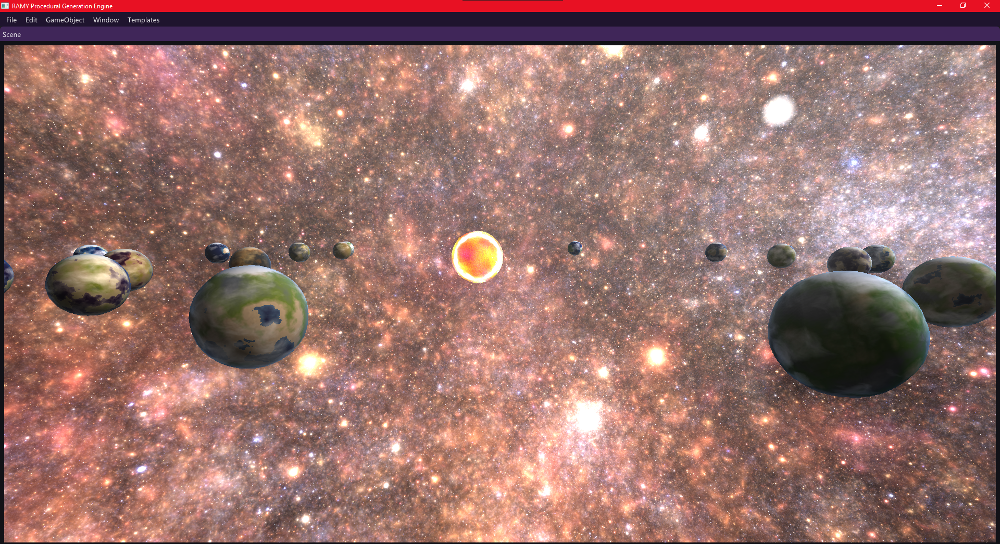
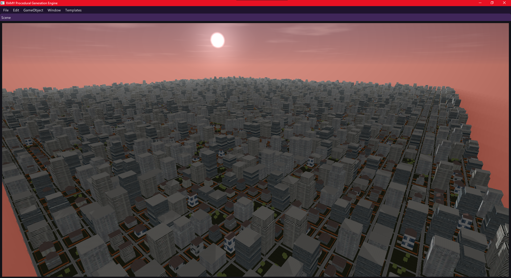
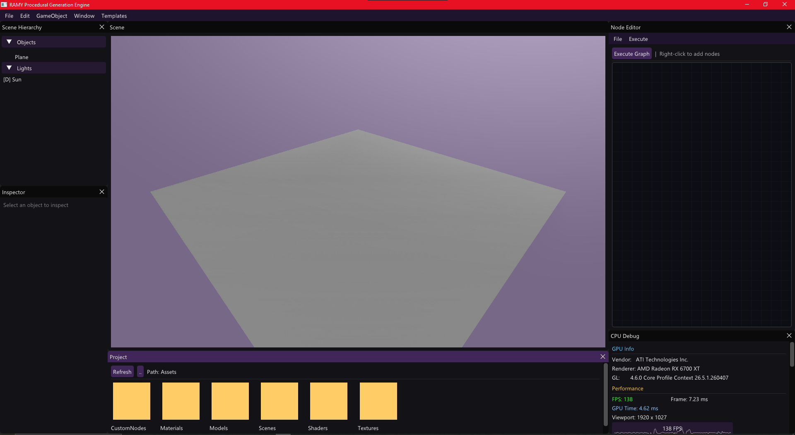
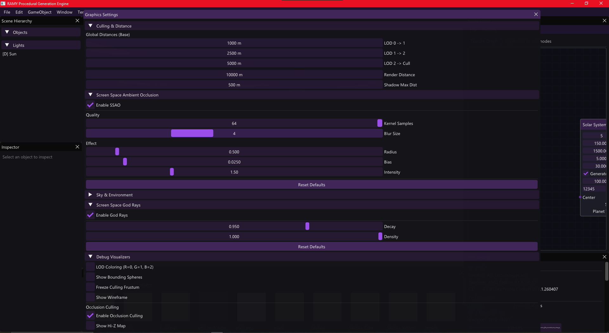

# RAMY Procedural Engine 🚀

**RAMY Procedural Engine** is a high-performance, node-based procedural content generation (PCG) engine built from the ground up using **C++** and **OpenGL**. It is designed to empower creators with the ability to build infinite, complex, and realistic virtual worlds through a flexible and intuitive node-graph interface.

## 🌟 Key Features

- **Node-Based Workflow:** Create terrain, vegetation, and entire solar systems by connecting functional nodes.
- **Physically Based Rendering (PBR):** Realistic lighting and materials using industry-standard BRDF models.
- **Dynamic Atmosphere:** Real-time atmospheric scattering and volumetric clouds.
- **Procedural Erosion:** Advanced hydraulic erosion algorithms for realistic geological formations.
- **High Performance:** Massive instanced rendering and optimized GPU pipelines (View Frustum Culling, Hi-Z).
- **Undo/Redo System:** Non-destructive editing with a robust action history.

## 🛠️ Technical Stack

- **Core:** C++17
- **Graphics API:** OpenGL 4.3+
- **GUI:** ImGui / ImNodes
- **Math:** GLM
- **Serialization:** nlohmann/json

## 📸 Showcase

### Procedural Landscapes

*A massive 5000x5000 terrain generated with hydraulic erosion and realistic river carving.*

### Urban Generation

*Procedural city grid and building generation integrated within the node graph.*

### Engine Interface

*The main landing window and editor layout.*

*Granular graphics settings for performance scaling across different hardware.*

## 📂 Project Structure

- `/Project`: Source code for the OpenGL engine.
- `/Licenta`: Academic documentation, thesis files, and screenshots.
- `build_word.py`: Automation script for generating formal documentation.

---
*Developed as part of an Academic Bachelor's Thesis.*
