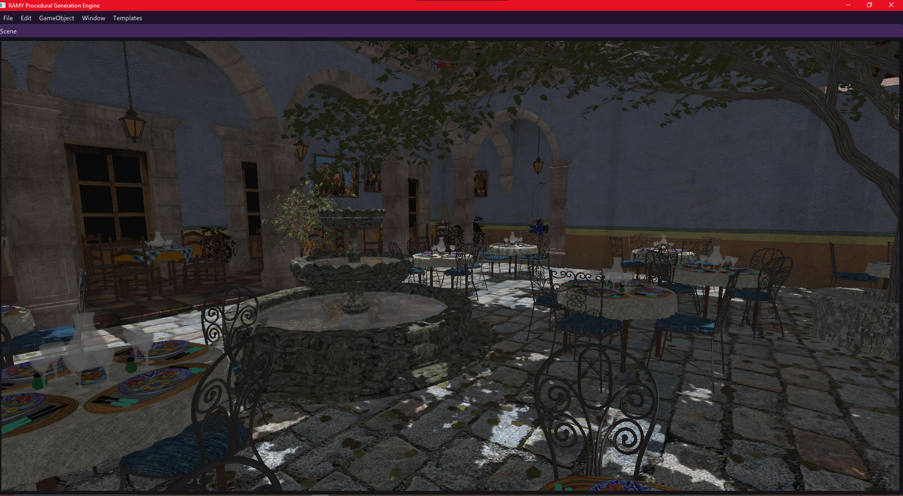

# RAMY Procedural Engine

**RAMY Procedural Engine** is a high-performance, node-based procedural content generation (PCG) engine and real-time renderer built from the ground up in **C++17** and **OpenGL 4.3+**. 

Designed as a modern, human-in-the-loop creator tool, RAMY features a highly optimized GPU-driven rendering pipeline, advanced procedural simulation algorithms, and a visual node-graph workspace to orchestrate and render massive virtual worlds in real-time.

---

## 🌟 Hero Showcase

### The San Miguel Architectural Benchmark

*Vast architectural environments containing **1,600+ individual meshes** are static-batched and drawn at buttery-smooth framerates, leveraged by our custom compute-based Hi-Z occlusion culling pipeline.*

---

## 🚀 Key Technical Achievements & Systems

### 1. Modern GPU-Driven Rendering Pipeline
Unlike traditional engines that suffer from heavy CPU-GPU driver bottlenecks, RAMY implements a modern GPU-driven pipeline:
* **Shader Patching & Dynamic Instancing:** Standard material shaders are parsed, dynamically patched with instance headers at runtime, and compiled into instanced equivalents.
* **Compute Shader Culling:** A multi-stage GPU compute pass performs:
  * **Frustum Culling:** Clip-space sphere testing.
  * **Distance & LOD Culling:** Dynamic level-of-detail mapping.
  * **Contribution Culling:** Automatic discarding of sub-pixel/infinitesimal objects.
  * **Hi-Z Occlusion Culling:** Uses a depth pyramid texture constructed from the previous frame's depth buffer to cull objects occluded by geometry (e.g., mountains or walls).
* **Multi-Draw Indirect (MDI):** Culling results are written directly to a GPU-bound indirect draw command buffer, allowing millions of instances to be rendered with a single `glDrawElementsIndirect` CPU call.

### 2. High-Fidelity Lighting & Atmospherics
* **Cascaded Shadow Mapping (CSM):** Real-time directional shadows using dynamic, user-configurable cascade splits (up to 4 cascades) to prevent shadow aliasing across vast landscape views.
* **Ambient Occlusion:** Screen Space Ambient Occlusion (SSAO) engine for deep contact shadowing and localized spatial grounding.
* **Physical Sky & Volumetrics:** Real-time atmospheric scattering simulation combined with volumetric cloud layers and dynamic day/night time-of-day control.
* **PBR Shading:** Industry-standard physically-based rendering workflow using realistic BRDF microfacet distribution models.

### 3. Advanced Procedural Content Generation (PCG)
* **Analytical "Beautiful" Erosion:** Multi-octave wave-based `PhacelleNoise` mimicking deep geological gully formations. The pipeline incorporates Nyquist frequency clamping to eliminate pixelation aliasing and leverages multi-threaded CPU parallelization for real-time grid updates.
* **Hydrological River & Lake Systems:**
  * **Spring Seeding:** Seeds riverheads at local height maxima with smart distribution spacing.
  * **Pathfinding:** Traverses downward gradients with multi-ring search heuristics (up to 12 rings) to step out of local depressions/pits.
  * **Lake Flooding:** Simulates water accumulation in depressions using Dijkstra-based priority queue flood-fill algorithms, generating actual 3D riverbed and lake geometry.
* **Urban & Interior Generation:** Dynamic city grid laying, building generation, and automated multi-level interior layout partitioning with decorative furniture placement rules.

### 4. Robust Creator Tooling
* **Visual Graph Workspace:** Connect inputs, noises, erosion filters, city generators, and geometry outputs interactively via a workspace utilizing ImGui and ImNodes.
* **Non-Destructive Action History:** Fully featured transactional Undo/Redo memory framework to allow painless, non-destructive editing.
* **JSON Project Serialization:** Deep serialization of the entire graph layout, nodes, properties, and static batching settings.

---

## 🎨 Visual Showcase

### Procedural Landscapes

*A massive 5000x5000 terrain generated via hydraulic erosion and realistic river carving.*

### Solar System Simulation

*Procedural generation of planetary bodies with custom orbits and scale metrics.*

### Procedural Urban Environments

*Procedural road networks and structural city blocks built dynamically within the node graph.*

### Engine Interface & Settings

*The main landing window, node editor workspace, and viewport layout.*

*Granular graphics control panel including real-time performance diagnostics and cascade shadow configurations.*

---

## 🛠️ Technical Stack

* **Core Engine:** C++17
* **Graphics API:** OpenGL 4.3+ (Compute Shaders, SSBOs, MDI)
* **Windowing & Input:** GLFW, GLAD
* **Math Library:** GLM (OpenGL Mathematics)
* **Workspace GUI:** Dear ImGui, ImNodes
* **File Parser & Serializer:** nlohmann/json
* **Asset Loading:** Assimp

## 📂 Repository Structure

* `/Project`: Core engine codebase (scene graph, renderers, shader compiler, nodes).
* `/Licenta`: Academic thesis documentation, slide presentations, and media resources.

---
*Developed as an Academic Bachelor's Thesis.*

